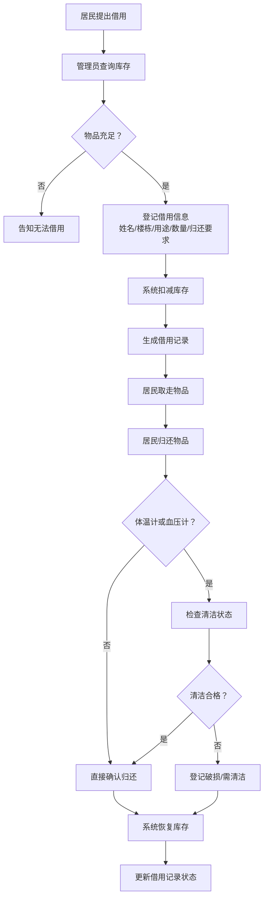

## 1. 产品概述

社区活动室便民药箱借用管理系统，解决药箱物品借用登记混乱、库存难以核对、过期物品无人管理等问题。

- 面向社区活动室管理员和居民使用，实现药箱档案管理、物品库存追踪、借用归还全流程管理
- 通过数字化看板和智能提醒，提升药箱管理效率，保障居民用药安全

## 2. 核心功能

### 2.1 用户角色

| 角色 | 登录方式 | 核心权限 |
|------|----------|----------|
| 管理员 | 系统登录 | 药箱档案管理、库存管理、借用审批、归还检查、数据看板、提醒配置 |
| 居民 | 无需登录（管理员代登记） | 借用物品、归还物品 |

### 2.2 功能模块

1. **数据看板**：今日借用统计、待归还列表、临期物品预警、补货建议
2. **药箱档案**：药箱信息增删改查（位置、负责人、容量、适用活动、照片）
3. **库存管理**：物品入库、出库、效期管理、存放格配置
4. **借用管理**：借用登记、归还登记、清洁检查（体温计/血压计）
5. **提醒中心**：过期提醒、破损提醒、低库存提醒

### 2.3 页面详情

| 页面名称 | 模块名称 | 功能描述 |
|----------|----------|----------|
| 数据看板 | 统计卡片 | 今日借用数、待归还数、临期物品数、低库存物品数 |
| 数据看板 | 今日借用列表 | 展示当日所有借用记录 |
| 数据看板 | 待归还列表 | 展示超期未还和即将到期的借用 |
| 数据看板 | 临期物品 | 展示30天内即将过期的物品 |
| 数据看板 | 补货建议 | 基于库存阈值自动生成补货清单 |
| 药箱档案 | 药箱列表 | 卡片式展示所有药箱，支持搜索筛选 |
| 药箱档案 | 药箱表单 | 新增/编辑药箱：位置、负责人、容量、适用活动、照片上传 |
| 库存管理 | 物品列表 | 按药箱分组展示物品：创可贴、纱布、碘伏棉签、冰袋、体温计、血压计 |
| 库存管理 | 物品表单 | 新增/编辑物品：名称、效期、数量、存放格、所属药箱 |
| 借用管理 | 借用登记 | 登记居民姓名、楼栋、用途、借用物品、数量、归还要求、预计归还日期 |
| 借用管理 | 归还登记 | 扫描或选择借用记录，归还物品，体温计/血压计需检查清洁状态 |
| 借用管理 | 借用记录 | 历史借用记录查询，支持筛选状态（借用中/已归还/已逾期） |
| 提醒中心 | 提醒列表 | 过期物品、破损物品、低库存物品分类展示，支持标记已处理 |

## 3. 核心流程

居民到活动室借用物品时，管理员在系统中登记借用信息，系统自动扣减库存。归还时管理员登记归还信息，特殊物品（体温计、血压计）需进行清洁状态检查后才能完成归还，系统自动恢复库存。物品临近过期或库存不足时，系统在看板和提醒中心展示预警信息。

## 4. 用户界面设计

### 4.1 设计风格

- **主色调**：医药绿 `#10b981`（专业、信任），辅助色：暖橙 `#f59e0b`（提醒）、警示红 `#ef4444`（预警）
- **中性色**：锌灰色系 `zinc`，背景浅灰 `#fafafa`
- **按钮风格**：圆角中等（`rounded-lg`），悬停有阴影和颜色加深效果
- **字体**：中文使用「思源黑体/Noto Sans SC」，数字使用等宽字体增强可读性
- **布局风格**：顶部导航 + 左侧菜单，内容区卡片式布局，大量留白
- **图标**：使用 Lucide React 图标库，图标风格简洁线性

### 4.2 页面设计概述

| 页面名称 | 模块名称 | UI 元素 |
|----------|----------|---------|
| 数据看板 | 统计卡片 | 4 个带图标的彩色统计卡片，数字醒目，有渐变色背景 |
| 数据看板 | 四象限布局 | 左上今日借用、右上待归还、左下临期物品、右下补货建议 |
| 药箱档案 | 卡片网格 | 每个药箱一张卡片，展示照片、位置、负责人、容量徽章 |
| 药箱档案 | 模态框表单 | 抽屉式表单，支持照片预览 |
| 库存管理 | 表格布局 | 按药箱分组的可折叠表格，物品状态用徽章标识 |
| 借用管理 | 两步表单 | 先选物品再填信息，归还时特殊物品弹出清洁检查弹窗 |

### 4.3 响应式

- 桌面优先设计，适配 1280px 以上屏幕
- 平板端（768px）：侧栏可折叠，看板改为 2x2 网格
- 移动端（< 640px）：顶部汉堡菜单，卡片单列堆叠，表格横向滚动
