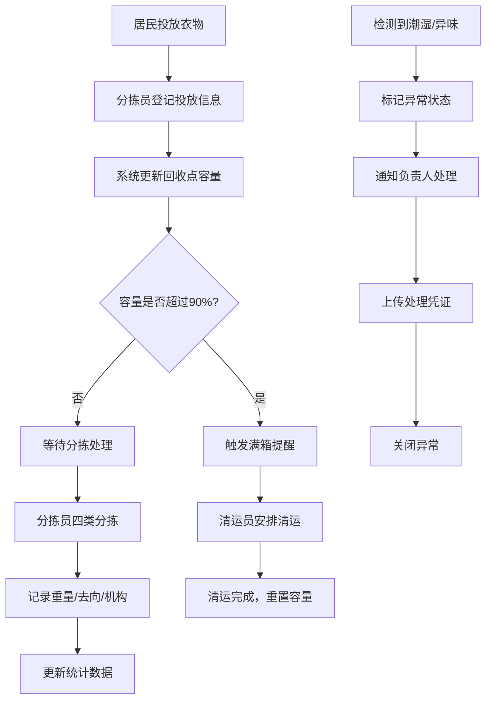

## 1. 产品概述

旧衣回收分拣看板系统，旨在解决社区旧衣回收箱混装难处理的问题，实现回收点管理、投放登记、分拣处理、异常提醒和数据统计的全流程数字化管理。

- **核心问题**：回收箱满后，可捐赠、可再生、需报废衣物混装，分拣效率低、资源浪费严重
- **目标用户**：回收点管理员、分拣工作人员、运营管理人员
- **产品价值**：提升分拣效率30%以上，提高可捐赠衣物比例，优化清运调度，实现公益去向透明化

## 2. 核心功能

### 2.1 用户角色

| 角色 | 权限说明 |
|------|----------|
| 系统管理员 | 回收点档案CRUD、用户管理、数据统计、系统配置 |
| 分拣员 | 投放登记、分拣处理、异常标记、问题照片上传 |
| 清运员 | 查看满箱提醒、确认清运、更新回收点状态 |

### 2.2 功能模块

1. **仪表盘首页**：全局概览、满箱提醒、异常预警、关键指标卡片
2. **回收点档案**：回收点列表、新增/编辑/删除、位置管理、容量配置、照片管理
3. **投放登记**：居民投放记录、袋数统计、衣物类型、清洗状态、鞋包玩具登记
4. **分拣处理**：四类分拣（可捐赠/可再生/破损报废/需清洗）、重量记录、去向登记、合作机构、问题照片
5. **统计分析**：各点投放量、可捐赠比例、清运效率、本月公益去向图表
6. **异常管理**：满箱提醒、潮湿异味标记、异常列表、处理记录

### 2.3 页面详情

| 页面名称 | 模块名称 | 功能描述 |
|-----------|-------------|---------------------|
| 仪表盘 | 数据概览 | 展示总回收量、可捐赠比例、清运完成率、异常数量等核心KPI |
| 仪表盘 | 满箱提醒 | 高亮显示容量超过90%的回收点，支持一键通知清运 |
| 仪表盘 | 异常预警 | 展示潮湿、异味等异常回收点，标记紧急程度 |
| 回收点档案 | 回收点列表 | 卡片式展示所有回收点，显示位置、负责人、容量、当前状态 |
| 回收点档案 | 回收点表单 | 录入位置、负责人、联系电话、设计容量、清运周期、照片 |
| 回收点档案 | 回收点详情 | 查看历史投放记录、分拣记录、清运记录 |
| 投放登记 | 投放列表 | 按时间展示所有投放记录，支持按回收点筛选 |
| 投放登记 | 投放表单 | 选择回收点、录入袋数、衣物类型（上衣/裤子/外套/其他）、是否清洗、是否含鞋包玩具 |
| 分拣处理 | 待分拣列表 | 展示已投放待分拣的记录，按回收点分组 |
| 分拣处理 | 分拣操作 | 按四类分拣，每类录入重量、选择去向、合作机构，上传问题照片 |
| 分拣处理 | 分拣记录 | 历史分拣记录查询，支持导出 |
| 统计分析 | 投放量统计 | 柱状图展示各回收点月/周投放量对比 |
| 统计分析 | 分拣比例 | 饼图展示四类衣物占比，可捐赠比例趋势 |
| 统计分析 | 清运效率 | 折线图展示平均清运响应时间，各回收点清运及时率 |
| 统计分析 | 公益去向 | 流向图展示本月衣物捐赠机构、再生资源企业等去向分布 |

## 3. 核心流程

### 3.1 回收点管理流程
管理员创建回收点档案 → 设置容量和清运时间 → 系统监控容量状态 → 满箱自动提醒 → 清运员确认清运 → 更新容量状态

### 3.2 投放分拣流程
居民投放 → 分拣员登记投放信息 → 系统自动计算容量占比 → 分拣员按四类分拣 → 记录重量和去向 → 更新统计数据

### 3.3 异常处理流程
检测到潮湿/异味 → 标记异常状态 → 通知负责人处理 → 上传处理照片 → 关闭异常记录

## 4. 用户界面设计

### 4.1 设计风格

- **设计理念**：环保公益主题，清新自然，专业高效
- **主色调**：环保绿 `#10B981`（代表可持续、环保）
- **辅助色**：大地棕 `#92400E`（代表衣物、纺织品）、警示橙 `#F59E0B`（代表提醒）、危险红 `#EF4444`（代表异常）
- **中性色**：深灰 `#1F2937`、中灰 `#6B7280`、浅灰 `#F3F4F6`、白色 `#FFFFFF`
- **字体**：标题使用 `Noto Sans SC` 粗体，正文使用 `Noto Sans SC` 常规体，数字使用 `JetBrains Mono` 等宽字体
- **按钮风格**：圆角8px，悬浮时上浮2px+阴影增强，点击时有按压反馈
- **卡片风格**：圆角12px，柔和阴影 `0 4px 6px -1px rgba(0, 0, 0, 0.1)`，边框1px `#E5E7EB`
- **图标风格**：使用 lucide-react 线性图标，统一24px尺寸，与文字颜色保持一致

### 4.2 页面设计概述

| 页面名称 | 模块名称 | UI 元素 |
|-----------|-------------|-------------|
| 仪表盘 | 数据概览 | 4个大尺寸KPI卡片，绿色渐变背景，数字动画效果，悬浮放大 |
| 仪表盘 | 满箱/异常列表 | 左右分栏，左侧满箱橙色预警卡片，右侧异常红色标记卡片 |
| 仪表盘 | 快捷操作 | 底部悬浮操作栏，快速进入投放登记和分拣处理 |
| 回收点档案 | 列表 | 网格布局卡片，每个卡片显示回收点照片、位置、状态指示灯 |
| 回收点档案 | 表单 | 抽屉式表单，分区填写，标签+输入框组合，照片上传区支持拖拽 |
| 投放登记 | 表单 | 分步式表单，第一步选回收点（地图+列表双模式），第二步填详情 |
| 分拣处理 | 操作区 | 四象限布局，每类一个卡片，内置重量输入、去向选择、照片上传 |
| 统计分析 | 图表区 | 响应式网格，2x2布局，每个图表卡片可展开全屏查看 |

### 4.3 响应式设计

- **桌面端**（≥1280px）：侧边导航 + 主内容区，网格布局，最多4列卡片
- **平板端**（768px-1279px）：顶部折叠导航，主内容区最多2列卡片
- **移动端**（<768px）：底部Tab导航，单列布局，大按钮方便触控

### 4.4 交互动效

- 页面加载：卡片依次从下往上滑入，间隔80ms
- 数据更新：数字滚动动画，进度条平滑增长
- 状态变化：满箱时卡片呼吸灯闪烁效果，异常标记脉冲动画
- 表单交互：输入框聚焦时边框高亮，下拉选项渐入
