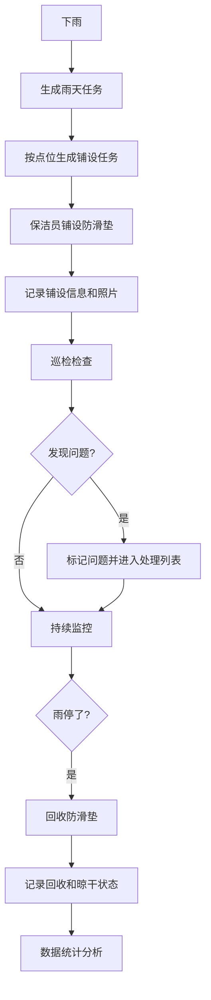

# 防滑垫铺设看板系统 - 产品需求文档

## 1. 产品概述

小区物业防滑垫铺设管理看板系统，用于管理雨天小区大厅和电梯口防滑垫的铺设、巡检和回收全流程管理，解决"哪块铺了、哪块卷边没人及时查的问题，提升雨天物业服务效率和业主安全保障。

- **目标用户**：物业保洁主管、保洁员、物业管理人员
- **核心价值**：可视化点位管理、问题及时发现、全流程可追溯、数据统计分析

## 2. 核心功能

### 2.1 用户角色

| 角色 | 登录方式 | 核心权限 |
|------|----------|----------|
| 保洁主管 | 账号登录 | 点位档案管理、任务派发、数据统计、问题审核 |
| 保洁员 | 账号登录 | 铺设记录、问题上报、回收记录 |
| 物业管理员 | 账号登录 | 全部权限、系统配置 |

### 2.2 功能模块

1. **总览看板**：今日铺设概览、问题统计、快速操作入口
2. **点位档案**：楼栋/入口/电梯厅点位管理，含垫子尺寸、责任保洁、照片
3. **雨天任务**：铺设任务生成、铺设状态跟踪、问题标记
4. **问题处理**：卷边、积水、脏污问题列表及处理
5. **回收管理**：雨停后回收记录、晾干状态跟踪
6. **数据统计**：点位完成率、积水高发区域、未回收垫子、雨天响应时间

### 2.3 页面详情

| 页面名称 | 模块名称 | 功能描述 |
|----------|----------|----------|
| 总览看板 | 数据概览 | 今日任务数、已铺设数、待处理问题、未回收数 |
| 总览看板 | 快捷操作 | 一键生成雨天任务、一键标记雨停 |
| 总览看板 | 问题分布 | 按类型分布图表、高发区域排行 |
| 点位档案 | 点位列表 | 按楼栋筛选、搜索、分页展示点位信息 |
| 点位档案 | 点位详情 | 查看点位详细信息、照片、历史记录 |
| 点位档案 | 点位管理 | 新增、编辑、删除点位档案 |
| 雨天任务 | 任务看板 | 按楼栋/状态分组展示铺设进度 |
| 雨天任务 | 铺设记录 | 记录铺设时间、铺设人、垫子状态、警示牌、现场照片 |
| 雨天任务 | 问题标记 | 标记卷边、积水、脏污等问题 |
| 问题处理 | 问题列表 | 按类型/状态筛选问题 |
| 问题处理 | 问题处理 | 记录处理人、处理时间、处理结果 |
| 回收管理 | 回收列表 | 展示待回收/已回收垫子 |
| 回收管理 | 回收记录 | 记录回收时间、回收人、晾干状态 |
| 数据统计 | 完成率统计 | 各点位铺设完成率排行 |
| 数据统计 | 区域分析 | 积水高发区域热力分析 |
| 数据统计 | 响应分析 | 本月雨天响应时间统计 |

## 3. 核心流程

### 3.1 雨天作业流程

下雨天，物业主管一键生成雨天任务 → 系统自动按点位档案生成铺设任务 → 保洁员领取任务并铺设防滑垫 → 记录铺设信息和现场照片 → 巡检发现问题并标记 → 问题处理跟进 → 雨停后回收垫子 → 记录回收和晾干状态 → 数据统计分析

## 4. 用户界面设计

### 4.1 设计风格

- **主色调**：深海蓝 (#0F52BA) 作为主色，代表专业和信任
- **辅助色**：警示橙 (#FF7A45) 用于问题告警，成功绿 (#22C55E) 用于已完成
- **按钮风格**：圆角矩形按钮，悬停时有轻微阴影和颜色加深
- **字体**：系统无衬线字体，清晰易读
- **布局风格**：卡片式布局，顶部导航 + 侧边栏
- **图标风格**：线性图标，简洁现代

### 4.2 页面设计概览

| 页面名称 | 模块名称 | UI元素 |
|----------|----------|--------|
| 总览看板 | 数据概览 | 4个数据卡片，带图标和趋势指示 |
| 总览看板 | 问题分布 | 饼图 + 柱状图组合 |
| 点位档案 | 点位列表 | 表格 + 筛选栏 + 搜索框 |
| 点位档案 | 点位卡片 | 照片缩略图 + 基本信息 + 状态标签 |
| 雨天任务 | 任务看板 | 分组卡片 + 进度条 + 状态标签 |
| 问题处理 | 问题列表 | 列表项 + 类型标签 + 优先级标记 |
| 数据统计 | 统计图表 | 柱状图 + 排行表 |

### 4.3 响应式

- 桌面端优先设计，适配 1440px 及以上
- 平板端 1024px 自适应
- 移动端 768px 以下单列布局，侧边栏收起为底部导航

### 4.4 动效设计

- 页面加载时卡片渐入动画
- 状态变化时数字跳动效果
- 悬停时卡片轻微上浮和阴影加深
- 数据刷新时骨架屏渐变过渡
