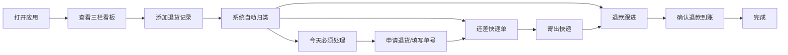

## 1. 产品概述

退货管家是一款个人退货管理工具，帮助用户跟踪和管理网购退货流程，解决"忘了申请、申请了没寄出、过了七天退不了"等常见痛点。通过三栏看板清晰展示退货进度，智能提醒关键节点，支持同一包裹多商品拆分管理。

## 2. 核心功能

### 2.1 用户角色

| 角色 | 注册方式 | 核心权限 |
|------|----------|----------|
| 普通用户 | 本地使用，无需注册 | 管理退货记录、查看提醒、上传商品照片 |

### 2.2 功能模块

1. **三栏看板**：今天必须处理、还差快递单、退款跟进
2. **退货管理**：添加/编辑/删除退货记录，支持包裹内多商品拆分
3. **智能提醒**：申请截止日提醒、未填单号提醒、退款超时提醒
4. **商品照片**：支持上传和预览商品照片

### 2.3 页面详情

| 页面名称 | 模块名称 | 功能描述 |
|----------|----------|----------|
| 主页面 | 三栏看板 | 展示三个状态列的退货卡片，支持拖拽切换状态 |
| 主页面 | 添加退货 | 弹窗表单，录入平台、商品、下单人、退货原因、日期等信息 |
| 主页面 | 退货详情 | 查看完整退货信息，编辑状态，上传照片 |
| 主页面 | 提醒标记 | 卡片右上角显示提醒标记（红色感叹号） |

## 3. 核心流程

用户打开应用后，首先看到三栏看板。点击"添加退货"按钮录入新的退货记录，系统根据截止日期自动归类到对应列。用户可以在卡片之间拖拽调整状态，点击卡片查看详情并更新进度（填写快递单号、标记寄出、确认退款等）。系统会对即将到期或已逾期的退货显示红色提醒标记。

## 4. 用户界面设计

### 4.1 设计风格

- **主色调**：温暖的珊瑚橙 (#FF6B6B) 作为主色，搭配米白背景，营造亲切实用的氛围
- **辅助色**：薄荷绿 (#4ECDC4) 表示已完成/成功，金色 (#FFE66D) 表示警告，深红 (#C92A2A) 表示紧急
- **卡片风格**：圆角 16px，柔和阴影，悬停时轻微上浮
- **字体**：标题使用 "Noto Serif SC" 衬线字体增加品质感，正文使用 "Noto Sans SC" 无衬线保证可读性
- **布局风格**：三栏等宽看板布局，卡片瀑布流排列
- **图标风格**：统一使用线性图标，搭配 emoji 增加亲切感

### 4.2 页面设计概述

| 页面名称 | 模块名称 | UI 元素 |
|----------|----------|---------|
| 主页面 | 顶部标题栏 | Logo、应用名称、添加按钮、日期显示 |
| 主页面 | 三栏看板 | 列标题、计数徽章、卡片列表、空状态提示 |
| 主页面 | 退货卡片 | 平台标签、商品名称、状态徽章、截止日期、提醒标记、照片缩略图 |
| 主页面 | 添加弹窗 | 表单输入、日期选择、图片上传、保存/取消按钮 |
| 主页面 | 详情弹窗 | 完整信息展示、状态操作按钮、照片画廊 |

### 4.3 响应式

桌面端优先设计，平板端三栏变两栏，移动端单列滚动布局，支持触摸滑动切换状态。

### 4.4 动效设计

- 页面加载时卡片依次淡入上浮
- 卡片拖拽时有缩放和阴影变化
- 状态切换时有平滑过渡动画
- 提醒标记有呼吸脉动效果
