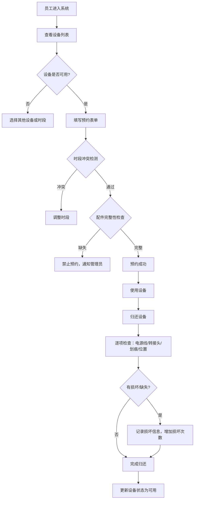

# 共享显示器预约管理系统 PRD

## 1. 产品概述

共享显示器预约管理系统用于解决公司临时工位外接显示器经常被移动、线和电源丢失的问题，实现显示器设备的规范化管理和预约使用流程。

- 主要目的：建立显示器设备档案库，支持在线预约、归还检查、使用统计
- 解决问题：设备随意搬动导致配件丢失、会议前才发现设备不可用的混乱状况
- 目标用户：公司全体员工（使用者）、行政/IT部门（管理员）
- 价值：提高设备利用率，减少损坏和丢失，规范借用流程

## 2. 核心功能

### 2.1 功能模块

1. **设备档案管理**：显示器编号、尺寸、接口类型、放置点、配件清单、状态、照片
2. **预约管理**：使用人、部门、使用日期、时段、工位、用途
3. **归还检查**：电源线、转接头、屏幕划痕、放回位置
4. **统计仪表盘**：使用率、损坏次数、最忙时段、缺配件待补清单

### 2.2 页面详情

| 页面名称 | 模块名称 | 功能描述 |
|---------|---------|---------|
| 首页仪表盘 | 统计概览 | 展示在库/借出/维修数量、今日预约、使用率趋势、最忙时段、损坏排行、缺配件清单 |
| 设备档案页 | 设备列表 | 分页展示所有设备卡片，支持按状态/尺寸/接口筛选和搜索 |
| 设备档案页 | 新增/编辑设备 | 表单录入编号、尺寸、接口、放置点、配件、状态、上传照片 |
| 预约页面 | 预约列表 | 展示所有预约记录，支持按日期/状态/部门筛选 |
| 预约页面 | 创建预约 | 选择设备+日期+时段，填写使用人、部门、工位、用途 |
| 预约页面 | 时段冲突检测 | 自动检测并提示同一时段设备重复预约 |
| 归还页面 | 待归还列表 | 显示到期未归还的设备预约记录 |
| 归还页面 | 归还检查单 | 逐项勾选检查：电源线/转接头/屏幕划痕/放回位置 |

## 3. 核心流程

### 3.1 预约流程

员工打开预约页面 → 选择可用显示器 → 选择日期和时段 → 填写个人信息和用途 → 系统校验时段冲突和配件完整性 → 预约成功 → 领取设备

### 3.2 归还流程

使用结束 → 打开归还页面 → 找到对应预约记录 → 逐项检查配件和外观 → 发现损坏记录 → 确认归还 → 更新设备状态

### 3.3 Mermaid 流程图

## 4. 用户界面设计

### 4.1 设计风格

- **主色调**：深海蓝 #0F4C81（专业、稳重、科技感）
- **辅助色**：琥珀橙 #F5A623（强调、警告、操作）、翡翠绿 #27AE60（成功、可用）、朱砂红 #E74C3C（错误、损坏）
- **中性色**：石墨黑 #2C3E50、浅灰 #ECF0F1、纯白 #FFFFFF
- **按钮风格**：圆角（8px）、悬停微上浮+阴影加深、点击轻微凹陷
- **字体**：标题使用思源黑体（Source Han Sans）CN Bold，正文使用思源黑体 Regular
- **布局风格**：顶部导航栏 + 左侧侧边栏 + 右侧内容区的经典管理后台布局；卡片式信息展示
- **图标风格**：线性图标（Lucide Icons），统一描边宽度 2px

### 4.2 页面设计概览

| 页面名称 | 模块名称 | UI 元素 |
|---------|---------|--------|
| 首页仪表盘 | 顶部状态卡片 | 4个大数字卡片：在库/借出/维修/待归还，渐变色背景+图标+数字+环比 |
| 首页仪表盘 | 使用率图表 | 折线图展示近7天每日使用率，面积填充渐变 |
| 首页仪表盘 | 最忙时段热力图 | 09:00-18:00 每小时一格的热力条，颜色越深越忙 |
| 首页仪表盘 | 损坏排行 | 带进度条的设备损坏次数排名 |
| 首页仪表盘 | 缺配件待补清单 | 表格列出缺失配件的设备和缺失项，带补料状态标签 |
| 设备档案页 | 设备卡片网格 | 卡片：照片+编号角标+状态色条+关键信息标签+操作按钮 |
| 预约页面 | 日历时间轴 | 7天日期选择器 + 每个设备的时段占用可视化色块 |
| 归还页面 | 检查清单 | 左侧设备照片，右侧4项勾选框+备注输入框，底部提交按钮 |

### 4.3 响应式设计

- 桌面端优先设计（1440px 基准宽度）
- 平板端：侧边栏收起为图标栏，卡片网格从4列变2列
- 移动端：顶部导航栏简化，侧边栏变为抽屉式，卡片单列堆叠
- 所有表单支持触摸操作，点击区域 ≥ 44px

