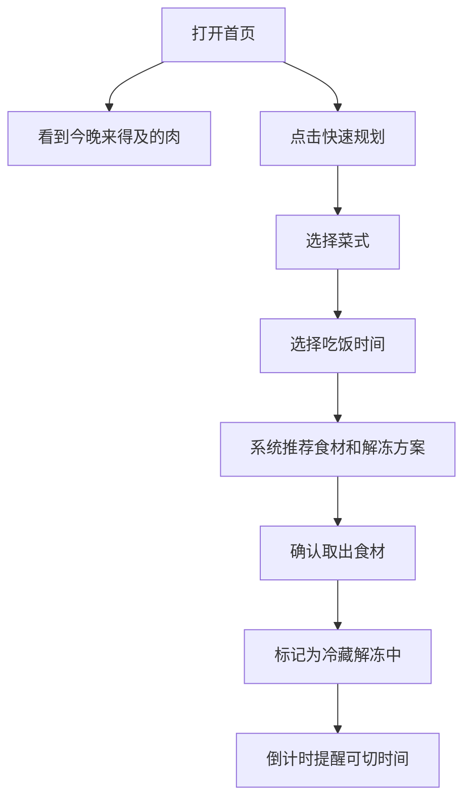
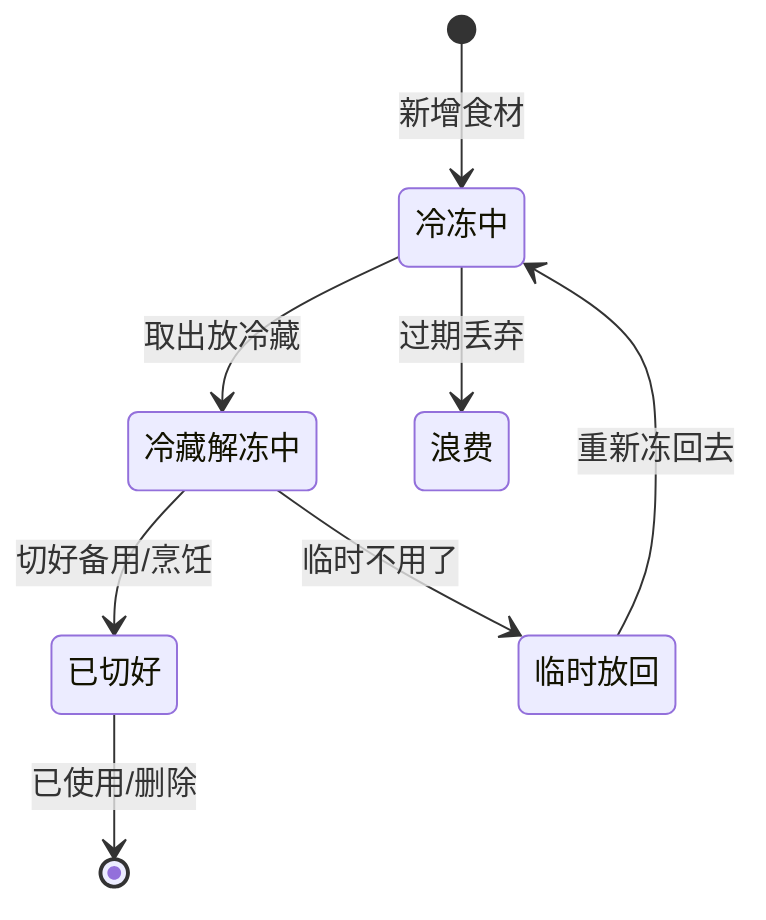

## 1. 产品概述

智能解冻管理助手，帮助用户管理冰箱冷冻食材，根据晚餐计划智能倒推解冻时间，减少食材浪费，提升做饭效率。

- 核心目标：解决"今晚吃什么肉、什么时候拿出来解冻"的日常痛点
- 目标用户：家庭主妇/煮夫、经常自己做饭的上班族
- 核心价值：可视化管理冷冻库存 + 智能解冻时间规划 + 浪费预警

## 2. 核心功能

### 2.1 功能模块

1. **首页（今晚解冻提醒）**：打开即看到今晚来得及做的肉、正在解冻中的食材
2. **冷冻食材库**：按抽屉分类管理所有冷冻食材，支持增删改查和照片
3. **解冻规划器**：选择菜式和吃饭时间，系统倒推算出该拿哪包、何时拿、用什么方式解冻
4. **状态追踪**：标记"冷藏解冻中""已切好""临时放回"，反复解冻超过一次提醒
5. **浪费风险区**：展示放太久、解冻过夜、接近保质期的高风险食材

### 2.2 页面详情

| 页面名称 | 模块名称 | 功能描述 |
|----------|----------|----------|
| 首页 | 今晚来得及做的肉 | 根据当前时间，展示能在晚餐时间前解冻完成的食材列表 |
| 首页 | 正在解冻中 | 展示当前处于"冷藏解冻中"状态的食材及预计完成时间 |
| 首页 | 快速操作入口 | 一键添加食材、快速规划晚餐 |
| 食材库 | 抽屉分类筛选 | 按冷冻抽屉筛选食材 |
| 食材库 | 食材卡片 | 展示肉类、重量、冷冻日期、适合菜式、包装照片 |
| 食材库 | 添加/编辑食材 | 录入抽屉、肉类、重量、冷冻日期、适合菜式、上传照片 |
| 解冻规划 | 菜式选择 | 从预设菜式中选择或自定义 |
| 解冻规划 | 用餐时间 | 选择预计吃饭时间 |
| 解冻规划 | 推荐结果 | 系统推荐用哪包肉、解冻方式、取出时间、可切时间 |
| 食材详情 | 状态操作 | 标记冷藏解冻中 / 已切好 / 临时不用放回 |
| 食材详情 | 解冻历史 | 展示该食材的解冻-冷冻历史记录 |
| 浪费风险区 | 久冻预警 | 冷冻超过90天的食材 |
| 浪费风险区 | 解冻过夜 | 解冻超过12小时未处理的食材 |
| 浪费风险区 | 临期预警 | 接近保质期的食材 |

## 3. 核心流程

### 3.1 晚餐规划流程

### 3.2 食材状态流转

## 4. 用户界面设计

### 4.1 设计风格

- **主色调**：暖橙色 (#FF6B35) - 代表食物、温暖、活力
- **辅助色**：深青色 (#2EC4B6) - 代表新鲜、冷静
- **中性色**：暖米白 (#FAF3E0) 背景 + 深棕 (#2D2A32) 文字
- **设计风格**：温暖有机风，圆角卡片，柔和阴影，食材摄影感
- **字体**：标题用圆润有温度的字体，正文清晰易读
- **图标风格**：线性图标，与食物/厨房相关的 emoji 点缀
- **整体感觉**：像一本精致的美食手账，温暖、实用、有生活气息

### 4.2 页面设计概览

| 页面名称 | 模块名称 | UI 元素 |
|----------|----------|---------|
| 首页 | 顶部问候 | 时间问候语 + 今日日期 |
| 首页 | 今晚来得及 | 横向滚动卡片，标"来得及"标签，显示剩余解冻时间 |
| 首页 | 解冻中面板 | 卡片式列表，进度条 + 倒计时，展示预计完成时间 |
| 首页 | 浪费提醒 | 红色小徽章 + 风险数量 |
| 食材库 | 抽屉切换 | 顶部 Tab 切换不同抽屉 |
| 食材库 | 食材网格 | 2列卡片网格，带照片缩略图 |
| 食材库 | 添加按钮 | 右下角浮动 + 按钮 |
| 解冻规划 | 菜式选择 | 大卡片选择，带菜式图片 |
| 解冻规划 | 时间选择 | 时间滚轮/选择器 |
| 解冻规划 | 方案卡片 | 突出显示推荐方案，大字体显示时间点 |
| 浪费风险区 | 风险分级 | 红色高风险 / 橙色中风险 / 黄色低风险 |
| 浪费风险区 | 风险卡片 | 显示食材照片 + 风险原因 + 建议处理方式 |

### 4.3 响应式

- 桌面端优先设计，同时适配平板和手机
- 食材卡片在桌面端 3 列，平板 2 列，手机 1 列
- 触摸优化：足够大的点击区域（最小 44px）
- 底部导航栏在移动端显示，桌面端用侧边导航

### 4.4 动效设计

- 页面切换：淡入淡出 + 轻微位移
- 卡片悬停：轻微上浮 + 阴影加深
- 状态变化：颜色过渡动画
- 倒计时：数字跳动效果
- 添加/删除：缩放动效
