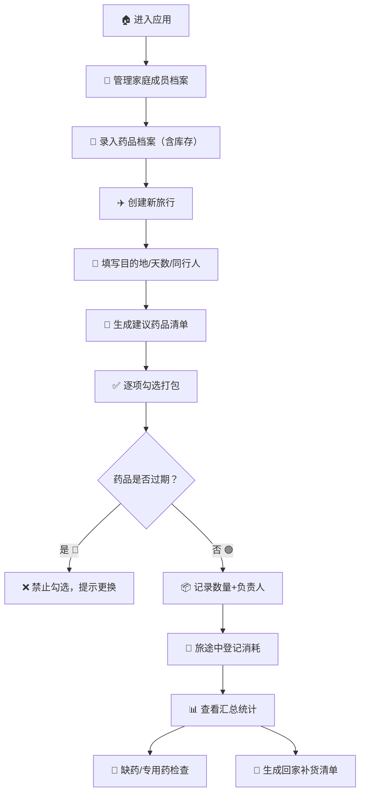

## 1. 产品概述

旅行药品清单管理系统，帮助家庭用户在出行前系统地管理药品档案、生成旅行必备药清单、追踪打包进度和库存状态，杜绝遗漏必备药品、携带过期药或回家后忘记补货的问题。

- **核心价值**：让家庭旅行的药品准备不再手忙脚乱，从建档→规划→打包→汇总全流程数字化管理
- **目标用户**：经常带家人出行的家庭用户、关注健康管理的旅行者

---

## 2. 核心功能

### 2.1 功能模块

1. **药品档案管理**：药品CRUD、包装照片上传、有效期预警、库存管理
2. **旅行规划**：新建旅行（目的地/天数/同行人）、AI智能建议清单生成
3. **打包管理**：勾选打包、数量记录、负责人分配、过期药拦截
4. **库存消耗**：用药/遗失登记、库存自动扣减
5. **汇总视图**：缺药提醒、专用药漏带预警、回家补货清单

### 2.2 页面详情

| 页面名称 | 模块名称 | 功能描述 |
|-----------|-------------|---------------------|
| 药品档案页 | 药品列表 | 卡片式展示所有药品，支持筛选（分类/适用人/是否过期） |
| 药品档案页 | 新建/编辑药品 | 表单：名称、适用人、剂量、有效期、存放位置、是否处方药、包装照片、当前库存 |
| 药品档案页 | 有效期预警 | 醒目标识临期（30天内）/过期药品，红色高亮过期药 |
| 旅行列表页 | 旅行卡片 | 展示历史/即将出发的旅行，显示目的地、日期、打包进度 |
| 新建旅行页 | 旅行信息表单 | 输入目的地、出发日期、旅行天数、添加同行人（从家庭成员中选） |
| 新建旅行页 | 建议清单生成 | 根据目的地、天数、同行人年龄/健康情况自动推荐必备药品 |
| 打包详情页 | 清单勾选 | 逐项勾选，记录打包数量，选择同行人作为负责人 |
| 打包详情页 | 过期药拦截 | 过期药品自动禁用勾选，提示"已过期请更换" |
| 打包详情页 | 库存消耗登记 | 标记药品"已使用"或"遗失"，自动扣减对应库存 |
| 汇总统计页 | 缺药提醒 | 列出当前库存不足、未纳入清单的必备药品 |
| 汇总统计页 | 专用药检查 | 按同行人维度检查个人专用药是否已打包 |
| 汇总统计页 | 补货清单 | 旅行结束后生成需补充采购的药品清单及数量 |
| 家庭成员管理 | 成员档案 | 管理同行人：姓名、关系、年龄、过敏史、慢性病、常备专用药 |

---

## 3. 核心流程

### 3.1 主要用户流程

1. **首次使用**：用户先录入家庭成员档案 → 录入药品档案（含库存）
2. **规划旅行**：创建新旅行（填写目的地/天数/选择同行人）→ 系统自动生成建议药品清单
3. **打包阶段**：用户逐项勾选打包 → 填写实际数量 → 指定负责人 → 系统拦截过期药
4. **旅行途中**：登记用药/遗失事件 → 系统自动扣减库存
5. **旅行结束**：查看汇总报告 → 确认缺药和专用药情况 → 生成回家补货清单

### 3.2 流程图

---

## 4. 用户界面设计

### 4.1 设计风格

- **设计方向**：清新健康风 + 旅行氛围感，柔和的薄荷绿与暖沙色为主调，营造安心、专业但不冰冷的医药管理体验
- **主色调**：薄荷绿 `#2DD4BF`（代表健康、安心）、暖沙色 `#FEF3C7`（代表旅行、温暖）
- **辅助色**：警示红 `#EF4444`（过期/缺药）、提醒橙 `#F59E0B`（临期）、确认蓝 `#3B82F6`（已打包）
- **按钮风格**：圆角胶囊按钮（16px），主按钮带微渐变和悬停浮起效果
- **字体**：中文使用「霞鹜文楷」作为标题展示字体，正文使用「思源黑体」保证可读性
- **布局风格**：卡片式布局，大圆角（20px），柔和投影，留白充足
- **装饰元素**：旅行主题几何图案（行李箱、飞机、药丸的极简线性图标），页面角落细微噪点纹理

### 4.2 页面设计概览

| 页面名称 | 模块名称 | UI 设计要点 |
|-----------|-------------|-------------|
| 药品档案页 | 药品卡片 | 左侧圆形色标（绿=正常/橙=临期/红=过期），右侧显示名称+适用人标签+库存数量，悬停上浮+阴影加深 |
| 新建旅行页 | 表单区 | 分步骤引导（3步：基本信息→选择同行人→确认清单），顶部进度条，每步完成打勾动画 |
| 打包详情页 | 清单勾选 | 左侧大复选框，中间药品信息+库存，右侧数量步进器+负责人下拉，已勾选项整体置灰+删除线效果 |
| 汇总统计页 | 数据看板 | 顶部3个大数字卡片：总项数/已打包/待补充，下方分区用折叠面板展示缺药、专用药、补货清单 |

### 4.3 响应式设计

- **设计策略**：Desktop-first，移动端适配
- **断点**：≥1024px 桌面三栏布局、768-1024px 平板双栏、<768px 手机单列堆叠
- **移动端优化**：底部Tab导航替代侧边栏，触摸目标≥44px，表单全宽输入

---
