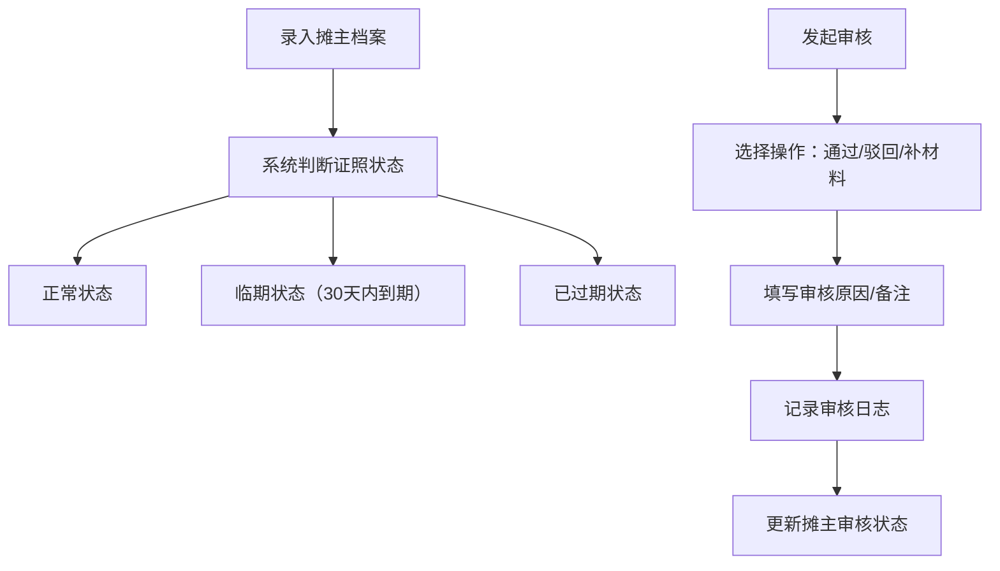

# 周末广场临时摊位管理台 - 产品需求文档

## 1. 产品概述
周末广场临时摊位证照管理系统，用于管理广场临时摊主的证照信息、审核状态和到期提醒，解决证照过期遗漏、食品证明缺失等管理难题。
- 目标用户：广场管理处工作人员、证照审核人员
- 核心价值：证照到期智能提醒、审核流程可追溯、数据统计一目了然

## 2. 核心功能

### 2.1 用户角色
| 角色 | 登录方式 | 核心权限 |
|------|----------|----------|
| 管理员 | 账号登录 | 摊主档案管理、证照审核、数据统计查看 |

### 2.2 功能模块
1. **首页仪表板**：本周到期证照、食品类摊主数量、待补材料人数
2. **摊主档案列表**：按正常/临期/已过期分类筛选，临期醒目提醒
3. **摊主详情页**：完整档案信息、证照照片预览、审核记录
4. **新增/编辑摊主**：档案信息录入、证照照片上传
5. **审核操作**：补材料记录、通过、驳回原因填写

### 2.3 页面详情
| 页面名称 | 模块名称 | 功能描述 |
|----------|----------|----------|
| 首页仪表板 | 数据概览卡片 | 本周到期证照数量、食品类摊主数、待补材料人数 |
| 首页仪表板 | 快捷入口 | 快速跳转到各分类列表、新增摊主 |
| 摊主列表 | 状态筛选标签 | 全部/正常/临期/已过期 四个标签切换 |
| 摊主列表 | 搜索栏 | 按姓名、证照编号、摊位类型搜索 |
| 摊主列表 | 摊主卡片 | 显示关键信息，临期/过期状态用颜色标识 |
| 摊主详情 | 基本信息 | 姓名、摊位类型、经营品类、联系电话 |
| 摊主详情 | 证照信息 | 证照编号、有效期、证照照片预览 |
| 摊主详情 | 审核记录 | 历史审核操作时间、操作人、结果、备注 |
| 摊主详情 | 审核操作 | 补材料、通过、驳回三种操作，需填写原因 |
| 新增/编辑 | 表单录入 | 所有档案字段的录入和编辑 |
| 新增/编辑 | 照片上传 | 证照照片上传和预览 |

## 3. 核心流程

### 摊主档案管理流程
管理员录入摊主档案 → 系统自动判断证照状态（正常/临期/已过期）→ 到期前自动标记为临期 → 到期后标记为已过期

### 审核流程
管理员查看摊主证照 → 选择审核操作（通过/驳回/补材料）→ 填写审核意见/原因 → 系统记录审核日志 → 更新摊主状态

## 4. 用户界面设计

### 4.1 设计风格
- 主色调：深蓝色系（专业、可信），辅以橙色作为临期提醒色，红色作为过期警示色
- 按钮风格：圆角矩形，主按钮深蓝色，次按钮浅灰边框
- 字体：现代无衬线字体，标题加粗，正文清晰易读
- 布局风格：顶部导航 + 侧边栏 + 内容区卡片式布局
- 图标风格：线性图标，简洁明了

### 4.2 页面设计概览
| 页面名称 | 模块名称 | UI 元素 |
|----------|----------|---------|
| 首页仪表板 | 数据卡片 | 渐变背景卡片、数字大字号、趋势图标 |
| 首页仪表板 | 快捷操作 | 图标按钮、悬停动效 |
| 摊主列表 | 状态标签 | 彩色标签页、选中态高亮 |
| 摊主列表 | 列表卡片 | 状态色条标识、信息网格布局 |
| 摊主详情 | 信息区块 | 分组卡片、标签式布局 |
| 摊主详情 | 审核记录 | 时间线样式、操作类型标签 |
| 审核弹窗 | 操作表单 | 单选按钮组、文本域、提交按钮 |

### 4.3 响应式
- 桌面端优先，适配 1280px 及以上宽度
- 平板端侧边栏收起为图标菜单
- 移动端列表改为单列卡片堆叠

### 4.4 状态颜色规范
- 正常状态：绿色系，表示证照有效
- 临期状态：橙色系 + 闪烁/脉冲动画，醒目提醒
- 已过期状态：红色系 + 红色背景高亮
- 待补材料：黄色系，表示需要跟进
