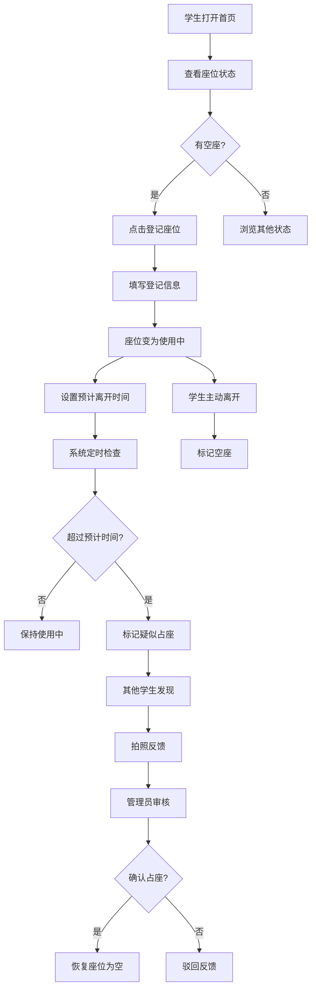

## 1. 产品概述

校园自习室座位管理系统，解决自习室占座乱象问题。学生可登记座位信息，系统自动监测超时疑似占座，支持拍照反馈争议，管理员处理争议并统计分析。

- 主要目的：规范自习室使用秩序，减少无效占座，提高座位利用率
- 目标用户：在校学生、自习室管理员
- 市场价值：提升校园公共资源使用效率，营造良好学习氛围

## 2. 核心功能

### 2.1 用户角色

| 角色 | 登录方式 | 核心权限 |
|------|----------|----------|
| 学生用户 | 无需注册，直接使用 | 登记座位、短暂离座标记、拍照反馈占座 |
| 管理员 | 管理员密码登录 | 查看争议、处理争议、恢复座位、查看统计 |

### 2.2 功能模块

1. **首页座位板**：座位状态分组展示（空座/使用中/短暂离开/疑似占座）、筛选搜索、状态统计
2. **座位登记**：填写教学楼/房间/座位号/预计离开时间/短暂离座标记/联系方式
3. **反馈功能**：拍照上传疑似占座、提交反馈
4. **管理员面板**：争议列表、处理争议（恢复座位/驳回反馈）
5. **统计分析**：自习室紧张度排行、占座时段热力图、恢复座位统计

### 2.3 页面详情

| 页面名称 | 模块名称 | 功能描述 |
|-----------|-------------|---------------------|
| 首页座位板 | 顶部导航 | 页面切换、搜索框、教学楼/房间筛选、管理员入口 |
| 首页座位板 | 状态统计卡片 | 显示各状态座位数量统计 |
| 首页座位板 | 状态分组面板 | 按空座/使用中/短暂离开/疑似占座分组展示座位卡片 |
| 座位登记 | 登记表单 | 教学楼选择、房间号、座位号、预计离开时间、短暂离座开关、联系方式输入 |
| 座位详情 | 座位信息展示 | 座位基本信息、当前使用人、状态、操作按钮 |
| 座位详情 | 反馈弹窗 | 拍照/上传图片、备注说明、提交反馈 |
| 管理员面板 | 登录 | 管理员密码登录 |
| 管理员面板 | 争议列表 | 待处理争议、已处理争议、操作按钮（恢复/驳回） |
| 统计分析 | 自习室紧张度 | 各自习室使用率排行榜 |
| 统计分析 | 占座时段分析 | 24小时占座数量折线图 |
| 统计分析 | 恢复统计 | 累计恢复座位数、近7日趋势 |

## 3. 核心流程

学生登记座位 → 系统根据预计离开时间监控 → 超时未回自动标记疑似占座 → 其他学生可拍照反馈 → 管理员审核处理 → 恢复座位为空

## 4. 用户界面设计

### 4.1 设计风格

- 主色调：深青色 #0F766E（学术、沉静）+ 橙色 #F97316（警示、活力）
- 辅助色：绿色 #10B981（空座/正常）、黄色 #F59E0B（短暂离开）、红色 #EF4444（疑似占座）
- 按钮风格：圆润大圆角（rounded-xl）、微立体阴影、hover放大效果
- 字体：标题使用思源黑体 Bold、正文使用思源黑体 Regular
- 布局风格：卡片式布局、顶部导航栏、网格座位矩阵
- 图标风格：Lucide 线性图标，配合状态色

### 4.2 页面设计概览

| 页面名称 | 模块名称 | UI元素 |
|-----------|-------------|----------|
| 首页座位板 | 顶部导航 | 深色导航栏、品牌Logo、搜索框、筛选下拉菜单、渐变背景 |
| 首页座位板 | 状态统计卡片 | 4个圆角卡片、渐变色背景、数字+图标组合、悬停微动效 |
| 首页座位板 | 状态分组面板 | 分组标题栏、座位网格布局、状态色边框、座位编号标签 |
| 座位登记 | 登记表单 | 分组输入框、时间选择器、开关组件、提交按钮动画 |
| 管理员面板 | 争议列表 | 时间线布局、反馈缩略图、操作按钮组、状态徽标 |
| 统计分析 | 图表区域 | 数据卡片+图表组合、渐变色柱状图、折线趋势图 |

### 4.3 响应式

- 桌面端优先设计，支持平板和移动端自适应
- 座位网格在移动端自动调整列数
- 触摸按钮尺寸 ≥ 44px，适配移动端点击
