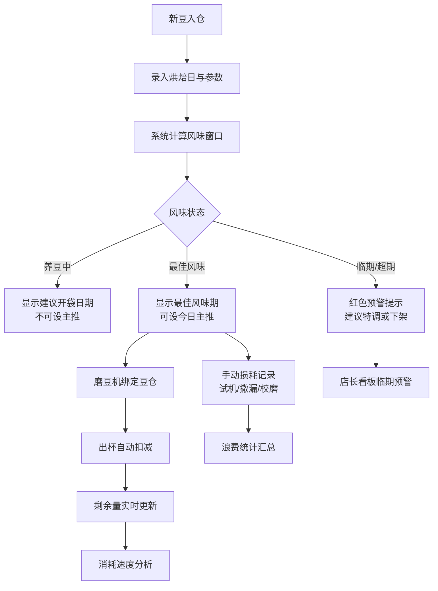

# 咖啡豆风味管理系统 PRD

## 1. 产品概述

专业咖啡馆咖啡豆全生命周期管理系统，从烘焙日到消耗完毕的完整追踪，确保每一杯咖啡都在最佳风味期出品。

- 面向咖啡吧台师、店长的内部管理工具
- 解决豆子信息不透明、风味期失控、库存消耗不可控的痛点
- 提升出品稳定性，减少浪费，优化库存周转

## 2. 核心功能

### 2.1 用户角色

| 角色 | 核心权限 |
|------|----------|
| 吧台师 | 查看风味窗口、设今日主推、出杯扣减、记录损耗 |
| 店长 | 全部吧台权限 + 数据看板、消耗分析、临期预警、推荐排序 |

### 2.2 功能模块

1. **吧台风味窗口页**：豆子卡片列表，展示产区、处理法、烘焙度、烘焙日、养豆建议、剩余克数
2. **豆子状态管理**：风味期判断、今日主推设置、超期预警提示
3. **磨豆机与出杯管理**：磨豆机绑定豆仓、出杯自动扣减克数
4. **损耗记录**：手动记录试机、撒漏、校磨等损耗类型
5. **店长数据看板**：消耗速度分析、临期集中预警、浪费统计、本周推荐排序

### 2.3 页面详情

| 页面名称 | 模块名称 | 功能描述 |
|-----------|-------------|---------------------|
| 吧台风味窗口 | 顶部状态栏 | 今日日期、主推豆标识、超期预警数量 |
| 吧台风味窗口 | 豆子卡片网格 | 每支豆的完整信息卡片，状态色标区分 |
| 吧台风味窗口 | 操作浮层 | 设为主推、出杯扣减、记录损耗快捷操作 |
| 磨豆机面板 | 磨豆机列表 | 每台磨豆机当前绑定的豆仓和剩余量 |
| 损耗记录 | 损耗表单 | 选择损耗类型、输入克数、备注 |
| 店长看板 | 消耗分析 | 各豆子消耗速度排行、周转率 |
| 店长看板 | 临期预警 | 按日期分组的临期豆子日历视图 |
| 店长看板 | 浪费统计 | 各类型损耗克数统计、趋势 |
| 店长看板 | 本周推荐 | 可拖拽排序的本周推荐豆子列表 |

## 3. 核心流程

### 3.1 日常出杯流程
吧台师上班查看风味窗口 → 确认今日主推豆 → 客人点单 → 在对应磨豆机上出杯 → 系统自动扣减克数 → 剩余量实时更新

### 3.2 风味期管理流程
新豆入仓录入烘焙日 → 系统自动计算最佳风味窗口 → 未到风味期显示"养豆中" → 进入最佳期显示"最佳风味"可设主推 → 超窗口显示"尽快使用"提示做特调或下架

### 3.3 损耗记录流程
发生损耗（试机/撒漏/校磨）→ 选择豆子和损耗类型 → 输入克数和备注 → 提交记录 → 库存扣减 → 浪费统计更新

## 4. 用户界面设计

### 4.1 设计风格

**美学方向：温暖专业的咖啡馆工业风**

- **主色调**：深咖啡棕 `#3E2723` 作为主色，传递专业与温暖
- **辅助色**：
  - 活力橙 `#FF8A65` — 最佳风味状态、主推标识
  - 森林绿 `#4CAF50` — 养豆中、正常状态
  - 警示红 `#EF5350` — 超期、预警状态
  - 暖金 `#FFB74D` — 临期提醒
- **中性色**：米白色背景 `#FAF7F2`、深棕文字 `#2C1810`、暖灰边框
- **卡片风格**：圆角 12px，柔和投影，米色底纹带细微颗粒感
- **按钮风格**：圆角 8px，悬停有微妙上浮效果，点击有按压反馈
- **字体**：标题使用衬线字体（Playfair Display）传递精品感，正文使用干净无衬线（Inter）保证可读性
- **图标风格**：线性图标，暖色调，与咖啡主题呼应

### 4.2 页面设计概述

| 页面名称 | 模块名称 | UI元素 |
|-----------|-------------|-------------|
| 吧台风味窗口 | 顶部状态条 | 日期徽章、主推豆胶囊、预警计数、导航切换 |
| 吧台风味窗口 | 豆子卡片 | 大标题产区名、处理法烘焙度标签、风味状态色带、剩余克数大字号、烘焙日与养豆建议小字 |
| 吧台风味窗口 | 卡片状态 | 绿边=养豆中、橙边=最佳风味、金边=临期、红边=超期，状态条在卡片顶部 |
| 磨豆机面板 | 磨豆机卡片 | 设备名称、当前豆仓、剩余量进度条、出杯按钮组（单份/双份） |
| 损耗记录 | 表单弹窗 | 豆子选择器、损耗类型分段控件、克数输入、备注框、确认按钮 |
| 店长看板 | 数据概览 | 四个指标卡片：在库豆数、本周消耗、浪费克数、临期预警 |
| 店长看板 | 消耗排行 | 横向条形图，按消耗速度排序，可切换周/月视图 |
| 店长看板 | 临期日历 | 日期格子视图，标注临期豆子数量，点击展开详情 |
| 店长看板 | 推荐排序 | 可拖拽卡片列表，序号徽章，实时保存排序 |

### 4.3 响应式

- 桌面端优先设计（1280px+），适配吧台大屏展示
- 平板端自适应网格列数
- 卡片式布局天然适配响应式缩放
- 关键操作按钮保持足够触摸区域（48px+）

### 4.4 微动效

- 卡片入场：交错淡入上移，营造呼吸感
- 状态变化：色带过渡动画，数字跳动效果
- 出杯扣减：克数数字滚动动画 + 轻微震动反馈
- 拖拽排序：被拖动卡片放大、阴影加深，释放位置有吸附感
- 预警闪烁：超期卡片边缘有呼吸灯效果
