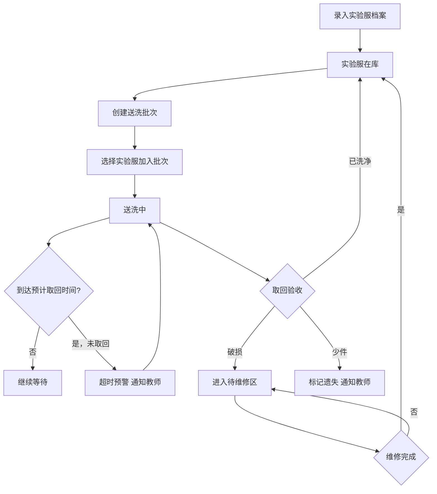

## 1. 产品概述

实验服清洗登记系统，解决实验课后白大褂堆叠难辨认、送洗追踪混乱、破损遗失无记录的问题。面向学校实验室管理场景，让每件实验服的档案、送洗、取回、维修全流程可追溯，帮助老师和实验员高效管理实验服资产。

## 2. 核心功能

### 2.1 用户角色

| 角色 | 进入方式 | 核心权限 |
|------|----------|----------|
| 实验员 | 默认进入 | 登记实验服档案、创建送洗批次、登记取回、管理待维修区 |
| 教师 | 默认进入 | 查看统计看板、接收超时提醒、查看未归还名单 |

### 2.2 功能模块

1. **实验服档案页**：实验服编号管理、尺码/班级/学生/污渍等级/照片录入、档案列表与搜索筛选
2. **送洗登记页**：创建送洗批次、选择送洗实验服、记录送洗人和件数、设置预计取回时间
3. **取回登记页**：按批次取回登记、标记洗净/破损/少件状态、破损件自动转入待维修区
4. **待维修区**：破损实验服列表、维修状态跟踪、修好后归还档案库
5. **统计看板页**：班级送洗次数排行、常见破损位置统计、未归还名单、超时预警

### 2.3 页面详情

| 页面名称 | 模块名称 | 功能描述 |
|----------|----------|----------|
| 实验服档案 | 档案列表 | 按编号/班级/学生搜索筛选，显示编号、尺码、班级、学生、污渍等级、状态标签 |
| 实验服档案 | 新建档案 | 表单录入编号、尺码、所属班级、领用学生、污渍等级(1-5星)，上传照片 |
| 实验服档案 | 档案详情 | 查看完整信息、送洗历史记录、当前状态 |
| 送洗登记 | 批次列表 | 显示所有送洗批次、批次号、送洗人、件数、预计取回时间、状态(送洗中/已取回/超时) |
| 送洗登记 | 新建批次 | 选择待洗实验服、填写送洗人、预计取回日期，生成批次号 |
| 取回登记 | 取回操作 | 选择批次，逐件标记：已洗净✓ / 破损✗ / 少件✗，破损件自动进待维修区 |
| 取回登记 | 超时预警 | 超过预计取回时间未取回的批次高亮提醒，可通知教师 |
| 待维修区 | 维修列表 | 破损实验服列表，显示破损位置描述、照片、等待时长 |
| 待维修区 | 维修操作 | 标记维修完成、记录维修内容、归还至档案库 |
| 统计看板 | 班级送洗统计 | 各班级送洗次数柱状图/排行 |
| 统计看板 | 破损分析 | 常见破损位置饼图/词云 |
| 统计看板 | 未归还名单 | 当前未归还的实验服及对应学生、班级、超时天数 |

## 3. 核心流程

**实验服全生命周期管理流程**：档案录入 → 日常使用 → 送洗登记 → 取回验收 → 破损进维修 → 维修归还 → 循环

## 4. 用户界面设计

### 4.1 设计风格

- **主题**：工业洁净美学 —— 参考实验室白瓷砖、不锈钢台面、试剂标签的视觉语言
- **主色**：冷白 (#F7F8FA) 为底，深青 (#0D7377) 为主强调色，警示橙 (#E8590C) 为超时/破损提醒
- **辅助色**：钢灰 (#6B7280)、浅青 (#CCFBF1)、淡橙 (#FFF7ED)
- **按钮风格**：微圆角(6px)、轻微阴影、hover 时颜色加深并上移 1px 的微交互
- **字体**：标题用 Noto Sans SC 粗体，正文用 Noto Sans SC 常规，数据/编号用 JetBrains Mono
- **布局**：左侧固定导航栏 + 右侧内容区，卡片式内容组织
- **图标**：线性风格（Phosphor Icons），与工业感统一
- **特殊元素**：污渍等级用色阶渐变圆点表示(绿→黄→橙→红→深红)，状态标签用药瓶标签式设计

### 4.2 页面设计概览

| 页面名称 | 模块名称 | UI 元素 |
|----------|----------|---------|
| 实验服档案 | 档案列表 | 顶部搜索栏+筛选下拉，网格卡片布局，每张卡片含编号(JetBrains Mono)、尺码标签、班级、学生名、污渍色点、状态药瓶标签 |
| 实验服档案 | 新建档案弹窗 | 表单弹窗，编号自动生成可修改，尺码下拉(S/M/L/XL/XXL)，班级下拉，污渍等级5级色点选择器，照片上传区域 |
| 送洗登记 | 批次列表 | 时间线式列表，每个批次卡片含批次号、送洗人头像、件数徽章、预计取回日期、状态指示灯(绿色已取回/黄色送洗中/红色超时) |
| 送洗登记 | 新建批次弹窗 | 左侧可选实验服列表(复选框)，右侧已选列表(可移除)，底部送洗人+日期选择器 |
| 取回登记 | 取回操作 | 批次卡片展开后显示实验服列表，每行三个操作按钮(洗净/破损/少件)，破损弹出位置描述+照片上传 |
| 待维修区 | 维修列表 | 卡片含破损照片缩略图、破损位置标签、等待天数计时器(越久越红)、维修完成按钮 |
| 统计看板 | 班级送洗统计 | 横向柱状图，每根柱子按班级着色，hover 显示详情 |
| 统计看板 | 破损分析 | 环形图显示破损位置分布(袖口/领口/前襟/口袋/其他) |
| 统计看板 | 未归还名单 | 表格，行按超时天数降序，超时行背景渐变为警示橙，含学生名+班级+编号+超时天数 |

### 4.3 响应式设计

- 桌面优先设计，最小宽度 1024px
- 导航栏在移动端收起为底部标签栏
- 卡片网格自适应列数(4→2→1)
- 表格在窄屏转为卡片列表

### 4.4 动效设计

- 页面切换：淡入 + 微上移 (200ms)
- 卡片 hover：轻微上浮 + 阴影加深
- 状态变更：药瓶标签颜色渐变过渡
- 超时预警：脉冲呼吸动画(红色光晕)
- 新建完成：卡片从缩放0.9→1弹性出现
