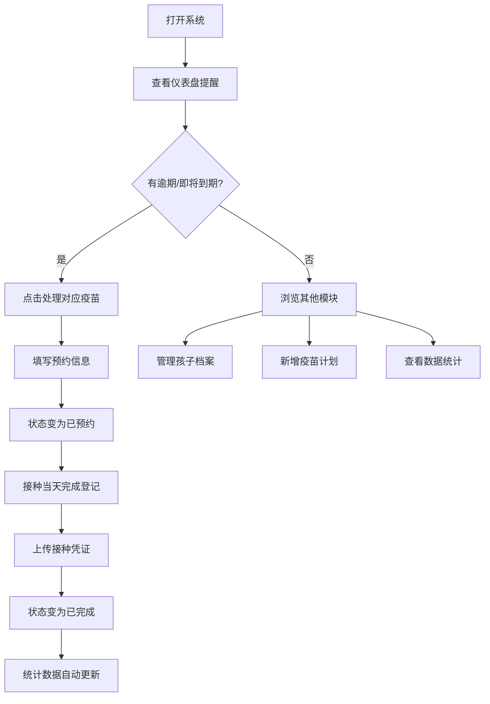

## 1. 产品概述

儿童疫苗预约管理系统，帮助家长系统化管理孩子的疫苗接种计划，解决疫苗本日期难记、家人频繁询问接种状态的痛点。通过建立孩子档案、制定疫苗计划、预约提醒和数据统计四大核心功能，让家长一目了然地掌握孩子的疫苗接种进度。

- 目标用户：0-6 岁儿童的家长/监护人
- 核心价值：清晰可视化的接种时间表、智能逾期提醒、全面的数据统计

## 2. 核心功能

### 2.1 用户角色

| 角色 | 注册方式 | 核心权限 |
|------|---------|---------|
| 家长用户 | 本地使用，无需注册 | 创建/编辑孩子档案、管理疫苗计划、预约登记、上传凭证、查看统计 |

### 2.2 功能模块

1. **总览仪表盘**：逾期/即将到期提醒卡片、核心统计数据、快捷操作入口
2. **孩子档案**：孩子列表、档案详情、档案编辑表单（含疫苗本照片上传）
3. **疫苗计划**：疫苗时间表、添加/编辑疫苗、状态流转（待预约→已预约→已完成）
4. **预约与凭证**：预约信息填写、接种完成凭证上传、延期原因记录
5. **数据统计**：剩余针数统计、月度接种分布、延期原因分析

### 2.3 页面详情

| 页面名称 | 模块名称 | 功能描述 |
|---------|---------|---------|
| 总览仪表盘 | 提醒区域 | 逾期未约红色警示卡片、即将到期（7天内）橙色提醒卡片 |
| 总览仪表盘 | 统计概览 | 总孩子数、待接种针数、本月待接种数、已完成率 |
| 总览仪表盘 | 快捷入口 | 快速添加疫苗、快速登记预约、查看全部提醒 |
| 孩子档案列表 | 孩子卡片 | 头像、姓名、年龄、过敏史标签、关联疫苗数量 |
| 孩子档案详情 | 基本信息 | 姓名、生日、年龄计算、过敏史、接种点、监护人电话 |
| 孩子档案详情 | 疫苗本照片 | 照片预览、上传/更换、大图查看 |
| 孩子档案详情 | 疫苗时间线 | 按时间排序的疫苗接种进度时间线 |
| 档案编辑表单 | 字段输入 | 全部档案字段的增改、照片上传组件 |
| 疫苗计划列表 | 筛选器 | 按孩子筛选、按状态筛选（全部/待预约/已预约/已完成/逾期） |
| 疫苗计划列表 | 疫苗卡片 | 疫苗名、剂次、建议日期、最晚日期、状态徽章、操作按钮 |
| 疫苗编辑弹窗 | 表单 | 疫苗名、剂次、建议日期、最晚日期、注意事项、延期原因 |
| 预约登记弹窗 | 表单 | 预约时间、接种地点、排队号、备注 |
| 接种完成弹窗 | 表单 | 实际接种日期、凭证图片上传、接种反应记录 |
| 数据统计 | 未接种统计 | 每个孩子剩余针数、按疫苗分类统计 |
| 数据统计 | 月度分布 | 柱状图展示各月接种数量，标识最忙月份 |
| 数据统计 | 延期记录 | 因生病延期的疫苗列表、延期次数统计 |

## 3. 核心流程

用户打开系统后，首先在总览仪表盘查看逾期和即将到期的提醒，然后可以点击进入对应操作。日常使用流程包括：创建孩子档案 → 录入疫苗计划 → 系统自动判断提醒 → 预约登记 → 接种完成上传凭证 → 查看统计分析。

## 4. 用户界面设计

### 4.1 设计风格

- **主色调**：柔和的薄荷绿（#10B981）作为主色，传递健康、安心的感觉；搭配温暖的珊瑚橙（#F97316）作为提醒强调色
- **辅助色**：柔和的玫瑰红（#EF4444）用于逾期警示，天蓝色（#3B82F6）用于信息状态
- **中性色**：以石板灰（slate）为基础，营造干净、专业的医疗感
- **按钮风格**：圆角 12px，微立体阴影，hover 时有轻微上浮和阴影加深
- **字体**：标题使用「LXGW WenKai / 霞鹜文楷」带来温和的人文感，正文使用「Inter」保证可读性
- **布局风格**：卡片式布局，充足的留白，圆角 16px 的卡片容器，柔和的渐变背景
- **图标风格**：使用 Lucide 线性图标，搭配柔和的彩色圆形背景徽标
- **整体氛围**：温暖、安心、清晰，避免冷冰冰的医疗感，偏向母婴 App 的柔和调性

### 4.2 页面设计概述

| 页面名称 | 模块名称 | UI 元素 |
|---------|---------|---------|
| 总览仪表盘 | 顶部横幅 | 渐变背景、今日日期、问候语、孩子头像轮播 |
| 总览仪表盘 | 提醒卡片 | 逾期卡片（红色渐变背景+闪烁指示点）、即将到期卡片（橙色渐变+倒计时） |
| 总览仪表盘 | 统计卡片 | 4 宫格带微渐变的数值卡片，底部配迷你趋势图 |
| 总览仪表盘 | 快捷操作 | 带图标的圆角快捷按钮，hover 有弹性动画 |
| 孩子档案列表 | 头部 | 页面标题、添加按钮、搜索框 |
| 孩子档案列表 | 孩子卡片 | 圆形头像、姓名+年龄、过敏史胶囊标签、疫苗进度环 |
| 孩子档案详情 | 顶部信息栏 | 大头像、基本信息网格、联系信息图标组 |
| 孩子档案详情 | 照片区 | 可点击放大的疫苗本照片缩略图，带上传按钮 |
| 孩子档案详情 | 时间线 | 垂直时间线，每个节点用不同颜色表示状态 |
| 疫苗计划列表 | 顶部筛选 | 孩子选择器下拉、状态筛选标签组 |
| 疫苗计划列表 | 疫苗卡片 | 左侧状态色条、疫苗名+剂次、日期区间、状态徽章、右侧操作按钮组 |
| 疫苗编辑弹窗 | 弹窗 | 半透明遮罩+圆角弹窗，表单字段分块布局 |
| 数据统计 | 统计图表 | 月度柱状图带高亮、延期疫苗表格、剩余针数环形图 |

### 4.3 响应式

桌面优先设计，≥1280px 采用三栏式布局（侧边导航 + 主内容 + 侧边栏提醒），768-1279px 采用两栏布局（折叠侧边导航 + 主内容），<768px 采用单栏布局（顶部汉堡菜单 + 纵向堆叠内容），支持触控点击区域优化。
