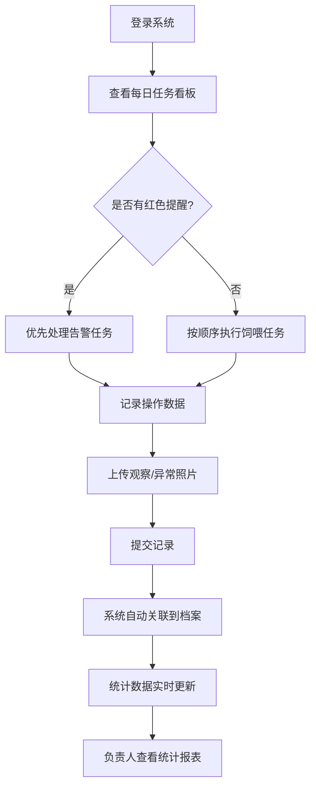

## 1. 产品概述

实验动物饲喂看板系统是一款面向科研实验室的动物饲养管理工具，用于规范小鼠、斑马鱼等实验动物的日常饲喂、换水、健康观察等操作留痕，替代传统白板记录方式，降低遗漏风险。

- 目标用户：实验室动物饲养员、课题组负责人、科研人员
- 核心价值：操作可追溯、异常即时提醒、数据统计分析

## 2. 核心功能

### 2.1 用户角色

| 角色 | 注册方式 | 核心权限 |
|------|---------|---------|
| 饲养员 | 系统分配 | 执行每日饲喂任务、记录观察数据、上报异常 |
| 课题组负责人 | 系统分配 | 查看本组数据、审核异常记录、导出统计报表 |
| 管理员 | 系统分配 | 管理笼盒/鱼缸档案、用户权限、系统配置 |

### 2.2 功能模块

1. **动物档案看板**：笼盒/鱼缸列表与详情、物种数量信息、饲养条件配置
2. **每日任务看板**：当日饲喂任务列表、任务执行记录、状态标记
3. **操作记录中心**：称重/换笼/换水/隔离/死亡等特殊记录管理
4. **异常提醒系统**：逾期未喂、温度超标、异常行为的红色告警
5. **数据统计中心**：各课题组任务完成率、异常趋势图表、待隔离清单

### 2.3 页面详情

| 页面名称 | 模块名称 | 功能描述 |
|---------|---------|---------|
| 动物档案页 | 档案列表 | 卡片式展示所有笼盒/鱼缸，支持按课题组/物种/状态筛选 |
| 动物档案页 | 档案详情 | 显示编号、物种、数量、课题组、负责人、饲养条件、照片及历史记录 |
| 动物档案页 | 新增/编辑 | 创建或修改笼盒/鱼缸档案信息 |
| 每日任务页 | 任务看板 | 时间轴形式展示当日所有待办/已办任务，按笼盒分组 |
| 每日任务页 | 任务执行 | 录入饲料量、饮水、垫料、温湿度、健康观察、上传异常照片 |
| 操作记录页 | 记录分类Tab | 切换查看称重、换笼、换水、隔离、死亡五大类记录 |
| 操作记录页 | 记录详情 | 查看记录详情，关联到具体动物或笼盒 |
| 统计分析页 | 完成率统计 | 各课题组任务完成率柱状图/表格 |
| 统计分析页 | 异常趋势 | 近7天/30天异常数量折线图 |
| 统计分析页 | 待隔离清单 | 当前需要隔离的动物/笼盒列表 |

## 3. 核心流程

饲养员每日登录系统后，查看当日饲喂任务看板，按顺序完成各笼盒/鱼缸的饲喂操作并记录数据；系统自动检测逾期未喂、温度超标、异常行为等情况并红色提醒；所有操作记录自动关联到对应笼盒/鱼缸档案；课题组负责人可在统计页查看本组任务完成率和异常趋势。

## 4. 用户界面设计

### 4.1 设计风格

- 主色调：深青绿色 #0F766E（专业、稳重、医疗感）
- 警示色：红色 #DC2626（用于逾期、温度超标、异常行为提醒）
- 辅助色：琥珀色 #D97706（警告状态）、翠绿色 #059669（正常状态）
- 中性色：石板灰系列 slate-50 ~ slate-900
- 按钮风格：圆角 8px，填充色按钮带轻微阴影，悬停微上浮
- 字体：中文使用 PingFang SC，英文使用 JetBrains Mono，数字使用等宽字体
- 布局：左侧固定导航栏 + 右侧主内容区，顶部状态栏显示全局告警数
- 图标：Lucide React 图标库，配合简洁线条风格

### 4.2 页面设计概述

| 页面名称 | 模块名称 | UI元素 |
|---------|---------|--------|
| 动物档案页 | 档案列表 | 网格卡片布局，每个卡片显示编号、物种标签、数量徽章、状态指示灯，悬停显示快捷操作 |
| 动物档案页 | 档案详情 | 左侧照片轮播，右侧分Tab展示基本信息、饲养条件、操作历史、异常记录 |
| 每日任务页 | 任务看板 | 时间轴布局，左侧时间刻度，中间任务卡片（待办灰色、进行中蓝色、已完成绿色、逾期红色闪烁边框） |
| 每日任务页 | 任务执行 | 模态弹窗表单，分步骤引导录入数据，实时预览 |
| 统计分析页 | 数据图表 | 顶部KPI卡片（总数、完成率、异常数、待隔离数），下方分区展示柱状图、折线图、数据表格 |

### 4.3 响应式设计

- Desktop-first 设计，优先适配 1440px 及以上分辨率
- 平板端（768px-1024px）：左侧导航收窄为图标模式，卡片网格减少列数
- 移动端（<768px）：导航改为底部Tab栏，任务时间轴改为垂直列表

### 4.4 动画与交互

- 页面加载：内容分区渐入，延迟 50ms 级联
- 告警提醒：红色边框脉冲动画（1.5s 周期）
- 卡片悬停：微上浮（translateY -2px）+ 阴影增强
- 任务状态切换：状态标签颜色平滑过渡（300ms ease）
- 数据更新：数字滚动动画、图表柱形生长动画
