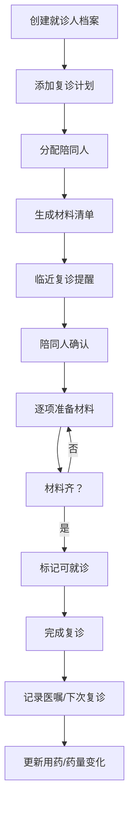

## 1. 产品概述

老人复诊陪同排班系统，帮助家庭协调老人复诊陪同安排，管理就诊材料准备和复诊记录，解决兄弟姐妹间排班扯皮、材料遗漏等问题。

- 目标用户：有老人需要定期复诊的家庭
- 核心价值：清晰的排班安排、材料清单管理、复诊记录追踪

## 2. 核心功能

### 2.1 用户角色
| 角色 | 描述 | 核心权限 |
|------|------|----------|
| 家庭成员 | 兄弟姐妹等陪同人 | 查看排班、确认陪同、标记材料准备 |

### 2.2 功能模块
1. **就诊人档案**：管理老人基本信息、疾病、医院、医生、用药备注
2. **复诊排班**：查看和管理复诊记录、分配陪同人
3. **材料准备**：检查清单、确认材料是否齐全
4. **复诊记录**：复诊后医嘱、下次复诊时间、药量变化
5. **统计面板**：陪同次数统计、待准备材料、未来一月就诊安排

### 2.3 页面详情
| 页面名称 | 模块名称 | 功能描述 |
|-----------|-------------|---------------------|
| 首页/仪表盘 | 统计概览 | 展示陪同次数、待准备材料、近期就诊安排 |
| 就诊人档案 | 档案列表/详情 | 新增/编辑就诊人信息，包含头像、疾病、医院等 |
| 复诊排班 | 排班日历/列表 | 查看复诊安排，分配陪同人，设置交通方式 |
| 材料准备 | 材料清单 | 勾选已准备材料，材料不齐无法标记完成 |
| 复诊记录 | 历史记录 | 记录医嘱、下次复诊时间、药量变化 |

## 3. 核心流程

## 4. 用户界面设计

### 4.1 设计风格
- **主色调**：温暖的珊瑚橙 (#FF6B6B) 搭配柔和的薄荷绿 (#4ECDC4)
- **辅助色**：米白背景 (#F7F9FC)、深灰文字 (#2C3E50)
- **按钮风格**：圆角胶囊形，柔和阴影，悬停微放大效果
- **字体**：使用 Noto Sans SC 中文优化字体，清晰易读
- **布局风格**：卡片式布局，柔和阴影，大量留白
- **图标风格**：线性图标，圆润线条

### 4.2 页面设计概述
| 页面名称 | 模块名称 | UI元素 |
|-----------|-------------|-------------|
| 首页 | 统计卡片 | 渐变色统计卡片、环形进度条、列表式即将就诊 |
| 就诊人档案 | 档案卡片 | 头像圆形裁切、信息标签、编辑按钮 |
| 复诊排班 | 时间线布局 | 时间轴、状态标签、陪同人头像 |
| 材料准备 | 清单勾选 | 复选框动画、进度条、禁用提交状态 |
| 复诊记录 | 卡片列表 | 医嘱文本框、日期选择器、药量变化标记 |

### 4.3 响应式
- 桌面端优先设计，支持平板和手机自适应
- 卡片在移动端变为单列堆叠
- 触控区域不小于44px

### 4.4 交互细节
- 材料勾选时有缩放动画
- 状态切换有颜色过渡
- 临近复诊的卡片有脉冲提醒动画
- 页面切换时的淡入过渡
