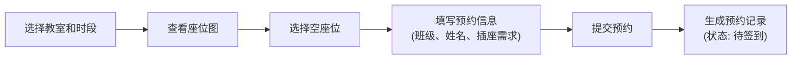
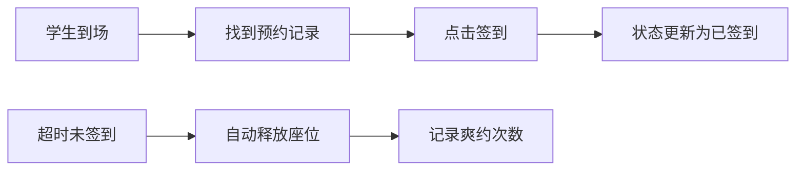
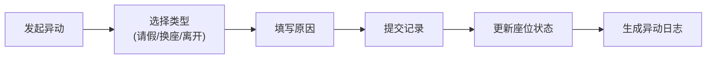

## 1. 产品概述

晚自习座位签到系统旨在解决晚自习教室座位资源紧张、学生占座不来、老师查空位麻烦的问题。通过数字化预约、签到和看板管理，实现座位资源的高效利用和透明化管理。目标用户为学生和值班老师，核心价值是提升座位利用率、减少占座浪费、简化管理流程。

## 2. 核心功能

### 2.1 用户角色

| 角色 | 登录方式 | 核心权限 |
|------|----------|----------|
| 学生 | 选择班级+姓名 | 预约座位、签到、请假、换座、提前离开 |
| 老师 | 选择值班老师 | 管理教室档案、查看看板、处理异常、手动释放座位 |

### 2.2 功能模块

1. **看板首页**：实时空位统计、未签到名单、连续爽约学生、各班使用率
2. **教室档案**：楼栋、房间、座位数、开放时间、值班老师、照片管理
3. **座位预约**：班级、姓名、日期、时段、是否需要插座
4. **签到管理**：到场签到、超时自动释放、手动释放
5. **异动记录**：临时请假、换座、提前离开记录

### 2.3 页面详情

| 页面名称 | 模块名称 | 功能描述 |
|----------|----------|----------|
| 看板首页 | 空位概览 | 显示各教室当前空位数、总座位数、使用率 |
| 看板首页 | 未签到名单 | 列出预约但未签到的学生，显示超时时间 |
| 看板首页 | 爽约记录 | 显示连续爽约学生名单及次数 |
| 看板首页 | 班级使用率 | 按班级统计座位使用率排行 |
| 教室管理 | 档案列表 | 展示所有教室卡片，包含照片和基本信息 |
| 教室管理 | 档案编辑 | 新增/编辑教室的楼栋、房间、座位数、开放时间、值班老师、照片 |
| 座位预约 | 预约表单 | 选择班级、姓名、日期、时段、是否需要插座 |
| 座位预约 | 座位图 | 可视化展示座位状态，点击选择座位 |
| 签到页面 | 签到列表 | 显示当前时段预约记录，支持签到操作 |
| 异动管理 | 请假/换座/离开 | 记录临时请假、换座申请、提前离开 |

## 3. 核心流程

### 3.1 座位预约流程

### 3.2 签到流程

### 3.3 异动处理流程

## 4. 用户界面设计

### 4.1 设计风格

- **主色调**：深蓝色 `#1e3a5f`（代表学术、稳重）
- **辅助色**：青色 `#0ea5e9`（操作按钮）、琥珀色 `#f59e0b`（警告）、绿色 `#10b981`（成功）、红色 `#ef4444`（危险）
- **中性色**：以 slate 色系为基础，确保阅读舒适度
- **按钮风格**：圆角12px，带微妙阴影，hover时有微缩放和阴影加深效果
- **字体**：标题使用 "Playfair Display" 衬线字体营造学术氛围，正文使用 "Noto Sans SC" 无衬线字体保证可读性
- **布局风格**：卡片式布局，清晰的网格系统，适度留白
- **图标**：使用 lucide-react 图标库，统一线性风格

### 4.2 页面设计概述

| 页面名称 | 模块名称 | UI元素 |
|----------|----------|--------|
| 看板首页 | 顶部导航 | 渐变色背景、logo、角色切换、时间显示 |
| 看板首页 | 统计卡片 | 4个大卡片展示核心指标，带微妙的渐变背景和悬停动效 |
| 看板首页 | 数据表格 | 斑马线表格，悬停高亮，状态标签使用不同颜色 |
| 看板首页 | 使用率图表 | 水平条形图，按班级排行，带渐变色填充 |
| 教室管理 | 教室卡片 | 网格布局，卡片显示教室照片、名称、座位数、状态标签 |
| 教室管理 | 表单弹窗 | 毛玻璃效果背景，表单分区，标签左对齐 |
| 座位预约 | 座位图 | 网格布局展示座位，不同颜色区分状态，点击选择 |
| 座位预约 | 预约表单 | 分步表单，下拉选择，复选框选项 |
| 签到页面 | 签到列表 | 时间线布局，签到按钮设计醒目 |

### 4.3 响应式设计

- 桌面端优先设计（1280px+），适配1920px大屏
- 平板端（768px-1279px）：调整网格列数，侧边栏可折叠
- 移动端（<768px）：单列布局，底部导航，简化操作
- 触摸优化：按钮最小44x44px，适当增加间距

### 4.4 视觉细节

- **背景**：使用微妙的网格纹理背景，营造学术感
- **卡片**：使用多层阴影创造深度，边框使用1px半透明白色
- **动效**：页面加载时的渐入动画、卡片悬停的微缩放、数据更新的平滑过渡
- **空状态**：设计友好的空状态插画，引导用户操作
- **加载状态**：使用骨架屏和脉冲动画
