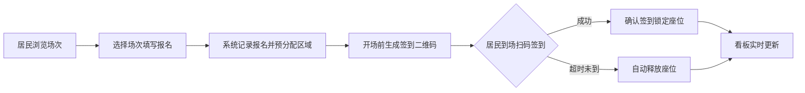

## 1. 产品概述
社区露天电影座椅分配管理系统，解决周末露天电影现场座椅乱排问题，实现场次档案管理、座椅库存管理、居民在线报名、扫码签到分配区域、实时数据看板等功能。
- 目标用户：社区工作人员（管理员）、社区居民
- 核心价值：规范露天电影座位秩序，提升居民观影体验，提高社区活动管理效率

## 2. 核心功能

### 2.1 用户角色
| 角色 | 登录方式 | 核心权限 |
|------|----------|----------|
| 社区管理员 | 账号密码（演示环境免登录） | 场次档案 CRUD、座椅库存管理、签到审核、看板查看、座位释放 |
| 社区居民 | 无需登录，填写报名信息 | 浏览场次、在线报名、扫码签到、查看座位分配 |

### 2.2 功能模块
1. **场次档案管理页**：场次列表、新增/编辑场次、场次详情
2. **座椅库存管理页**：库存概览、各类座椅数量维护、存放点管理
3. **居民报名页**：场次选择、报名表单（人数、老人小孩、无障碍位、联系方式）
4. **扫码签到页**：二维码生成、扫码签到、区域自动分配、迟到座位释放
5. **数据看板页**：已报名统计、未签到提醒、特殊座位需求、库存缺口预警、天气备选方案

### 2.3 页面详情
| 页面名称 | 模块名称 | 功能描述 |
|----------|----------|----------|
| 场次档案管理页 | 场次列表卡片 | 展示片名、日期、场地、天气、预计人数，支持搜索筛选 |
| 场次档案管理页 | 新增/编辑表单 | 片名、日期、场地、预计人数、天气、屏幕位置、照片上传 |
| 场次档案管理页 | 场次详情 | 完整场次信息、报名人数、签到进度、座位分配图 |
| 座椅库存管理页 | 库存总览 | 折叠椅、儿童椅、轮椅位、野餐垫数量统计卡片 |
| 座椅库存管理页 | 库存维护 | 增减数量、编辑存放点、低库存预警 |
| 居民报名页 | 场次选择 | 可选场次列表，显示剩余座位 |
| 居民报名页 | 报名表单 | 人数、老人数量、小孩数量、是否需要无障碍位、姓名、手机号 |
| 扫码签到页 | 签到二维码 | 每场专属签到二维码展示 |
| 扫码签到页 | 签到列表 | 报名人员列表、签到状态、分配区域、手动签到 |
| 扫码签到页 | 座位释放 | 迟到超过阈值自动释放，手动释放功能 |
| 数据看板页 | 统计概览 | 总报名数、已签到数、未签到数、签到率环形图 |
| 数据看板页 | 特殊需求 | 老人/小孩/无障碍位需求统计 |
| 数据看板页 | 库存缺口 | 实际需求 vs 库存对比，缺口高亮预警 |
| 数据看板页 | 天气方案 | 天气展示，雨天/高温备选方案提示 |

## 3. 核心流程
居民浏览场次 → 选择场次填写报名信息 → 系统记录报名并预分配区域 → 开场前生成签到二维码 → 居民扫码/管理员手动签到 → 系统确认签到并锁定座位 → 迟到超时自动释放座位 → 看板实时更新数据

## 4. 界面设计

### 4.1 设计风格
- **主色调**：深蓝绿 `#0d4f4f`（夏夜星空感）、暖橙 `#e0784f`（露天电影暖光感）
- **辅助色**：米白 `#faf6ef`、深棕 `#3a2e2a`、森林绿 `#4a7c59`
- **按钮风格**：圆角 12px，主色填充 + 细微阴影，hover 时轻微上浮
- **字体**：标题用「ZCOOL KuaiLe」展示字体，正文用「Noto Sans SC」无衬线体
- **布局风格**：卡片式布局，柔和阴影，圆角 16px，顶部导航 + 侧边菜单
- **图标风格**：Lucide 线性图标，配电影胶片、座椅、星空等氛围图标

### 4.2 页面设计概览
| 页面名称 | 模块名称 | UI 元素 |
|----------|----------|----------|
| 数据看板页 | 统计概览区 | 顶部渐变横幅（星空+电影主题），4 个大数字卡片带环形进度，入场动效错开出现 |
| 场次档案管理页 | 场次卡片网格 | 卡片悬停上浮，图片覆盖渐变遮罩，日期标签用丝带样式 |
| 座椅库存管理页 | 库存卡片 | 每个座椅类型独立卡片，数量大号显示，低库存时背景泛红警告 |
| 居民报名页 | 表单区域 | 分步表单样式，左侧步骤条，右侧表单内容，暖色调按钮 |
| 扫码签到页 | 二维码区域 | 大尺寸二维码居中，闪烁边框动画，签到状态用彩色标签 |

### 4.3 响应式
- 采用桌面端优先设计，侧边导航在平板/移动端折叠为汉堡菜单
- 卡片网格在窄屏自动换列（桌面 4 列 → 平板 2 列 → 手机 1 列）
- 表单区域自适应宽度，移动端输入框全宽排列

### 4.4 视觉细节
- 全局背景使用细腻的噪点纹理叠加米白色
- 卡片使用多层阴影营造纸张质感
- 顶部导航栏使用半透明毛玻璃效果
- 数字统计使用数字滚动动画
- 页面切换使用淡入+位移过渡
