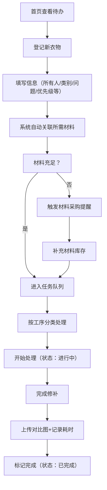

## 1. 产品概述

家庭缝补改衣排队管理系统，解决家中衣物修补（裤脚、纽扣、拉链等）零散存放容易遗忘的问题。目标用户是家庭主妇/主夫、手工爱好者，帮助系统化管理衣物修补任务，追踪进度，提醒材料采购。

## 2. 核心功能

### 2.1 用户角色
| 角色 | 注册方式 | 核心权限 |
|------|---------|---------|
| 家庭用户 | 无需注册，本地使用 | 衣物登记、任务管理、材料管理、查看统计 |

### 2.2 功能模块
1. **首页仪表板**：本周待处理统计、快到期提醒、长期拖着没动的衣物、缺材料采购提醒
2. **衣物登记**：录入衣物信息（所有人、类别、问题类型、优先级、洗后改、照片、截止日期）
3. **任务队列**：按工序（缝扣、补洞、改裤长、换拉链、熨烫）分类展示，支持排序和状态流转
4. **材料管理**：线色、纽扣、拉链、备用布库存管理，缺材料自动提醒
5. **完成记录**：上传对比照片、记录耗时、查看历史完成情况

### 2.3 页面详情
| 页面名称 | 模块名称 | 功能描述 |
|---------|---------|---------|
| 首页仪表板 | 统计卡片 | 显示待处理总数、本周待处理、快到期、长期搁置数量 |
| 首页仪表板 | 任务列表预览 | 按优先级展示紧急和快到期的任务 |
| 首页仪表板 | 材料提醒 | 显示库存不足需要采购的材料 |
| 衣物登记 | 表单录入 | 所有人、衣物类别、问题类型、优先级、洗后改开关、照片上传、截止日期 |
| 衣物登记 | 材料关联 | 自动关联所需材料，检查库存 |
| 任务队列 | 分类标签 | 按工序分类：缝扣、补洞、改裤长、换拉链、熨烫 |
| 任务队列 | 任务卡片 | 显示衣物信息、优先级、截止日期、材料状态 |
| 任务队列 | 状态流转 | 待处理 → 进行中 → 已完成 |
| 任务队列 | 排序功能 | 按优先级、截止日期、创建时间排序 |
| 材料管理 | 库存列表 | 线色、纽扣、拉链、备用布的库存管理 |
| 材料管理 | 低库存提醒 | 库存低于阈值时标红提醒采购 |
| 完成记录 | 完成表单 | 上传前后对比图、记录耗时、填写备注 |
| 完成记录 | 历史列表 | 查看已完成的衣物修补记录 |

## 3. 核心流程

用户从首页看到需要处理的衣物，点击登记新衣物，填写详细信息后进入任务队列。用户按工序分类处理任务，处理前检查材料是否充足，完成后上传对比图并记录耗时。

## 4. 用户界面设计

### 4.1 设计风格
- **主色调**：暖橙色（#FF7A45）代表温暖、手工、家庭感
- **辅助色**：抹茶绿（#96CEB4）表示完成、健康；珊瑚红（#FF6B6B）表示紧急、提醒
- **中性色**：米白（#FFF8F0）背景，深棕（#4A4A4A）文字
- **按钮风格**：圆角胶囊形，轻微阴影，悬停时有缩放动效
- **字体**：标题用"Zen Kaku Gothic New"（温暖圆润的日式字体），正文用"Noto Sans SC"
- **布局风格**：卡片式布局，柔和圆角（16px），细腻阴影
- **图标风格**：手绘线稿风格图标，配合emoji增强亲和力

### 4.2 页面设计概述
| 页面名称 | 模块名称 | UI元素 |
|---------|---------|--------|
| 首页仪表板 | 统计卡片 | 渐变色背景，大号数字，微型动画 |
| 首页仪表板 | 任务列表 | 卡片横向排列，优先级用颜色区分（红色紧急，橙色普通） |
| 首页仪表板 | 材料提醒 | 红色圆点标记，可点击跳转到材料管理 |
| 衣物登记 | 表单 | 分段式表单，带图标标签，清晰的必填提示 |
| 任务队列 | 分类标签 | 横向滚动标签，选中态有底色和下划线动效 |
| 任务队列 | 任务卡片 | 悬停上浮效果，拖拽排序（可选） |
| 材料管理 | 库存列表 | 网格布局，库存条可视化，低库存闪烁提醒 |
| 完成记录 | 对比图 | 左右滑动对比组件，时间轴展示历史 |

### 4.3 响应式设计
- 桌面端优先（1440px），自适应到平板和移动端
- 移动端：卡片改为单列，底部导航栏，手势操作支持
- 触摸优化：按钮最小44x44px，列表项触控区域充足

### 4.4 动效设计
- 页面加载：元素错落出现（staggered reveal），延迟50ms递增
- 卡片悬停：轻微上浮（translateY(-4px)），阴影加深
- 状态变更：颜色渐变过渡（300ms ease-out）
- 完成动画：轻微的庆祝动效（缩放+淡入）
