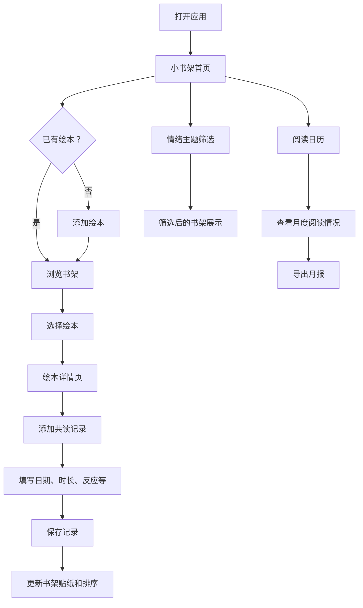

## 1. 产品概述

儿童绘本共读记录应用——帮助家长每天读完一本绘本后顺手记录共读体验。通过小书架、阅读日历、共读时间线等可视化方式，让亲子阅读轨迹清晰可见，并支持按情绪主题筛选绘本和导出亲子阅读月报。

- 目标用户：3-8岁儿童家长
- 核心价值：让阅读记录变得轻松有趣，帮助家长发现孩子阅读偏好与成长变化

## 2. 核心功能

### 2.1 用户角色

| 角色 | 注册方式 | 核心权限 |
|------|----------|----------|
| 家长 | 无需注册，本地使用 | 绘本管理、共读记录、月报导出 |

### 2.2 功能模块

1. **小书架首页**：绘本卡片展示、贴纸标记、情绪主题筛选、快捷添加
2. **绘本详情页**：绘本信息、共读时间线、添加共读记录
3. **阅读日历页**：月历视图、每日阅读标记、阅读统计
4. **月报导出**：生成亲子阅读月报图片

### 2.3 页面详情

| 页面名称 | 模块名称 | 功能描述 |
|----------|----------|----------|
| 小书架首页 | 书架展示区 | 以卡片形式展示所有绘本，读过的书显示小贴纸，常读的排前面 |
| 小书架首页 | 情绪主题筛选栏 | 横向滚动标签，按"害怕、分享、上幼儿园、睡觉、勇气、友谊、情绪管理、自然"等主题筛选 |
| 小书架首页 | 添加绘本按钮 | 弹出添加绘本表单 |
| 添加绘本弹窗 | 绘本信息表单 | 填写书名、作者、主题标签、适合年龄、页数、封面图片、大人备注 |
| 绘本详情页 | 绘本信息卡 | 显示绘本封面、书名、作者、主题、适合年龄、页数、大人备注 |
| 绘本详情页 | 共读时间线 | 纵向时间轴展示每次共读记录，可看到同一本书孩子反应的变化 |
| 绘本详情页 | 添加共读记录 | 弹出表单：日期、读了多久、孩子反应、喜欢的角色、问了什么问题、专注度评分、开心程度评分 |
| 阅读日历页 | 月历视图 | 日历网格，有阅读的日期有月亮标记，点击可看当日共读详情 |
| 阅读日历页 | 月度统计 | 本月共读次数、共读时长、读了多少本不同的书 |
| 月报导出 | 月报生成 | 生成一张精美的亲子阅读月报图片，包含统计数据和亮点，可保存分享 |

## 3. 核心流程

用户首次使用时，先添加绘本到书架，然后每次共读后在对应绘本下添加共读记录。首页小书架展示所有绘本，通过贴纸和排序体现阅读状态。日历页提供宏观的阅读频率视角，详情页的共读时间线提供微观的阅读变化视角。月报则是对一个月阅读的总结。

## 4. 用户界面设计

### 4.1 设计风格

- 主色调：暖米色（#FFF8F0）、焦糖棕（#C4854C）、柔粉（#F5C6C6）
- 辅助色：薄荷绿（#A8D5BA）、淡蓝（#B8D4E3）、暖黄（#F5E6A3）
- 按钮风格：圆角大按钮，微阴影，温暖手感
- 字体：标题用手写风格字体（如 ZCOOL XiaoWei），正文用清晰易读的圆润字体（如 Noto Sans SC）
- 布局风格：卡片式布局，圆角、柔和阴影、温暖纹理背景
- 图标风格：圆润可爱的线条图标，搭配贴纸和星星装饰元素

### 4.2 页面设计概览

| 页面名称 | 模块名称 | UI元素 |
|----------|----------|--------|
| 小书架首页 | 书架展示区 | 木质纹理背景、绘本卡片（封面+书名+贴纸）、瀑布流/网格布局 |
| 小书架首页 | 情绪主题筛选栏 | 横向滚动药丸标签、选中态高亮、每个主题配小图标 |
| 小书架首页 | 添加绘本按钮 | 右下角浮动按钮，温暖色调 |
| 添加绘本弹窗 | 绘本信息表单 | 模态弹窗、圆润输入框、主题多选标签、封面上传区 |
| 绘本详情页 | 绘本信息卡 | 大封面、信息标签、大人备注卡片 |
| 绘本详情页 | 共读时间线 | 纵向时间轴、连线、每条记录气泡卡片、表情评分 |
| 绘本详情页 | 添加共读记录 | 底部弹窗、滑块评分（专注度/开心度）、文本输入 |
| 阅读日历页 | 月历视图 | 日历网格、月亮/星星标记、点击弹出当日记录 |
| 阅读日历页 | 月度统计 | 顶部统计卡片、数字大号展示 |
| 月报导出 | 月报生成 | 预览卡片、导出按钮、精美排版 |

### 4.3 响应式设计

- 桌面优先设计，适配平板和手机
- 手机端：单列布局，底部导航栏
- 平板/桌面端：多列卡片网格，侧边导航

### 4.4 动效设计

- 书架卡片入场：交错渐入动画
- 添加贴纸：弹跳缩放动画
- 日历标记：月亮升起动画
- 时间线：滚动渐入动画
- 页面切换：淡入淡出过渡
