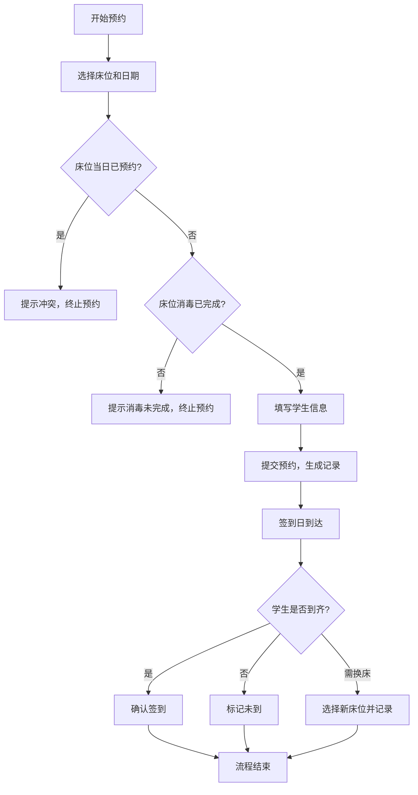

## 1. 产品概述

低年级午休床位预约管理系统，解决传统纸质排床效率低、易冲突、难追踪的问题。实现床位档案数字化、学生预约智能化、签到流程化和数据统计可视化，为学校后勤管理提供高效工具。

- 核心目标：消除床位重复预约、确保消毒合规、提升管理效率
- 目标用户：低年级班主任、生活老师、后勤管理人员

## 2. 核心功能

### 2.1 用户角色

| 角色 | 说明 | 核心权限 |
|------|------|----------|
| 管理员 | 后勤/生活老师 | 全部功能：床位管理、预约审批、签到登记、数据统计 |

### 2.2 功能模块

1. **床位管理**：床位档案CRUD、消毒状态管理、床位照片上传
2. **预约管理**：学生预约登记、床位冲突检测、消毒状态校验、预约列表
3. **签到管理**：签到确认、未到记录、临时换床操作、签到状态追踪
4. **统计分析**：班级使用量统计、空床率分析、消毒漏检床位清单

### 2.3 页面详情

| 页面名称 | 模块名称 | 功能描述 |
|-----------|-------------|---------------------|
| 首页仪表盘 | 统计概览 | 今日预约数、已签到数、空床数、待消毒床位快速预览 |
| 床位管理 | 床位列表 | 房间/床号筛选、上下铺/靠窗/消毒状态标签展示 |
| 床位管理 | 床位表单 | 房间、床号、上下铺、是否靠窗、消毒状态、照片上传 |
| 预约管理 | 预约日历 | 按日期查看床位占用情况，可视化床位状态 |
| 预约管理 | 预约表单 | 班级、姓名、日期、午休时段、过敏备注、家长确认 |
| 预约管理 | 冲突提示 | 同一床位同日重复预约拦截、消毒未完成床位禁用 |
| 签到管理 | 签到列表 | 当日预约学生列表，批量/单个签到操作 |
| 签到管理 | 换床记录 | 临时换床登记，记录原床位和新床位 |
| 统计分析 | 使用量统计 | 按班级维度统计预约人次和使用率 |
| 统计分析 | 空床率分析 | 按日期/房间统计空床数量和空床率 |
| 统计分析 | 消毒漏检 | 列出未按规定消毒或消毒状态过期的床位 |

## 3. 核心流程

### 3.1 床位预约流程
管理员录入学生预约信息 → 系统校验床位当日是否已被预约 → 系统校验床位消毒状态是否达标 → 校验通过生成预约记录 / 校验失败提示冲突原因

### 3.2 签到流程
管理员进入当日签到页面 → 勾选学生完成签到 / 标记未到 → 如需换床则选择新床位并记录 → 系统更新预约状态

### 3.3 流程图

## 4. 用户界面设计

### 4.1 设计风格
- 主色调：温暖的青绿 `#0D9488`（代表安全、卫生），辅助色：柔和橙 `#F97316`（提醒）
- 按钮风格：圆角胶囊按钮，悬浮时轻微上浮和阴影加深
- 字体：标题使用思源宋体增强校园人文感，正文使用思源黑体保证可读性
- 布局风格：卡片式布局，顶部导航 + 侧边菜单，清爽的教育类后台风格
- 图标风格：Lucide 线性图标，统一 18px 尺寸

### 4.2 页面设计概览

| 页面名称 | 模块名称 | UI元素 |
|-----------|-------------|-------------|
| 首页仪表盘 | 统计卡片 | 4个大数字卡片带图标，渐变色背景，数字动画计数 |
| 床位管理 | 床位网格 | 卡片网格布局，状态标签（消毒/靠窗/上下铺）彩色徽标 |
| 预约管理 | 日历视图 | 日历格子 + 床位占用热力图，冲突用红色边框高亮 |
| 签到管理 | 签到列表 | 行内操作按钮，签到成功显示绿色对勾动画 |
| 统计分析 | 图表区 | 柱状图展示班级使用量，饼图展示空床率 |

### 4.3 响应式
桌面端优先设计（1280px+），平板端自适应（768px+），侧边栏可折叠为图标模式。
