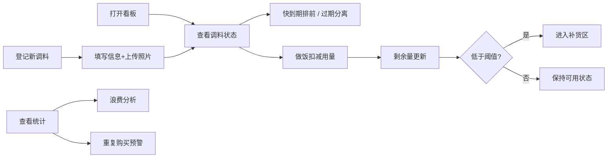

## 1. 产品概述

厨房调料管家是一款帮助家庭管理开封调料的应用，解决调料开封后忘记过期时间、重复购买、浪费严重的问题。通过记录调料信息、追踪保质期、管理用量和统计分析，让厨房调料管理变得井然有序。

## 2. 核心功能

### 2.1 用户角色
| 角色 | 注册方式 | 核心权限 |
|------|----------|----------|
| 家庭成员 | 无需注册，本地存储 | 登记调料、查看看板、扣减用量、查看统计 |

### 2.2 功能模块
1. **调料登记页**：表单录入调料信息，支持照片上传
2. **调料看板页**：按保质期排序展示，快到期排前，过期独立分区
3. **补货区**：自动收纳快空的调料，支持标记已补货
4. **统计面板**：浪费类别分析、重复购买预警、用量统计

### 2.3 页面详情
| 页面名称 | 模块名称 | 功能描述 |
|----------|----------|----------|
| 调料看板 | 状态筛选标签 | 全部/可用/快到期/过期/补货 五种状态切换 |
| 调料看板 | 调料卡片列表 | 展示调料照片、名称、品牌、剩余量、剩余天数、状态标签 |
| 调料看板 | 快速扣减按钮 | 点击扣减常用用量，支持自定义用量 |
| 调料登记 | 信息表单 | 调料名、品牌、开封日期、建议用完天数、存放位置、剩余量、类别 |
| 调料登记 | 照片上传 | 支持拍照或从相册选择瓶身照片 |
| 补货区 | 补货列表 | 展示剩余量低于阈值的调料，支持一键补货 |
| 统计面板 | 浪费分析 | 按类别统计过期浪费的调料数量和金额 |
| 统计面板 | 重复购买 | 识别同品牌同名称的调料，提示重复购买风险 |
| 统计面板 | 用量趋势 | 展示各类别调料的消耗速度 |

## 3. 核心流程

用户打开应用后，首先看到调料看板，按保质期紧急程度排列调料。做饭时找到对应的调料，点击扣减用量。当调料快空时自动进入补货区，方便下次采购时对照。定期查看统计面板，了解哪些类别浪费最多、哪些调料容易买重复，优化采购习惯。

## 4. 用户界面设计

### 4.1 设计风格
- **主色调**：温暖的橙棕色系（#E67E22 主色），搭配深棕色文字，营造厨房温暖氛围
- **辅助色**：绿色（#27AE60）表示正常，黄色（#F39C12）表示快到期，红色（#E74C3C）表示过期
- **按钮风格**：圆润的胶囊形按钮，带有微妙的阴影和悬浮效果
- **字体**：标题使用圆润友好的字体，正文清晰易读
- **布局风格**：卡片式布局，柔和圆角，轻阴影，层次分明
- **图标风格**：线性+填充结合的可爱风格图标，使用 emoji 增强亲和力

### 4.2 页面设计概览
| 页面名称 | 模块名称 | UI 元素 |
|----------|----------|---------|
| 调料看板 | 顶部导航 | 应用标题、统计入口、添加按钮 |
| 调料看板 | 状态标签栏 | 横向滚动的筛选标签，选中态有底色 |
| 调料看板 | 调料卡片 | 左侧缩略图，右侧名称/品牌/剩余量/天数进度条 |
| 调料登记 | 表单页 | 分组表单，输入框带图标，照片上传区域醒目 |
| 补货区 | 补货卡片 | 勾选框样式，支持批量标记已补货 |
| 统计面板 | 图表区域 | 柱状图展示浪费类别，列表展示重复购买 |

### 4.3 响应式
桌面优先设计，支持移动端自适应。调料卡片在桌面端两列排列，移动端单列。表单元素在移动端全宽展示。

### 4.4 动效设计
- 页面加载时卡片依次淡入上移（staggered animation）
- 扣减用量时数字滚动变化
- 状态标签切换时有平滑过渡
- 悬停时卡片轻微上浮，阴影加深
