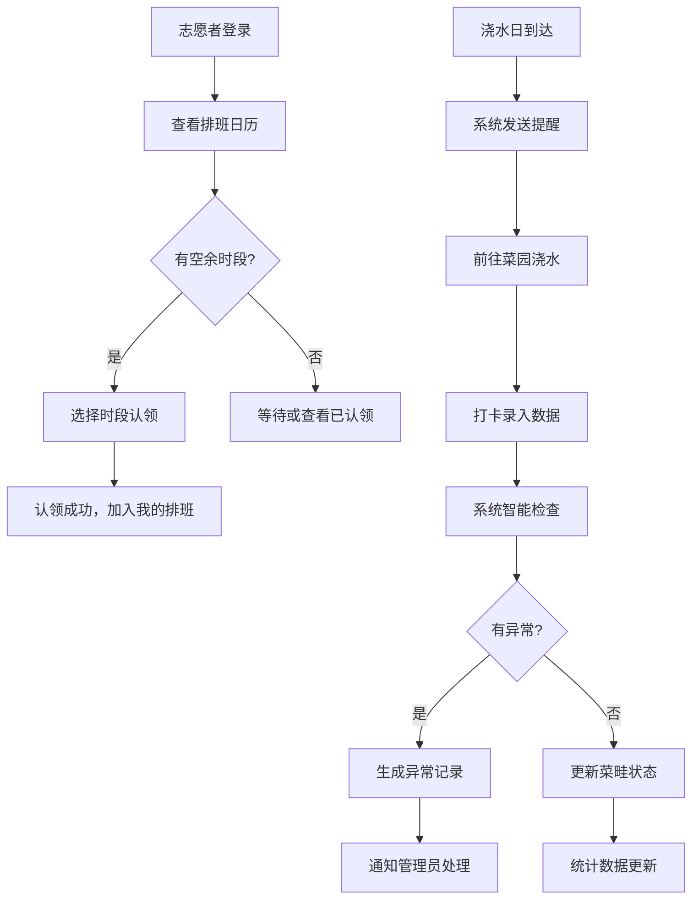

## 1. 产品概述

共享菜园浇水排班系统，解决社区共享菜园中浇水责任不清、重复浇水或漏浇导致作物生长不良的问题。通过系统化的排班、打卡和智能提醒机制，确保每块菜畦得到恰当的照料，同时提供数据看板辅助管理决策。

### 1.1 核心价值
- 解决"多人浇水=没人浇水"的公地悲剧
- 通过智能提醒降低管理成本
- 数据化管理作物生长状态和用水情况
- 提升志愿者参与感和责任感

## 2. 核心功能

### 2.1 用户角色

| 角色 | 注册方式 | 核心权限 |
|------|---------|---------|
| 管理员 | 系统预设 | 菜畦档案管理、志愿者管理、异常处理、数据统计 |
| 志愿者 | 自主注册/管理员添加 | 认领时段、打卡记录、查看排班、个人中心 |

### 2.2 功能模块

1. **看板首页**：今日排班概览、缺人时段提醒、作物长势展示、可采摘清单、用水统计图表
2. **菜畦档案**：菜畦列表、新增/编辑菜畦、详情查看、照片管理
3. **排班管理**：时段认领、排班日历、我的排班
4. **打卡记录**：浇水打卡、数据录入（浇水量、湿度、虫害等）、历史记录
5. **异常中心**：异常列表（重复浇水、漏浇、病虫害）、异常处理、统计分析
6. **个人中心**：个人信息、认领记录、贡献统计

### 2.3 页面详情

| 页面名称 | 模块名称 | 功能描述 |
|---------|---------|---------|
| 看板首页 | 今日排班卡片 | 展示今日需要浇水的时段和志愿者，状态标签（已完成/进行中/待认领） |
| 看板首页 | 缺人时段提醒 | 高亮显示尚未认领的时段，支持快速认领 |
| 看板首页 | 作物长势面板 | 按菜畦展示作物生长状态（幼苗/生长中/成熟/待采收） |
| 看板首页 | 可采摘清单 | 列出已成熟可采摘的作物，包含菜畦编号、作物名称、预计产量 |
| 看板首页 | 用水统计图表 | 柱状图展示本周每日用水量，折线图展示月度趋势 |
| 菜畦档案 | 菜畦列表 | 卡片式展示所有菜畦，支持按作物、种植人筛选 |
| 菜畦档案 | 菜畦表单 | 录入编号、种植人、作物、播种日期、浇水频率、遮阴情况，上传照片 |
| 菜畦档案 | 菜畦详情 | 展示完整档案信息、历史浇水记录、生长照片时间线 |
| 排班管理 | 排班日历 | 周视图展示所有时段，色块区分已认领/待认领/已完成 |
| 排班管理 | 时段认领 | 点击空闲时段弹出认领确认，显示菜畦信息和浇水要求 |
| 打卡记录 | 打卡表单 | 选择菜畦、录入浇水量、土壤湿度、虫害情况、杂草情况、采摘情况 |
| 打卡记录 | 智能提示 | 下雨天显示"今日有雨，可跳过浇水"提示；高温天气显示加密提醒 |
| 异常中心 | 异常列表 | 分类展示重复浇水、漏浇、病虫害异常，支持标记处理 |
| 个人中心 | 我的信息 | 展示志愿者信息、总贡献时长、浇水次数排行榜 |

## 3. 核心流程

### 3.1 浇水排班流程

志愿者进入系统查看排班日历 → 选择空闲时段认领 → 系统确认认领成功 → 浇水日当天收到提醒 → 到达菜园进行浇水 → 打开打卡页面录入数据 → 系统检查是否异常（重复浇水等）→ 提交完成，更新菜畦状态

### 3.2 异常检测流程

每次打卡提交后 → 系统检查24小时内该菜畦是否已有浇水记录（重复浇水） → 检查是否超过浇水频率24小时未浇水（漏浇） → 检查虫害/杂草登记是否超标 → 生成异常记录并推送给管理员

### 3.3 Mermaid 流程图

## 4. 用户界面设计

### 4.1 设计风格

**设计基调：有机自然风格**

- **主色调**：
  - 深绿色 `#2D5A27`（代表成熟的植物叶片）
  - 翠绿色 `#4CAF50`（代表生机勃勃的生长）
- **辅助色**：
  - 土棕色 `#8B6914`（代表土壤）
  - 天蓝色 `#87CEEB`（代表天空/雨水）
  - 暖橙色 `#FF8C42`（代表阳光/高温提醒）
- **中性色**：
  - 米白色 `#FAF8F0`（背景，像田园的感觉）
  - 深灰色 `#2C3E2C`（文字）

**按钮风格**：圆润边角（border-radius: 12px），带有微妙的阴影，悬停时有轻微上浮效果和绿色加深。

**字体**：
- 标题：`"Noto Serif SC"` 衬线字体，传达自然、有机的感觉
- 正文：`"Noto Sans SC"` 无衬线字体，保证可读性

**布局风格**：卡片式布局，每个模块有柔和的阴影和圆角，卡片间有充足的留白。顶部固定导航栏，左侧可折叠菜单。

**图标风格**：使用 lucide-react 图标，配合自然主题的emoji（🌱、💧、☀️、🌿、🍅）增强亲切感。

### 4.2 页面设计概述

| 页面名称 | 模块名称 | UI元素 |
|---------|---------|--------|
| 看板首页 | 顶部统计栏 | 4个数据卡片（今日待浇水、已完成、缺人时段、异常数），带动画计数 |
| 看板首页 | 排班时间表 | 时间轴布局，按小时展示今日排班，状态用不同颜色圆点标识 |
| 看板首页 | 作物长势网格 | 菜畦卡片网格，每个卡片包含作物emoji、生长进度条、下次浇水时间 |
| 看板首页 | 可采摘侧边栏 | 右侧固定宽度面板，带轻微绿色渐变背景，列表项有采摘emoji |
| 看板首页 | 用水统计图 | 底部双图表区域，柱状图+折线图，绿色渐变填充 |
| 菜畦档案 | 筛选工具栏 | 搜索框+下拉筛选，圆角设计，悬浮状态 |
| 菜畦档案 | 菜畦卡片网格 | 3列网格，卡片悬停放大，展示照片缩略图 |
| 菜畦档案 | 详情抽屉 | 右侧滑出抽屉，展示完整信息和照片时间线 |
| 排班管理 | 日历头部 | 周切换按钮+日期选择器，突出显示今天 |
| 排班管理 | 日历格子 | 每个时段一个方块，已认领绿色，待认领米白，已完成深绿带勾 |
| 打卡记录 | 打卡表单 | 大输入框，明显的提交按钮，数据输入有即时反馈 |
| 打卡记录 | 天气提示条 | 顶部横幅，雨天蓝色背景+雨滴图标，高温橙色背景+太阳图标 |
| 异常中心 | 异常标签页 | 三个标签页（重复浇水、漏浇、病虫害），选中有绿色下划线 |
| 异常中心 | 异常卡片 | 红色边框提示未处理，绿色边框已处理，有处理按钮 |

### 4.3 响应式设计

- **桌面端**（>1024px）：完整布局，左侧菜单+主内容区+右侧信息栏
- **平板端**（768-1024px）：左侧菜单可折叠，右侧信息栏合并到主内容区
- **移动端**（<768px）：底部导航栏，卡片单列布局，日历简化为列表

### 4.4 动效设计

- 页面加载：元素依次淡入，顶部导航先出现，然后内容卡片从下往上滑入
- 卡片悬停：轻微上浮（transform: translateY(-4px)），阴影加深
- 按钮点击：缩放效果（scale: 0.95），配合绿色波纹
- 数据更新：数字跳动动画，新记录从右侧滑入
- 异常提示：红色边框脉冲动画（pulse）引起注意
