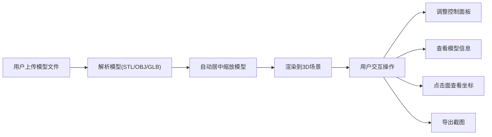

# 3D模型查看器 PRD

## 1. 产品概述

3D模型查看器是一款基于Web的专业3D模型浏览工具，支持STL、OBJ、GLB等主流3D格式。用户可以上传模型文件，通过直观的交互方式旋转、缩放、平移视角，并进行多种视觉效果调整。适用于设计师、工程师、3D艺术家等需要快速预览3D模型的专业人群。

- 核心价值：无需安装专业软件，在浏览器中即可查看和分析3D模型
- 目标用户：设计师、工程师、3D艺术家、教育工作者

## 2. 核心功能

### 2.1 功能模块

1. **3D场景渲染**：Three.js + OrbitControls实现高质量3D渲染和交互
2. **模型上传解析**：支持STL、OBJ、GLB格式文件上传和自动解析
3. **左侧控制面板**：背景色、灯光、渲染模式、材质颜色、辅助开关
4. **右侧信息面板**：顶点数、面数、文件大小、包围盒尺寸实时显示
5. **截图导出**：一键导出当前视角为PNG图片
6. **点击交互**：点击面高亮显示并展示三维坐标气泡

### 2.2 页面详情

| 页面名称 | 模块名称 | 功能描述 |
|---------|---------|---------|
| 主页面 | 3D画布区域 | 全屏Canvas渲染，支持鼠标交互（左键旋转、滚轮缩放、右键平移） |
| 主页面 | 顶部上传区 | 文件上传按钮，支持拖拽上传，格式过滤 |
| 主页面 | 左侧控制面板 | 背景色选择、灯光强度滑块、渲染模式切换、材质颜色、辅助开关 |
| 主页面 | 右侧信息面板 | 模型统计信息展示、包围盒尺寸 |
| 主页面 | 截图功能 | 一键截图导出PNG，文件名带时间戳 |
| 主页面 | 点击高亮 | 射线检测、面高亮、坐标气泡显示 |

## 3. 核心流程

## 4. 用户界面设计

### 4.1 设计风格

- **设计方向**：科技感深色主题，专业工具风格
- **主色调**：深蓝渐变 (#1a1a2e → #16213e)，营造专业科技氛围
- **强调色**：青色 (#00d9ff) 用于交互元素和高亮效果
- **面板背景**：半透明深色毛玻璃效果 (rgba(20, 25, 40, 0.85))
- **字体**：现代无衬线字体 - Inter (UI) + JetBrains Mono (数字显示)
- **布局**：三栏布局（左控制面板 + 中间画布 + 右信息面板）+ 顶部工具栏

### 4.2 页面设计概述

| 页面名称 | 模块名称 | UI元素 |
|---------|---------|---------|
| 主页面 | 顶部工具栏 | 上传按钮（拖放区域）、截图按钮、状态指示器 |
| 主页面 | 左侧控制面板 | 分组折叠面板、色板选择器、滑块控件、单选按钮组、开关组件 |
| 主页面 | 右侧信息面板 | 数据卡片、键值对展示、实时数值更新动画 |
| 主页面 | 坐标气泡 | 浮动卡片、带箭头指示器、三维坐标格式化显示 |

### 4.3 响应式设计

- 桌面端：完整三栏布局，面板宽度固定
- 平板端：面板可折叠收起，通过侧边按钮呼出
- 移动端：单列布局，优先保证画布区域，控制面板转为浮动抽屉

### 4.4 3D场景指导

- **环境**：深色背景配合柔和雾化效果，突出模型主体
- **光照**：三光源系统（环境光 + 主方向光 + 补光），支持强度调节
- **相机**：PerspectiveCamera，视野角度60度，近裁剪面0.1，远裁剪面1000
- **辅助元素**：RGB坐标轴、网格地面（可开关）
- **后期效果**：抗锯齿 (MSAA)、色调映射
