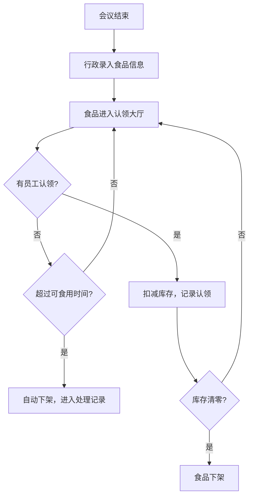

## 1. 产品概述

茶歇会后剩余食品认领系统，解决会议结束后剩余水果、点心、饮料浪费问题。行政人员录入剩余食品信息，员工可自助认领，通过智能化管理减少食物浪费。

- **核心问题**：会后剩余食品丢弃浪费，放茶水间无人知晓是否可取
- **目标用户**：行政人员（录入管理）、公司员工（认领食品）、管理层（数据统计）
- **产品价值**：减少食物浪费，提升员工福利，精细化管理茶歇成本

## 2. 核心功能

### 2.1 用户角色

| 角色 | 使用方式 | 核心权限 |
|------|----------|----------|
| 员工 | 网页访问 | 浏览可认领食品、提交认领申请、查看认领记录 |
| 行政人员 | 网页访问 | 录入剩余食品、管理食品状态、查看处理记录 |
| 管理员 | 网页访问 | 查看统计报表、部门剩余排行、食品浪费分析 |

### 2.2 功能模块

1. **食品认领大厅**：展示所有可认领食品列表，支持筛选和搜索
2. **食品录入**：行政人员录入剩余食品信息（品类、数量、过敏原、照片等）
3. **认领功能**：员工选择份数、取走时间、所属部门进行认领
4. **智能下架**：开封食品超过可食用时间自动下架
5. **过敏原警示**：含坚果或乳制品食品进行显眼标注
6. **处理记录**：记录无人认领的食品处理情况
7. **数据统计**：部门剩余排行、常没人领食品、今日安全可取数量

### 2.3 页面详情

| 页面名称 | 模块名称 | 功能描述 |
|-----------|-------------|---------------------|
| 认领大厅 | 食品卡片列表 | 展示可认领食品，显示名称、数量、过敏原标签、剩余时间 |
| 认领大厅 | 筛选搜索 | 按品类、是否开封、过敏原筛选 |
| 认领详情 | 食品信息展示 | 完整食品信息、照片、过敏原警示 |
| 认领详情 | 认领表单 | 选择份数、取走时间、部门 |
| 食品录入 | 录入表单 | 会议室、结束时间、品类、数量、是否开封、过敏原、照片上传 |
| 管理后台 | 统计看板 | 部门剩余排行、常没人领食品、今日可取数量 |
| 管理后台 | 处理记录 | 查看所有过期/处理的食品记录 |
| 我的认领 | 认领记录 | 查看个人认领历史 |

## 3. 核心流程

### 3.1 行政录入流程
行政人员在会议结束后，进入录入页面填写会议室、结束时间、食品品类、数量、是否开封、过敏原信息，上传照片后提交，食品自动进入认领大厅。

### 3.2 员工认领流程
员工浏览认领大厅，选择心仪食品进入详情页，填写认领份数、取走时间和所属部门后提交认领，系统扣减库存。

### 3.3 自动下架流程
系统实时检查开封食品的可食用时间，超过安全时限的食品自动下架并进入处理记录。

## 4. 用户界面设计

### 4.1 设计风格
- **主色调**：暖橙色系（#FF7A45 为主色），传递温暖、食物、分享的感觉
- **辅助色**：柔和的米白色背景，深咖啡色文字
- **警示色**：红色用于过敏原标注，绿色用于安全可领
- **卡片风格**：圆角卡片，柔和阴影，悬停微放大效果
- **字体**：使用现代无衬线字体，标题粗体有力，正文清晰易读
- **图标风格**：线性图标，搭配食物相关 emoji 增加亲和力

### 4.2 页面设计概述

| 页面名称 | 模块名称 | UI 元素 |
|-----------|-------------|-------------|
| 认领大厅 | 顶部导航 | Logo、导航菜单、角色切换、今日统计 |
| 认领大厅 | 筛选栏 | 品类筛选、过敏原筛选、排序选项 |
| 认领大厅 | 食品卡片网格 | 图片、名称、数量、过敏原标签、倒计时、认领按钮 |
| 食品录入 | 表单布局 | 分组表单、图片上传区、过敏原多选 |
| 统计后台 | 数据看板 | 统计卡片、排行列表、趋势图表 |
| 认领详情 | 弹窗/页面 | 大图展示、详细信息、过敏原警示、认领表单 |

### 4.3 响应式设计
- 桌面端优先设计，采用网格布局展示食品卡片
- 平板端自适应列数，保持良好间距
- 移动端单列布局，优化触摸区域

### 4.4 动画与交互
- 页面加载时卡片淡入上浮，依次错开时间
- 悬停卡片轻微上浮，阴影加深
- 认领成功有弹跳动效
- 过敏原标签呼吸闪烁效果
- 倒计时接近结束时颜色渐变警示
