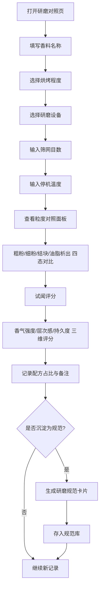

## 1. 产品概述
香料店咖喱粉研磨粒度对照页——为香料调配师傅提供研磨参数记录、粒度差异可视化和试闻评分的工具，最终沉淀为可复用的研磨规范。
- 解决香料研磨记录散乱、粒度差异难以直观比较、经验难以复用的问题
- 目标用户为香料店调配师傅，核心价值是将隐性经验显性化、规范化

## 2. 核心功能

### 2.2 功能模块
1. **研磨记录页**：香料名称录入、烘烤程度选择、研磨设备选择、筛网目数输入、停机温度输入
2. **粒度对照面板**：粗粉/细粉/结块/油脂析出四种粒度状态的可视化展示与差异对比
3. **试闻评分模块**：香气强度、层次感、持久度三维评分，配方占比备注
4. **研磨规范库**：将记录沉淀为可复用规范，支持查看、筛选、导出

### 2.3 页面详情
| 页面名称 | 模块名称 | 功能描述 |
|----------|----------|----------|
| 研磨记录页 | 基本信息表单 | 录入香料名称、选择烘烤程度（生/微烘/中烘/深烘/焦烘）、研磨设备（石磨/钢磨/陶瓷磨/手动研磨器）、筛网目数（20-200目）、停机温度（℃） |
| 研磨记录页 | 粒度对照卡片 | 四张卡片分别展示粗粉、细粉、结块、油脂析出的视觉形态，含粒度尺寸范围、典型特征描述、显微镜模拟纹理 |
| 研磨记录页 | 试闻评分区 | 三维雷达图评分（香气强度/层次感/持久度，1-10分），配方占比滑块（0-100%），文字备注输入 |
| 研磨记录页 | 研磨规范输出 | 将当前记录一键沉淀为规范卡片，包含完整参数快照，可添加到规范库 |
| 研磨规范库 | 规范列表 | 按香料分类展示已保存的研磨规范，支持筛选和删除，展示关键参数摘要 |

## 3. 核心流程
师傅打开页面 → 填写香料研磨参数 → 查看粒度对照面板理解差异 → 进行试闻评分并记录配方占比 → 将满意记录沉淀为研磨规范 → 规范库中可复用查阅

## 4. 用户界面设计

### 4.1 设计风格
- 主色调：姜黄深琥珀色 (#B8860B) + 炭黑底色 (#1A1410)，辅以肉桂棕 (#8B4513) 和藏红花橙 (#E8912D)
- 按钮：圆角微浮雕，带细微光影质感，hover时温暖发光
- 字体：标题使用 Noto Serif SC（衬线体，典雅香料店气质），正文使用 Noto Sans SC
- 布局：桌面端单页应用，上方表单区 + 中部粒度对照 + 下方评分与规范
- 图标/装饰：香料元素纹理（磨石纹理背景、香料颗粒点缀），卡片带纸张质感边框

### 4.2 页面设计概览
| 页面名称 | 模块名称 | UI元素 |
|----------|----------|--------|
| 研磨记录页 | 基本信息表单 | 深色卡片式表单，左侧标签右侧输入，烘烤程度用色阶圆点选择器，筛网目数用滑块+数值输入，停机温度用温度计图标+输入 |
| 研磨记录页 | 粒度对照卡片 | 四列卡片布局，每张卡片含粒度纹理模拟图（CSS渐变模拟）、尺寸标签、特征标签，hover放大细节 |
| 研磨记录页 | 试闻评分区 | 左侧雷达图（SVG绘制），右侧配方占比滑块组，底部备注文本框 |
| 研磨记录页 | 研磨规范输出 | 底部固定操作栏，沉淀按钮点击后弹出规范预览模态框 |
| 研磨规范库 | 规范列表 | 右侧抽屉式面板，卡片列表，每张含香料名+关键参数标签 |

### 4.3 响应式
- 桌面优先设计，1920px最佳体验
- 平板端粒度卡片2x2网格
- 移动端粒度卡片纵向堆叠，规范库全屏覆盖
