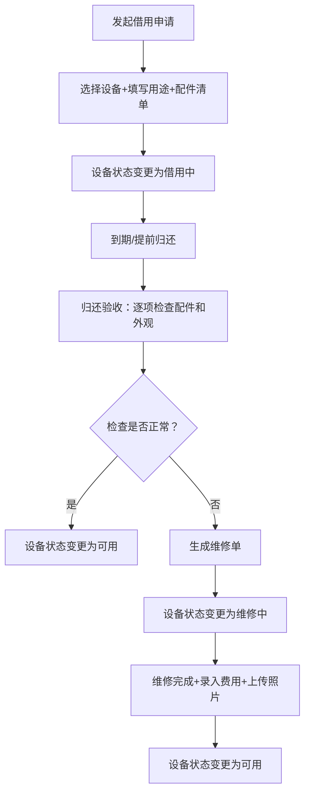

## 1. 产品概述

设备借修台管理系统，解决公司设备（投影仪、录音笔、小相机等）借出后损坏无人认账、归还时无人检查的管理痛点。

- 主要用途：设备档案管理、借用申请、归还验收、维修跟踪、数据统计看板
- 目标用户：行政管理人员、设备保管人、公司员工
- 产品价值：实现设备全生命周期闭环管理，责任到人，降低设备损耗

## 2. 核心功能

### 2.1 功能模块
1. **统计看板**：借用中、逾期未还、维修中设备统计，最常损坏设备排名
2. **设备档案**：设备编号、品类、状态、购买日期、保管人、价值、照片管理
3. **借用管理**：借用申请（用途、借用人、预计归还时间、配件清单）、借用记录
4. **归还验收**：逐项勾选配件和外观检查，发现问题直接生成维修单
5. **维修管理**：维修单记录（故障现象、处理人、费用、完成照片）、维修进度跟踪

### 2.2 页面详情
| 页面名称 | 模块名称 | 功能描述 |
|-----------|-------------|---------------------|
| 统计看板 | 数据概览卡片 | 展示借用中、逾期未还、维修中、设备总数四个核心指标 |
| 统计看板 | 状态分布图表 | 设备状态饼图/柱状图可视化 |
| 统计看板 | 高频损坏排行 | 按维修次数排序的设备列表TOP10 |
| 统计看板 | 近期动态 | 最近借用/归还/维修记录时间线 |
| 设备档案 | 设备列表 | 支持搜索、筛选、分页的设备表格 |
| 设备档案 | 设备表单 | 新增/编辑设备信息（含图片上传） |
| 设备档案 | 设备详情 | 查看设备完整信息及借用/维修历史 |
| 借用管理 | 借用申请 | 填写借用信息、选择设备、录入配件清单 |
| 借用管理 | 借用列表 | 查看所有借用记录，支持状态筛选 |
| 归还验收 | 验收清单 | 逐项勾选配件完整性和外观状态 |
| 归还验收 | 问题上报 | 发现问题一键转维修单 |
| 维修管理 | 维修单列表 | 所有维修单状态跟踪 |
| 维修管理 | 维修单表单 | 录入故障、处理信息、费用及完成照片 |

## 3. 核心流程

## 4. 用户界面设计

### 4.1 设计风格
- **主色调**：深海蓝 #1e40af 作为品牌色，搭配琥珀橙 #f59e0b 作为警示强调色
- **辅助色**：翠绿 #10b981 表示正常状态，玫瑰红 #f43f5e 表示异常/逾期
- **按钮风格**：圆角中等（8px），悬浮有轻微上浮阴影效果
- **字体**：Noto Sans SC 作为中文显示字体，思源黑体粗细搭配
- **布局风格**：左侧导航栏 + 顶部面包屑 + 主内容卡片式布局
- **图标风格**：Lucide 线性图标，简洁现代

### 4.2 页面设计概览
| 页面名称 | 模块名称 | UI 元素 |
|-----------|-------------|-------------|
| 统计看板 | 数据概览 | 渐变背景卡片，数值大号字体，趋势小箭头 |
| 统计看板 | 排行榜 | 前三名带奖杯图标，渐变色排名背景 |
| 设备档案 | 列表 | 斑马纹表格，状态胶囊标签，头像缩略图 |
| 借用/归还 | 表单 | 分组卡片布局，复选框带勾选动画 |
| 维修管理 | 进度 | 时间线进度条，状态颜色区分 |

### 4.3 响应式
桌面端优先设计（1440px），平板端（768px）折叠导航栏，移动端（375px）卡片堆叠排列。
