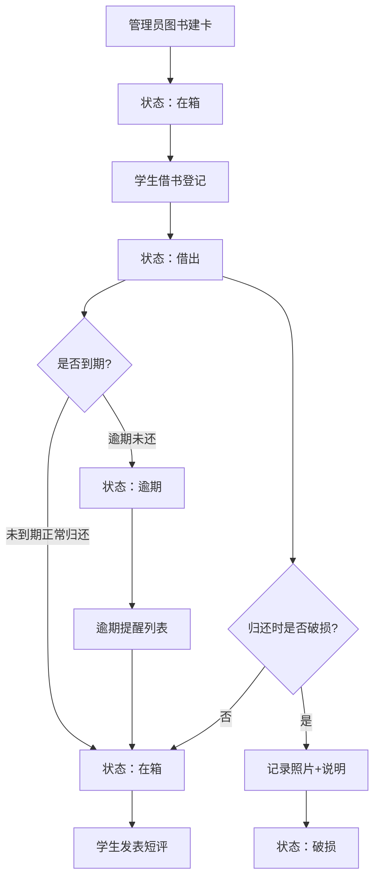

## 1. 产品概述
教学楼门口图书漂流箱管理系统，解决图书漂流过程中去向不明、归还不可追踪的问题。面向学校师生管理图书的借还、破损、评价全流程。
- 核心目标：让每一本漂流书可追踪、可统计、可评价
- 目标用户：学校管理员、教师、学生

## 2. 核心功能

### 2.1 用户角色
| 角色 | 说明 | 核心权限 |
|------|------|----------|
| 管理员 | 学校老师或工作人员 | 图书建卡、破损处理、查看统计、全功能操作 |
| 学生 | 使用漂流箱的学生 | 借书、归还、发表短评、查看在箱图书 |

### 2.2 功能模块
1. **看板首页**：四状态看板（在箱、借出、逾期、破损），快速浏览图书分布
2. **图书管理**：图书建卡、编辑、删除，包含书名、作者、捐赠人、适合年级、放入箱子、封面照片、状态
3. **借阅管理**：借书登记（姓名、班级、预计归还日期、联系方式）、归还登记
4. **逾期提醒**：逾期图书列表，显示超期天数和借阅人信息
5. **破损管理**：破损归还记录（照片、说明）
6. **短评系统**：学生给书写短评
7. **统计中心**：哪类书最受欢迎、哪个箱子流转最快

### 2.3 页面详情
| 页面名称 | 模块名称 | 功能描述 |
|-----------|-------------|---------------------|
| 看板首页 | 四象限看板 | 在箱、借出、逾期、破损四类图书卡片展示，支持点击查看详情 |
| 看板首页 | 顶部导航 | 页面切换：看板、图书管理、统计中心 |
| 看板首页 | 快捷操作 | 新增图书、借书登记入口 |
| 图书管理 | 图书列表 | 显示所有图书卡片，支持搜索、筛选 |
| 图书管理 | 图书建卡/编辑表单 | 书名、作者、捐赠人、适合年级、所属箱子、封面上传、状态 |
| 图书详情 | 基本信息展示 | 书籍完整信息展示 |
| 图书详情 | 借阅记录 | 历史借阅记录时间线 |
| 图书详情 | 短评列表 | 学生短评展示 |
| 图书详情 | 操作按钮 | 借书、归还、破损处理、添加短评 |
| 借书弹窗 | 借书表单 | 姓名、班级、预计归还日期、联系方式 |
| 归还弹窗 | 归还选项 | 正常归还 / 破损归还 |
| 破损弹窗 | 破损记录 | 上传照片、填写说明 |
| 短评弹窗 | 短评输入 | 学生姓名、评分、短评内容 |
| 统计中心 | 类别受欢迎度 | 柱状图显示各适合年级/类别的借阅次数 |
| 统计中心 | 箱子流转速度 | 折线图或卡片显示各箱子的平均流转周期和借阅次数 |

## 3. 核心流程
主要用户流程：管理员先为每本图书建卡录入系统 → 图书放入漂流箱（状态：在箱） → 学生借书登记（状态：借出） → 到期前归还（状态：在箱）或逾期（状态：逾期） → 破损时记录照片和说明（状态：破损） → 学生借阅后可发表短评。

## 4. 用户界面设计

### 4.1 设计风格
- 主色调：温暖的琥珀橙色（#F59E0B）作为主色，搭配深青色（#0D9488）作为辅色
- 背景：米白色（#FFFBEB）搭配柔和的米色纸张质感
- 按钮风格：圆角矩形（rounded-xl），带有柔和阴影和悬停放大效果
- 字体：标题使用具有手写质感的 "Ma Shan Zheng"，正文使用简洁现代的 "Noto Sans SC"
- 布局风格：卡片式布局，四象限看板设计，带有轻微的纸张纹理背景
- 图标风格：使用 Lucide 图标，风格统一圆润

### 4.2 页面设计概述
| 页面名称 | 模块名称 | UI 元素 |
|-----------|-------------|-------------|
| 看板首页 | 四象限看板 | 2x2 网格布局，每象限带不同颜色标题条和计数徽章，卡片悬停有浮动效果 |
| 看板首页 | 顶部导航 | 渐变色导航栏，带有 Logo、页面切换标签、用户头像 |
| 图书管理 | 图书列表 | 网格布局，每张图书卡片带封面缩略图、状态标签、基础信息 |
| 图书详情 | 信息布局 | 左侧封面大图，右侧详细信息，下方时间线式借阅记录和短评区 |
| 弹窗表单 | 统一风格 | 毛玻璃背景（backdrop-blur），圆角卡片，字段带图标前缀 |
| 统计中心 | 图表区域 | 彩色柱状图和卡片式指标，带有动画数字计数效果 |

### 4.3 响应式
- Desktop-first 设计，≥1024px 为完整四象限看板布局
- 768px-1024px 调整为 2 列纵向排列的看板
- <768px 移动端为单列堆叠布局，每类看板可折叠展开
