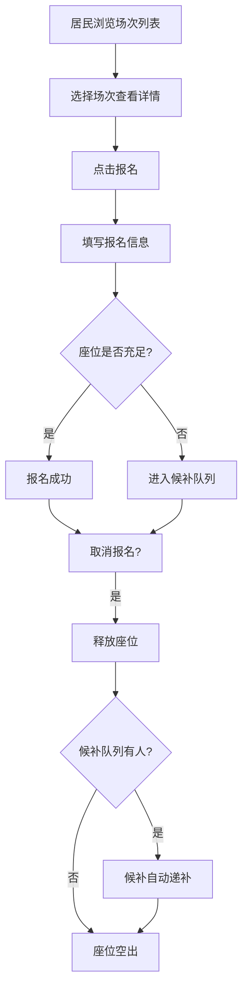
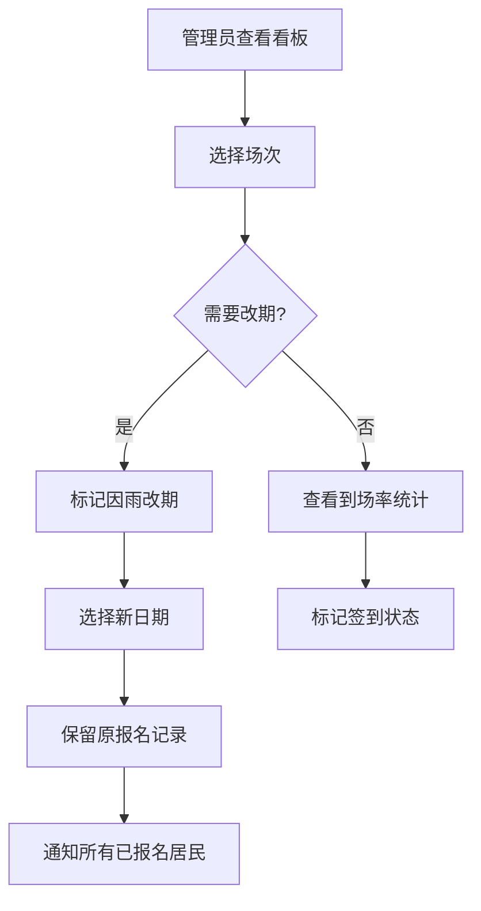

## 1. 产品概述

社区周五露天电影活动管理系统，帮助社区管理员高效管理放映场次发布、居民报名与候补、雨天改期通知，以及到场率统计，让每场露天电影活动井然有序。

- 解决社区露天电影活动信息分散、报名混乱、座位超员和雨天改期通知困难的问题
- 面向社区管理员和社区居民，提供一站式的电影活动管理体验

## 2. 核心功能

### 2.1 用户角色

| 角色 | 说明 | 核心权限 |
|------|------|----------|
| 社区管理员 | 负责发布和管理活动 | 创建/编辑场次、查看看板、改期通知 |
| 社区居民 | 报名参加活动 | 浏览场次、报名/取消报名 |

### 2.2 功能模块

1. **放映场次页面**：电影海报展示、场次列表、场次详情、报名入口
2. **报名管理页面**：报名表单、候补队列、取消报名、自动递补
3. **管理看板页面**：数据统计、到场率、儿童座椅需求、改期操作

### 2.3 页面详情

| 页面名称 | 模块名称 | 功能描述 |
|----------|----------|----------|
| 放映场次 | 场次列表 | 展示所有即将放映的电影，含海报、名称、日期、地点、剩余座位 |
| 放映场次 | 发布场次 | 填写电影名、日期、地点、座位上限、适合年龄、海报URL、天气预案 |
| 放映场次 | 场次详情 | 展示场次完整信息、报名/候补状态、天气预案说明 |
| 报名管理 | 报名表单 | 填写姓名、人数、楼栋、是否带小孩、联系电话 |
| 报名管理 | 候补队列 | 座位满时自动进入候补，显示候补位置 |
| 报名管理 | 取消报名 | 取消后候补自动递补，释放座位 |
| 管理看板 | 统计面板 | 已报名人数、候补人数、儿童座椅需求统计 |
| 管理看板 | 到场率 | 每部电影的签到到场率统计 |
| 管理看板 | 雨天改期 | 标记改期、保留原报名、生成通知 |

## 3. 核心流程

**居民报名流程**：居民浏览场次 → 点击报名 → 填写信息 → 判断座位是否充足 → 充足则报名成功，不足则进入候补 → 取消报名时候补自动顶上

**管理员改期流程**：管理员查看场次 → 标记因雨改期 → 选择新日期 → 系统保留原报名记录 → 通知所有已报名居民

## 4. 用户界面设计

### 4.1 设计风格

- 主色调：暖橘色（#E8773A）搭配深蓝夜空色（#1B2838），营造露天电影院的夏夜氛围
- 辅助色：星光金（#F5C542）用于高亮和CTA按钮
- 按钮风格：圆角按钮，带微弱阴影和hover浮起效果
- 字体：标题使用 "Playfair Display" 衬线体增添电影质感，正文使用 "Noto Sans SC" 保证中文可读性
- 布局风格：卡片式布局，海报采用电影宽银幕比例（16:9），整体留白充足
- 图标：使用 lucide-react 图标库，线描风格

### 4.2 页面设计概览

| 页面名称 | 模块名称 | UI元素 |
|----------|----------|--------|
| 放映场次 | 场次列表 | 卡片网格布局，海报+信息叠加，渐变遮罩，hover放大动效 |
| 放映场次 | 发布场次 | 侧滑面板表单，分段输入，海报预览区 |
| 放映场次 | 场次详情 | 全屏弹窗，左侧海报右侧信息，底部报名区 |
| 报名管理 | 报名表单 | 模态弹窗表单，实时座位余量指示器 |
| 报名管理 | 候补队列 | 带序号的候补列表，入场动效 |
| 管理看板 | 统计面板 | 数字卡片+环形图，色彩区分不同状态 |
| 管理看板 | 到场率 | 条形图对比各场次到场率 |
| 管理看板 | 雨天改期 | 改期操作面板，日期选择器，通知预览 |

### 4.3 响应式设计

- 桌面优先设计，4列卡片网格
- 平板适配2列，移动端单列堆叠
- 表单在移动端全屏展示
- 触控优化：按钮最小44px触控区域

### 4.4 3D场景指引

不适用
