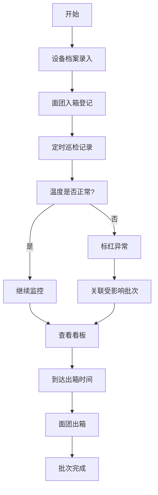

## 1. 产品概述
发酵箱温控记录系统，为面包店提供冷藏发酵过程的精细化管理。通过记录设备档案、面团入箱数据和巡检信息，实现温度异常预警、批次追溯和生产看板可视化，解决温度漂移导致面团品质不稳定的核心问题。

目标用户：面包店店长、烘焙师、质量管理人员
产品价值：减少因温度失控导致的原料浪费，保证产品品质一致性，建立可追溯的发酵质量管理体系。

## 2. 核心功能

### 2.1 用户角色
| 角色 | 注册方式 | 核心权限 |
|------|----------|----------|
| 烘焙师 | 系统账号登录 | 记录面团入箱、填写巡检记录、查看看板 |
| 管理员 | 系统账号登录 | 设备档案管理、所有功能权限、数据导出 |

### 2.2 功能模块
1. **设备档案管理**：发酵箱基本信息、探头配置、保养记录、照片管理
2. **入箱记录管理**：面团批次登记、配方信息、目标参数设置
3. **巡检记录管理**：温湿度巡查、异常情况记录、门开关频率
4. **监控看板**：实时状态展示、温度曲线、异常预警、批次追踪

### 2.3 页面详情
| 页面名称 | 模块名称 | 功能描述 |
|----------|----------|----------|
| 监控看板 | 批次概览 | 显示当前箱内所有批次列表，标注所在层、剩余时间 |
| 监控看板 | 即将出箱 | 倒计时展示2小时内需要出箱的批次 |
| 监控看板 | 温度曲线 | 24小时温度变化趋势图，标记异常时段 |
| 监控看板 | 异常预警 | 温度超范围标红显示，关联受影响批次 |
| 监控看板 | 探头校准 | 显示需要校准的温度探头列表 |
| 设备档案 | 设备列表 | 发酵箱编号、容量、层数等基本信息 |
| 设备档案 | 探头配置 | 温度探头位置、校准记录、状态监控 |
| 设备档案 | 保养记录 | 保养日期、保养内容、照片上传 |
| 入箱记录 | 批次登记 | 配方、重量、目标温度、入箱时间、预计出箱、所在层 |
| 入箱记录 | 批次查询 | 历史批次查询、状态追踪 |
| 巡检记录 | 巡查登记 | 实际温度、湿度、门开关频率、结霜情况、异常声音 |
| 巡检记录 | 异常处理 | 温度超范围标记、关联批次、处理措施 |

## 3. 核心流程

烘焙师每日工作流程：选择发酵箱→登记面团入箱信息→定时巡检记录温湿度→系统自动判断温度是否正常→异常时标红并提示受影响批次→查看看板确认出箱时间→面团出箱完成批次。

## 4. 界面设计

### 4.1 设计风格
- **主色调**：冷蓝色系 (#1E40AF 深蓝, #3B82F6 亮蓝)，代表冷藏专业感
- **辅助色**：警示红 (#EF4444) 用于温度超标，成功绿 (#10B981) 用于正常状态
- **中性色**：深灰 (#1F2937) 背景，浅灰 (#F3F4F6) 卡片，确保数据可读性
- **按钮风格**：圆角8px，扁平化设计，悬停时有轻微阴影和色彩加深
- **字体**：标题使用 'Space Grotesk'，正文使用 'Inter'，数据数字使用等宽字体 'JetBrains Mono'
- **布局风格**：卡片式网格布局，顶部导航栏 + 左侧侧边栏 + 主内容区
- **图标**：使用 Phosphor Icons 线性图标风格，简洁专业

### 4.2 页面设计总览
| 页面名称 | 模块名称 | UI元素 |
|----------|----------|--------|
| 监控看板 | 批次概览 | 卡片网格布局，每层一个卡片，显示批次信息和状态指示灯 |
| 监控看板 | 温度曲线 | 交互式折线图，可悬停查看具体数值，异常区域红色半透明遮罩 |
| 监控看板 | 异常预警 | 红色背景卡片，闪烁动画提示，点击展开关联批次 |
| 设备档案 | 设备卡片 | 左侧设备照片，右侧信息列表，探头位置示意图 |
| 入箱记录 | 登记表单 | 分步表单，下拉选择配方，时间选择器，层位可视化选择 |
| 巡检记录 | 巡查卡片 | 温湿度大数字显示，异常选项开关，提交时动画反馈 |

### 4.3 响应式设计
- **桌面端优先**：1280px以上完整展示所有模块
- **平板端**：768px-1279px，侧边栏收起为图标，看板模块改为两列布局
- **移动端**：767px以下，顶部导航折叠为汉堡菜单，模块垂直堆叠
- **触摸优化**：按钮最小高度44px，表单元素增加内边距，支持滑动切换时间范围

### 4.4 动效设计
- 页面加载：模块从下往上渐入，间隔50ms依次显示
- 温度超标：红色边框脉冲动画（每2秒一次）
- 看板更新：数据变化时数字滚动动画
- 表单提交：成功时绿色对勾缩放动画
- 卡片悬停：上移2px，阴影加深
