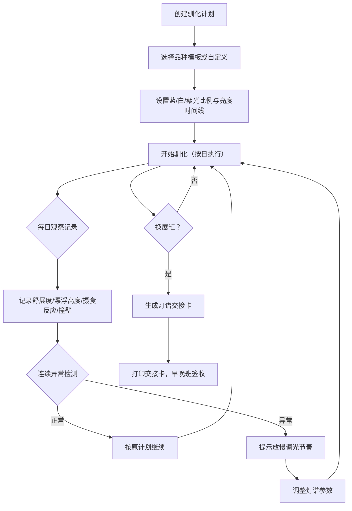

## 1. 产品概述

水族馆水母换缸灯谱驯化工具——帮助饲养员科学规划蓝光/白光/紫光的渐变驯化时间线，记录水母行为指标，自动检测连续异常并提示放慢调光节奏，生成可打印的灯谱交接卡以避免早晚班参数操作不一致。

## 2. 核心功能

### 2.1 用户角色

| 角色 | 使用方式 | 核心权限 |
|------|----------|----------|
| 饲养员 | 直接使用 | 创建驯化计划、记录观察数据、生成交接卡 |
| 主管 | 审核查看 | 查看历史驯化计划、审核交接卡 |

### 2.2 功能模块

1. **驯化计划页**：创建/编辑灯谱渐变时间线，设置每日蓝光、白光、紫光比例与亮度
2. **观察记录页**：每日录入水母舒展度、漂浮高度、摄食反应、是否撞壁
3. **异常预警页**：连续异常自动检测与调光节奏建议
4. **交接卡页**：生成可打印的灯谱交接卡，含完整参数与签收栏

### 2.3 页面详情

| 页面名称 | 模块名称 | 功能描述 |
|----------|----------|----------|
| 驯化计划 | 时间线编辑器 | 拖拽调整每日蓝/白/紫光比例滑块，亮度曲线可视化，支持7-30天渐变排期 |
| 驯化计划 | 灯谱预览 | 实时预览当前选中日期的灯光颜色混合效果，模拟缸内视觉 |
| 驯化计划 | 快捷模板 | 预设常见水母品种（海月、狮鬃、倒立等）的推荐驯化模板 |
| 观察记录 | 行为录入表单 | 舒展度（1-5级）、漂浮高度（上/中/下）、摄食反应（积极/一般/拒绝）、撞壁（是/否） |
| 观察记录 | 历史曲线 | 各指标随日期变化的折线图，标注异常点 |
| 异常预警 | 异常检测面板 | 连续2天以上指标异常高亮，自动建议放慢节奏（如"建议蓝光日增幅从5%降至2%"） |
| 异常预警 | 调光建议 | 根据异常类型生成具体参数调整建议，一键应用至计划 |
| 交接卡 | 卡片预览 | 含缸号、品种、当前灯谱参数、下一步参数、异常记录摘要、早晚班签收栏 |
| 交接卡 | 打印导出 | 生成打印友好格式，支持浏览器直接打印 |

## 3. 核心流程

## 4. 用户界面设计

### 4.1 设计风格

- **主色调**：深海藏青（#0a1628）为底，搭配生物荧光青（#00e5c7）与柔和紫光（#a855f7）作为强调色，模拟深海生物发光
- **辅助色**：白光用暖白（#fef9ef），蓝光用钴蓝（#1e40af），紫光用薰衣草（#a78bfa）
- **字体**：标题使用 Outfit（几何感科技字体），正文使用 Noto Sans SC（中文友好）
- **按钮风格**：圆角微光按钮，hover 时有荧光扩散效果
- **布局风格**：左侧导航 + 右侧内容区，卡片式模块布局
- **动效**：灯谱预览区域有缓慢呼吸般的光晕脉动，异常预警有柔和闪烁提示

### 4.2 页面设计概览

| 页面名称 | 模块名称 | UI 元素 |
|----------|----------|---------|
| 驯化计划 | 时间线编辑器 | 横向日期轴 + 纵向三通道（蓝/白/紫）堆叠面积图，拖拽控制点调整比例 |
| 驯化计划 | 灯谱预览 | 圆形光晕混合预览，三原色叠加模拟，底部亮度条 |
| 驯化计划 | 快捷模板 | 水母品种卡片网格，含品种图与推荐参数摘要 |
| 观察记录 | 行为录入 | 四组滑块/选择器，舒展度用星级、漂浮高度用垂直位标、摄食反应用表情按钮、撞壁用开关 |
| 观察记录 | 历史曲线 | 多轴折线图，异常日期红色标记，hover 显示详情 |
| 异常预警 | 异常检测面板 | 状态卡片列表，异常项红色边框脉动，正常项绿色勾选 |
| 异常预警 | 调光建议 | 建议卡片含参数对比（当前→建议），一键应用按钮 |
| 交接卡 | 卡片预览 | A5 纸张格式预览，含表头、参数表、备注栏、双签收栏 |
| 交接卡 | 打印导出 | 打印按钮 + 打印预览，隐藏导航和操作按钮 |

### 4.3 响应式设计

- 桌面优先设计，核心操作区最小宽度 1024px
- 平板适配：导航折叠为侧边抽屉
- 打印模式：仅保留交接卡内容，隐藏所有交互元素

### 4.4 数据持久化

- 使用 localStorage 存储驯化计划与观察记录
- 数据结构支持多缸、多品种并行管理
