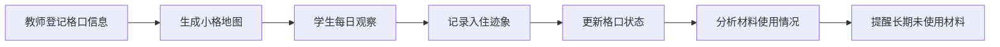
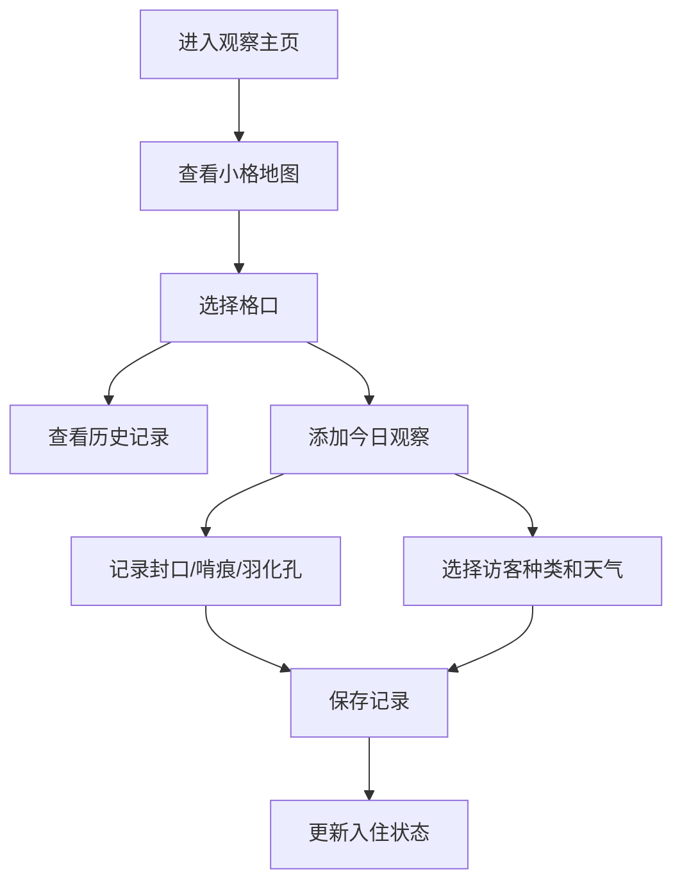

## 1. 产品概述

昆虫旅馆入住观察系统是一个面向学校师生的科学观察工具，用于记录和追踪学校花园中昆虫旅馆各格口的入住情况。通过系统化的数据采集和可视化展示，帮助学生了解不同材料、环境对昆虫栖息偏好的影响，培养科学观察能力。

- **主要用途**：记录昆虫旅馆格口属性，每日观察入住迹象，分析昆虫栖息偏好
- **目标用户**：小学/初中科学教师、学生
- **核心价值**：将自然观察转化为可追踪的数据，发现材料与入住率的关联

## 2. 核心功能

### 2.1 用户角色

| 角色 | 注册方式 | 核心权限 |
|------|----------|----------|
| 教师 | 直接使用 | 管理格口信息、查看全部记录、导出分析报告 |
| 学生 | 直接使用 | 登记每日观察记录、查看入住地图 |

### 2.2 功能模块

1. **入住观察主页**：小格地图、入住状态总览、材料使用提醒
2. **格口管理**：格口登记（材料、朝向、高度、遮雨、周边植物）
3. **每日记录**：封口、啃痕、羽化孔、访客种类、天气记录
4. **数据分析**：入住变化趋势、材料偏好统计

### 2.3 页面详情

| 页面名称 | 模块名称 | 功能描述 |
|----------|----------|----------|
| 入住观察主页 | 小格地图 | 以网格可视化展示所有格口，颜色区分入住状态，点击查看详情 |
| 入住观察主页 | 状态总览 | 显示已入住/空置/观察中格口数量统计 |
| 入住观察主页 | 材料提醒 | 高亮显示超过14天无人入住的材料类型 |
| 格口管理 | 格口列表 | 展示所有格口基础信息，支持筛选和编辑 |
| 格口管理 | 登记表单 | 录入格口材料、朝向、高度、遮雨情况、周边植物 |
| 每日记录 | 观察表单 | 记录封口、啃痕、羽化孔、访客种类、当日天气 |
| 每日记录 | 记录历史 | 按时间线展示各格口的观察记录 |
| 数据分析 | 趋势图表 | 展示入住变化折线图、材料偏好柱状图 |

## 3. 核心流程

## 4. 用户界面设计

### 4.1 设计风格

- **主色调**：森林绿 `#2D5A27`、大地棕 `#8B6914`
- **辅助色**：日光黄 `#F4D03F`、天空蓝 `#85C1E9`、叶嫩绿 `#82E0AA`
- **中性色**：米白 `#FDF5E6`、深棕 `#3E2723`
- **整体风格**：自然有机、手绘质感、亲切友好
- **卡片风格**：圆角12px，轻量阴影，边框用浅棕虚线增加童趣
- **按钮风格**：圆润胶囊形，悬停时有轻微上浮和阴影加深
- **字体**：标题用 "ZCOOL KuaiLe" 活泼字体，正文用 "Noto Sans SC" 清晰易读
- **图标风格**：使用 lucide-react 图标，配合自然主题emoji（🐛🦋🌿🌻）

### 4.2 页面设计概述

| 页面名称 | 模块名称 | UI元素 |
|----------|----------|--------|
| 入住观察主页 | 顶部导航 | 品牌logo、功能切换标签、当前日期显示 |
| 入住观察主页 | 状态统计卡 | 三个圆角卡片分别显示已入住/空置/观察中数量，配emoji图标 |
| 入住观察主页 | 小格地图 | 网格布局，每个格子用颜色表示状态（绿色=入住，灰色=空置，黄色=观察中），悬停显示格口编号和材料，点击弹出详情面板 |
| 入住观察主页 | 材料提醒区 | 顶部通栏警示条，列出长期未使用的材料，配换色建议 |
| 格口管理 | 格口列表 | 卡片式列表，显示格口照片、属性标签、最新状态 |
| 格口管理 | 登记表单 | 分组表单，下拉选择材料/朝向/高度，开关选择遮雨，多选周边植物 |
| 每日记录 | 观察表单 | 分步表单，图标化选择入住迹象，多选访客类型，天气用emoji选择 |
| 每日记录 | 记录历史 | 时间线布局，每天一条记录，配状态图标和照片缩略图 |
| 数据分析 | 趋势图表 | 折线图显示30天入住变化，柱状图对比不同材料入住率 |

### 4.3 响应式

- **桌面优先**：主内容区最大宽度1200px，网格地图自适应列数（桌面12列，平板8列，移动4列）
- **平板适配**：768px断点，导航改为横向滚动，卡片间距缩小
- **手机适配**：480px断点，侧边面板改为底部抽屉，表单改为单列表单
- **触控优化**：按钮最小高度48px，可点击区域不小于44x44px

### 4.4 交互动效

- 小格地图加载时，格子按顺序渐入（staggered animation）
- 格口状态变化时有颜色过渡动画（0.3s ease）
- 表单提交成功有绿色对勾弹出动画
- 提醒区域有轻微脉冲动画吸引注意
- 每日记录添加后，时间线节点滑入显示
