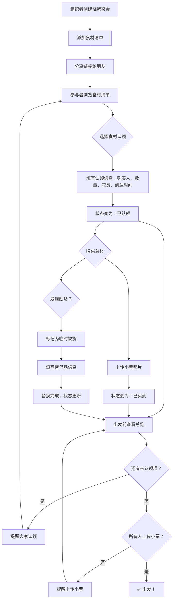

## 1. 产品概述

朋友聚会烧烤食材认领工具——解决每次烧烤肉谁买、炭谁带、饮料够不够、有人重复买的混乱问题。让每位参与者清晰认领食材、追踪购买状态、自动核算费用，确保出发前万事俱备。

- 目标用户：组织烧烤聚会的朋友群体（5-15人）
- 核心价值：零重复、零遗漏、费用透明、出发前心中有数

## 2. 核心功能

### 2.1 用户角色

| 角色 | 参与方式 | 核心权限 |
|------|----------|----------|
| 组织者 | 创建聚会 | 创建/编辑清单、查看总览、管理食材 |
| 参与者 | 加入聚会 | 认领食材、上传小票、替换缺货项 |

### 2.2 功能模块

1. **食材清单页**：食材列表、分类筛选、认领操作、状态分组
2. **出发总览页**：缺项提醒、小票核查、冷藏追踪、人均费用

### 2.3 页面详情

| 页面名称 | 模块名称 | 功能描述 |
|----------|----------|----------|
| 食材清单页 | 食材卡片列表 | 按分类（肉类/海鲜/蔬菜/主食/饮品/调料/耗材）展示食材，每张卡片显示：食材名、分类标签、预算、建议数量、是否冷藏标识、参考图 |
| 食材清单页 | 状态分组切换 | 四个状态Tab：未认领、已认领、已买到、临时缺货，点击切换显示对应状态的食材 |
| 食材清单页 | 认领弹窗 | 点击"认领"按钮弹出表单：购买人（姓名选择）、实际数量、花费金额、预计到达时间、小票照片上传 |
| 食材清单页 | 缺货替换 | 临时缺货状态的食材可点击"替换"按钮，填写替代品名称和相关信息 |
| 食材清单页 | 费用统计栏 | 底部固定栏，实时显示总花费、参与人数、人均费用 |
| 出发总览页 | 缺项提醒 | 显示仍为"未认领"状态的食材，高亮紧急项 |
| 出发总览页 | 小票核查 | 显示已认领/已买到但未上传小票的人员清单 |
| 出发总览页 | 冷藏追踪 | 显示所有需冷藏食材及其认领状态，标记"尚无人认领"的冷藏项为红色警示 |
| 出发总览页 | 费用汇总 | 分类费用饼图 + 人均费用明细表 |

## 3. 核心流程

## 4. 用户界面设计

### 4.1 设计风格

- **主题**：篝火户外风——温暖、自然、有烟火气
- **主色**：炭火橙 `#E8652E`，搭配烟熏灰 `#2D2A26`
- **辅助色**：烤肉棕 `#8B5E3C`，蔬菜绿 `#5A8F5C`，冰蓝（冷藏标识）`#4AA8D8`
- **按钮风格**：圆角胶囊按钮，认领按钮为炭火橙填充，次要操作为描边按钮
- **字体**：标题用偏手写感的趣味字体，正文用清晰易读的圆体
- **布局**：卡片式布局，分类标签横滑筛选，状态分组Tab切换
- **图标风格**：线性图标 + 食物emoji点缀，营造轻松聚会氛围

### 4.2 页面设计概览

| 页面名称 | 模块名称 | UI元素 |
|----------|----------|--------|
| 食材清单页 | 顶部导航栏 | 聚会名称、日期、参与人数徽章 |
| 食材清单页 | 分类筛选栏 | 横向滑动的分类胶囊标签：全部/肉类/海鲜/蔬菜/主食/饮品/调料/耗材 |
| 食材清单页 | 状态分组Tab | 四个Tab：未认领(橙色)/已认领(蓝色)/已买到(绿色)/临时缺货(红色)，显示各自数量 |
| 食材清单页 | 食材卡片 | 左侧参考图、右侧信息（名称+分类标签+预算+建议数量+冷藏标识），底部认领/替换按钮 |
| 食材清单页 | 认领弹窗 | 毛玻璃遮罩，居中表单卡片，包含姓名输入、数量、金额、时间选择、图片上传区 |
| 食材清单页 | 费用统计栏 | 底部固定吸底栏，左总花费、中人均、右参与人数 |
| 出发总览页 | 缺项提醒卡 | 红色边框卡片，列出未认领食材名称和分类 |
| 出发总览页 | 小票核查卡 | 黄色边框卡片，列出未上传小票的人员和对应食材 |
| 出发总览页 | 冷藏追踪卡 | 蓝色边框卡片，冷链图标，未认领项红色高亮 |
| 出发总览页 | 费用汇总 | 环形图 + 下方分类明细列表 |

### 4.3 响应式设计

- 桌面优先设计，最大宽度1200px居中
- 移动端适配：卡片单列、底部吸底栏保持、弹窗全屏
- 触摸优化：卡片点击区域≥44px、滑动手势切换分类

### 4.4 3D场景指导

不适用
