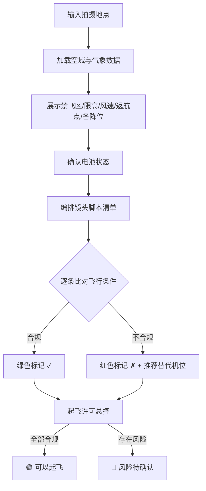

## 1. 产品概述

无人机起飞前检查工具——帮助航拍飞手在出发前快速评估拍摄地点的空域安全、气象条件和电池状态，并按镜头脚本排列任务清单。当天气或限高不适合某个镜头时，系统提前标红并建议替代机位，从源头减少「到了现场才发现不能飞」的窘境。

- 目标用户：航拍飞手、影视航拍团队、测绘/巡检作业人员
- 核心价值：将分散的飞行合规信息、气象数据和设备状态整合到一张起飞前检查清单中，一次确认即可放心起飞

## 2. 核心功能

### 2.1 用户角色

| 角色 | 说明 |
|------|------|
| 飞手 | 创建任务、录入拍摄地点、管理电池、查看检查结果 |

### 2.2 功能模块

1. **航前总览页面**：地点输入 → 禁飞区/限高/风速/返航点/备降位一览
2. **电池管理模块**：录入电池循环次数，自动估算可飞时间
3. **镜头脚本任务清单**：按脚本排列镜头，自动标红不合规项并建议替代机位

### 2.3 页面详情

| 页面名称 | 模块名称 | 功能描述 |
|----------|----------|----------|
| 航前总览页 | 地点搜索栏 | 输入拍摄地点名称或坐标，触发空域与气象数据加载 |
| 航前总览页 | 空域信息卡片 | 展示禁飞区范围、限高值、与拍摄点距离，用红/黄/绿三级色标 |
| 航前总览页 | 气象信息卡片 | 展示风速、风向、温度、能见度，风速超标时标红 |
| 航前总览页 | 返航与备降卡片 | 展示返航点坐标、备降位置列表（含距离和方向） |
| 航前总览页 | 电池状态面板 | 显示所有电池的循环次数、健康度、预计可飞时间，低电量标黄 |
| 航前总览页 | 镜头脚本清单 | 按脚本顺序排列每个镜头，显示所需高度/风速要求与实际对比，不合规镜头标红并推荐替代机位 |
| 航前总览页 | 起飞许可总控 | 汇总所有检查项，绿色=可起飞，红色=存在风险需确认 |

## 3. 核心流程

用户打开工具 → 输入拍摄地点 → 系统加载空域/气象模拟数据 → 用户录入/确认电池状态 → 用户创建镜头脚本清单 → 系统逐条比对飞行条件 → 不合规镜头标红+推荐替代机位 → 全部确认后显示「可以起飞」

## 4. 用户界面设计

### 4.1 设计风格

- **主题**：深色航空仪表盘风格（Avionics HUD），贴合飞手场景
- **主色**：深灰 `#0F1419` 背景 + 青绿 `#00E5A0` 作为安全/确认色 + 琥珀 `#FFB800` 作为警告色 + 红色 `#FF4757` 作为危险色
- **字体**：显示字体 `JetBrains Mono`（仪表感），正文 `Noto Sans SC`
- **布局**：左侧信息栏 + 中央地图/空域可视化 + 右侧电池/清单面板，桌面端优先
- **卡片风格**：圆角 8px，半透明磨砂玻璃效果，细微边框发光
- **图标**：Lucide React 图标库
- **动效**：数据加载时脉动呼吸动画，状态变更时过渡闪烁

### 4.2 页面设计概览

| 页面名称 | 模块名称 | UI 元素 |
|----------|----------|----------|
| 航前总览页 | 地点搜索栏 | 顶部搜索输入框 + 定位图标，深色背景，发光边框聚焦态 |
| 航前总览页 | 空域信息卡片 | 玻璃磨砂卡片，红/黄/绿状态条，禁飞区图标+距离数字，限高进度条 |
| 航前总览页 | 气象信息卡片 | 风速罗盘指示器，温度/能见度数字，超标项红色脉冲 |
| 航前总览页 | 返航与备降卡片 | 返航点坐标显示，备降列表含方向箭头和距离 |
| 航前总览页 | 电池状态面板 | 电池图标+循环次数，健康度进度条，可飞时间倒计时样式 |
| 航前总览页 | 镜头脚本清单 | 编号列表，每行含镜头描述+高度/风速条件+状态色标+替代建议折叠区 |
| 航前总览页 | 起飞许可总控 | 底部固定栏，大号状态指示灯+文字，确认按钮 |

### 4.3 响应式

- 桌面端（≥1280px）：三栏布局，左侧空域+气象，中央地图，右侧电池+清单
- 平板端（768-1279px）：双栏布局，空域/气象+电池上排，地图+清单下排
- 移动端（<768px）：单栏堆叠，可折叠分区

### 4.4 动效细节

- 页面加载：卡片依次淡入（stagger 100ms）
- 风速罗盘：平滑旋转动画
- 状态变更：颜色过渡 + 微脉冲
- 标红镜头：左侧红色竖条 + 微抖动提示
