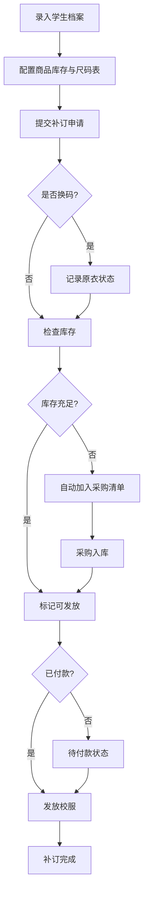

## 1. 产品概述

校服补订尺码系统是一套面向学校后勤管理人员的信息化管理工具，解决开学季校服补订流程混乱问题。系统整合学生档案、商品库存、补订申请、采购管理和数据看板，实现校服补订全流程数字化管理。

- 主要解决：学生换码统计分散、各班级群报尺寸混乱、库存管理不清、采购计划滞后
- 目标用户：学校后勤管理人员、年级主任、班主任
- 产品价值：提高补订效率300%，减少错发漏发，数据实时可追溯

## 2. 核心功能

### 2.1 用户角色

| 角色 | 注册方式 | 核心权限 |
|------|----------|----------|
| 系统管理员 | 系统预置 | 全部功能：学生/商品/补订/采购/看板管理 |
| 班主任 | 管理员创建 | 查看本班学生档案、提交本班补订申请 |

### 2.2 功能模块

1. **数据看板页**：待付款统计、待采购清单、可发放统计、尺码缺口分析、各班补订进度
2. **学生档案管理**：学生信息CRUD、班级筛选、批量导入
3. **商品档案管理**：五大类校服（夏装/秋装/运动服/马甲/校裤）、尺码表配置、库存管理、供应商信息
4. **补订申请管理**：选款式/尺码/数量、换码标记、付款状态跟踪、原衣状态记录
5. **采购清单管理**：库存不足自动触发采购、采购单跟踪、供应商关联

### 2.3 页面详情

| 页面名称 | 模块名称 | 功能描述 |
|----------|----------|----------|
| 数据看板 | 统计卡片 | 待付款/待采购/可发放数量统计卡片 |
| 数据看板 | 尺码缺口 | 各款式各尺码缺货数量柱状图 |
| 数据看板 | 班级进度 | 各班补订完成率进度条列表 |
| 数据看板 | 近期动态 | 最新补订申请、入库、发放记录时间线 |
| 学生档案 | 学生列表 | 班级筛选、搜索、分页表格展示 |
| 学生档案 | 新增/编辑 | 班级、姓名、身高、体重、原尺码、联系电话、备注表单 |
| 商品档案 | 商品列表 | 五大类校服Tab切换、库存预警高亮 |
| 商品档案 | 尺码配置 | S-XXL多尺码表、身高体重对应建议 |
| 商品档案 | 库存管理 | 入库/出库操作、库存变动日志 |
| 补订申请 | 申请列表 | 状态筛选（待付款/已付款/待采购/可发放/已完成） |
| 补订申请 | 新建申请 | 学生选择、款式选择、尺码选择、数量、换码开关、付款状态 |
| 补订申请 | 换码详情 | 原尺码、原衣状态（完好/破损/丢失）、备注 |
| 采购清单 | 待采购列表 | 自动生成、可编辑数量、关联供应商 |
| 采购清单 | 采购入库 | 确认入库自动更新库存状态 |

## 3. 核心流程

主要业务流程：管理员录入学生档案 → 配置商品库存 → 家长/班主任提交补订申请 → 系统检查库存 → 库存不足自动生成采购单 → 采购入库更新库存 → 确认付款 → 校服发放 → 完成

## 4. 用户界面设计

### 4.1 设计风格

- 主色调：深蓝色 `#1e3a5f`（教育专业感）+ 暖橙色 `#f59e0b`（警示强调）
- 中性色：锌灰色系 `zinc`（界面基调）
- 按钮风格：圆角 8px，主按钮深蓝色填充，次按钮描边
- 字体：标题使用「思源黑体 Heavy」，正文使用「思源黑体 Regular」
- 布局风格：左侧导航栏 + 顶部标题 + 卡片式内容区
- 图标风格：lucide-react 线性图标，统一 18px 尺寸

### 4.2 页面设计概览

| 页面名称 | 模块名称 | UI元素 |
|----------|----------|--------|
| 数据看板 | 统计卡片 | 渐变背景、数值动画、图标右上角悬浮 |
| 数据看板 | 尺码缺口 | 横向柱状图、暖色渐变填充、悬浮tooltip |
| 数据看板 | 班级进度 | 绿色进度条、百分比显示、已完成/总数 |
| 学生档案 | 学生列表 | 斑马纹表格、悬停高亮、操作列按钮 |
| 商品档案 | 商品列表 | 分类Tab切换、库存预警红色背景标注 |
| 补订申请 | 申请列表 | 状态标签彩色区分（灰/蓝/橙/绿） |
| 补订申请 | 表单弹窗 | 分步表单、换码区域条件渲染 |

### 4.3 响应式设计

- 桌面优先设计，适配 1440px 及以上屏幕
- 平板端（1024px）：导航栏折叠为图标模式
- 移动端（768px）：底部Tab导航，表格改为卡片式列表

