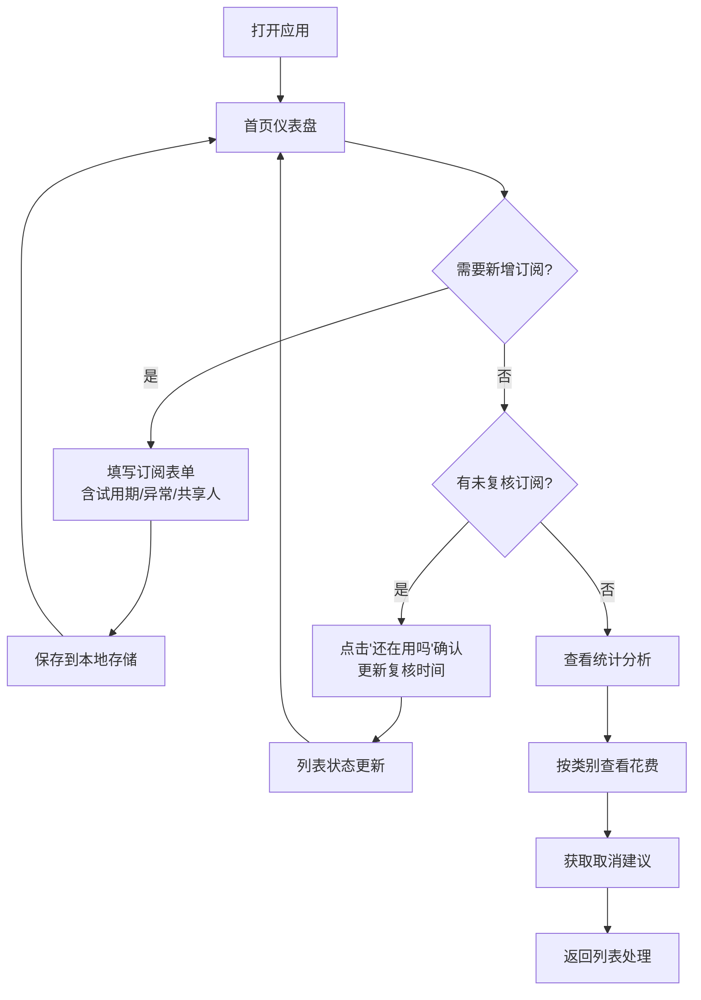

## 1. 产品概述

订阅管家 SubTrack 是一款个人订阅续费管理工具，帮助用户一站式追踪所有自动扣费，告别翻支付宝、App Store 和邮箱的繁琐。通过可视化月历、智能提醒和消费分组分析，让用户对每月订阅支出一目了然，避免不必要的浪费。

- 核心目标：让用户一眼看清下月扣费情况，主动掌控订阅消费
- 目标用户：有多平台订阅习惯、时常忘记取消试用期或无用订阅的都市人群
- 产品价值：减少无意识订阅浪费，建立健康的数字消费习惯

## 2. 核心功能

### 2.1 用户角色

| 角色 | 注册方式 | 核心权限 |
|------|---------|---------|
| 普通用户 | 本地存储（无需注册） | 全部功能：增删改查订阅、查看统计、导出数据 |

### 2.2 功能模块

1. **首页仪表盘**：月历视图、金额汇总卡片、近期扣费提醒、犹豫区提示
2. **订阅管理**：订阅列表、新增/编辑表单、复核按钮、异常状态标记
3. **统计分析**：按类别分组（娱乐/学习/办公/家庭）、年化花费、可取消建议
4. **提醒中心**：试用期即将结束、提前N天提醒取消、异常事件记录

### 2.3 页面详情

| 页面名称 | 模块名称 | 功能描述 |
|---------|---------|------------|
| 首页仪表盘 | 月历视图 | 展示当月/下月每天扣费事项，悬浮显示明细，按金额热力着色 |
| 首页仪表盘 | 金额汇总 | 本月总花费、下月预估、对比上月变化、年度累计、日均花费 |
| 首页仪表盘 | 即将扣费 | 未来7天扣费列表，含倒计时、金额、渠道图标 |
| 首页仪表盘 | 犹豫区入口 | 显示3个月未复核的订阅数量及一键进入 |
| 订阅列表 | 分类筛选 | 娱乐/学习/办公/家庭/全部 分类切换 |
| 订阅列表 | 订阅卡片 | 服务Logo、名称、用途、扣费渠道、周期、金额、下次扣费日 |
| 订阅列表 | 状态标签 | 试用期、涨价、换卡失败、重复订阅 等醒目标记 |
| 订阅列表 | 复核按钮 | "还在用吗？"确认按钮，3个月未确认变灰进入犹豫区 |
| 订阅表单 | 基础信息 | 服务名、用途、扣费渠道（下拉+自定义）、周期（月/季/年/自定义） |
| 订阅表单 | 金额与日期 | 金额、下次扣费日、上次扣费历史（可选） |
| 订阅表单 | 特殊标记 | 试用期开关+结束日期+提前提醒天数、家庭共享人列表 |
| 订阅表单 | 异常记录 | 涨价标记（原金额→新金额+日期）、换卡失败次数、重复订阅关联 |
| 订阅表单 | 截图上传 | 本地截图预览（Base64存储） |
| 统计分析 | 分类饼图 | 娱乐/学习/办公/家庭 花费占比可视化 |
| 统计分析 | 年化计算 | 各分类年度预估花费、总年化、Top5高价订阅 |
| 统计分析 | 智能建议 | 3个月未复核建议取消、同品类重复订阅合并建议、性价比评分 |

## 3. 核心流程

用户打开应用 → 首页仪表盘展示月历和汇总 → 浏览即将扣费事项 → 新增/编辑订阅（填写完整信息含试用期/异常标记）→ 定期点击"还在用吗"复核 → 查看统计分析 → 根据建议取消无用订阅

## 4. 用户界面设计

### 4.1 设计风格

**设计基调：专业财务感 × 温暖治愈系**
- 主色调：深海绿 `#0F766E`（信任感、财务感）搭配琥珀橙 `#F59E0B`（提醒色、温暖感）
- 辅助色：石板灰中性色 `#1E293B` - `#F8FAFC`，避免紫色渐变
- 背景：深色模式优先，采用墨蓝底色 `#0B1220` + 细腻噪点纹理，营造金融仪表盘氛围
- 按钮风格：圆角胶囊按钮，主按钮带微立体渐变，悬停有微妙光晕效果
- 卡片风格：毛玻璃半透明卡片 `backdrop-blur`，边框细描边，阴影层次分明
- 字体组合：展示字体 "Space Grotesk"（数字、标题）搭配正文 "Inter"（阅读友好）
- 图标风格：Lucide 线性图标 + 服务品牌 Emoji，减少图片依赖
- 微交互：数据数字滚动动画、卡片入场交错动画、月历日格悬停微放大

### 4.2 页面设计概览

| 页面名称 | 模块名称 | UI 元素 |
|---------|---------|---------|
| 首页仪表盘 | 顶部导航 | 品牌Logo、日期切换器（← 本月 →）、搜索/设置图标 |
| 首页仪表盘 | 汇总卡片行 | 4张卡片：本月花费、下月预估、年度累计、日均，采用渐变顶边装饰 |
| 首页仪表盘 | 月历视图 | 7列网格，有扣费的日期显示金额徽标，今日边框高亮，悬停Popover显示明细 |
| 首页仪表盘 | 即将扣费列表 | 垂直时间轴样式，含渠道图标、服务名、金额、倒计时胶囊 |
| 首页仪表盘 | 犹豫区横幅 | 橙红色警示条，显示数量 + 快捷按钮 |
| 订阅列表 | 分类Tab | 横向滑动Tab，选中态带下划线+背景色块 |
| 订阅列表 | 订阅卡片 | 左：Logo/Emoji + 名称用途；中：渠道/周期标签；右：金额 + 复核按钮 |
| 订阅列表 | 异常标记 | 试用期绿标签、涨价红箭头、重复🔗图标、换卡失败⚠️图标 |
| 订阅表单 | 模态弹窗 | 全屏抽屉式，分Section分组输入，底部固定保存按钮 |
| 统计分析 | 分类概览 | 4个分类大卡片，含图标、月/年花费、占比条 |
| 统计分析 | 建议列表 | 每条建议含严重程度徽章、理由说明、操作按钮 |

### 4.3 响应式设计

- **桌面优先（1280px+）**：三栏布局 - 左侧导航 + 中间主内容 + 右侧即将扣费侧边栏
- **平板（768-1279px）**：两栏布局 - 顶部折叠导航 + 主内容 + 即将扣费放在下方
- **移动端（<768px）**：单栏堆叠，底部Tab导航，月历压缩为周视图，表单全屏覆盖
- **触摸优化**：按钮最小高度44px，列表项左右滑动快捷操作（复核/编辑/删除）
