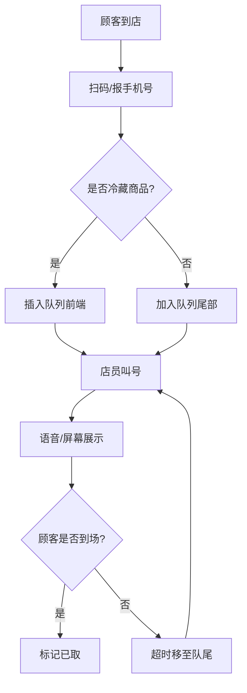

## 1. 产品概述

团购到货当日，顾客集中到店取货，店员需手动翻找订单导致效率低下、顾客等待时间长。本系统为线下门店提供团购取货全流程管理，通过排号叫号机制提升取货效率，降低店员工作压力。

- 核心价值：将混乱的取货场景转化为有序的排队系统，冷藏商品优先处理保障食品安全，数据看板实时监控取货进度。
- 目标用户：门店店员、团购团长、到店取货顾客。

## 2. 核心功能

### 2.1 用户角色

| 角色 | 使用方式 | 核心权限 |
|------|---------|---------|
| 店员 | 门店终端操作 | 管理团购批次、录入订单、叫号操作、查看看板 |
| 顾客 | 到店扫码/报手机号 | 排号取货、查看等待状态 |

### 2.2 功能模块

1. **团购批次管理**：创建批次、编辑商品信息、管理到货状态
2. **顾客订单管理**：订单录入、批量导入、付款状态管理
3. **排号叫号系统**：扫码/手机号排号、叫号、已取标记、超时重排
4. **数据看板**：当前叫号、未取统计、异常订单、时段压力分析

### 2.3 页面详情

| 页面名称 | 模块名称 | 功能描述 |
|---------|---------|---------|
| 团购批次列表 | 批次卡片 | 展示商品名、到货时间、总份数、冷藏标识，支持增删改查 |
| 团购批次表单 | 商品信息录入 | 商品名、到货时间、总份数、冷藏要求、商品照片上传 |
| 订单列表 | 订单表格 | 姓名、电话、数量、付款状态、取货码、备注，支持搜索筛选 |
| 订单表单 | 订单录入 | 顾客信息、购买数量、付款状态、自动生成取货码 |
| 取号排队 | 排号操作 | 扫码/手机号输入排号，冷藏商品自动优先 |
| 叫号屏幕 | 叫号展示 | 大号字体显示当前叫号、等待队列，语音播报提示 |
| 数据看板 | 实时监控 | 当前叫号、未取数量、异常订单、各时段取货压力图表 |

## 3. 核心流程

顾客到店后，通过扫码或报手机号进行排号。系统根据是否为冷藏商品自动调整优先级，冷藏商品插入队列前端。店员叫号后，顾客取货，店员标记已取。若叫号后顾客超时未到，系统自动将其移至队尾等待下一轮叫号。看板实时展示取货进度和压力分布。

## 4. 用户界面设计

### 4.1 设计风格

- **主色调**：深靛蓝 `#1e3a5f` 作为主色，代表专业可靠；珊瑚橙 `#ff6b6b` 作为强调色，用于叫号提示和异常状态。
- **辅助色**：翠绿 `#51cf66` 表示已取货/正常，琥珀黄 `#ffd43b` 表示等待/警告，冷灰 `#495057` 作为中性色。
- **字体**：大号等宽字体 `JetBrains Mono` 用于叫号数字展示，`Noto Sans SC` 用于正文信息，确保远距离清晰可读。
- **布局**：卡片式网格布局，叫号屏幕采用极简工业风，大号数字配合动态闪烁效果。
- **图标**：lucide-react 线性图标，冷藏商品使用雪花图标 ❄️，叫号使用喇叭图标 🔊。

### 4.2 页面设计概览

| 页面名称 | 模块名称 | UI 元素 |
|---------|---------|---------|
| 叫号屏幕 | 当前叫号展示 | 全屏大号数字（20rem+），渐变背景，脉冲动画，当前号码动态闪烁 |
| 叫号屏幕 | 等待队列 | 侧栏滚动列表，冷藏商品红色标识，预计等待时间 |
| 数据看板 | 统计卡片 | 四象限布局，数字跳动动画，趋势箭头指示 |
| 数据看板 | 时段压力图 | 柱状图按小时分组，颜色深浅表示压力等级 |
| 团购批次卡片 | 商品展示 | 左侧商品照片，右侧文字信息，冷藏标签角标 |
| 取号界面 | 输入操作 | 大号输入框，扫码按钮，确认动画反馈 |

### 4.3 响应式设计

- 桌面端优先设计，叫号屏幕支持全屏展示适配大显示器
- 平板端适配店员手持操作，按钮尺寸放大便于触控
- 叫号数字区域采用 vw 单位自适应屏幕尺寸

### 4.4 动画与交互

- 叫号时数字从中间放大弹出，配合背景色闪烁 3 次
- 排队列表滚动更新时采用平滑过渡动画
- 冷藏商品卡片有轻微呼吸动画提示优先级
- 标记已取时出现绿色打勾动效
