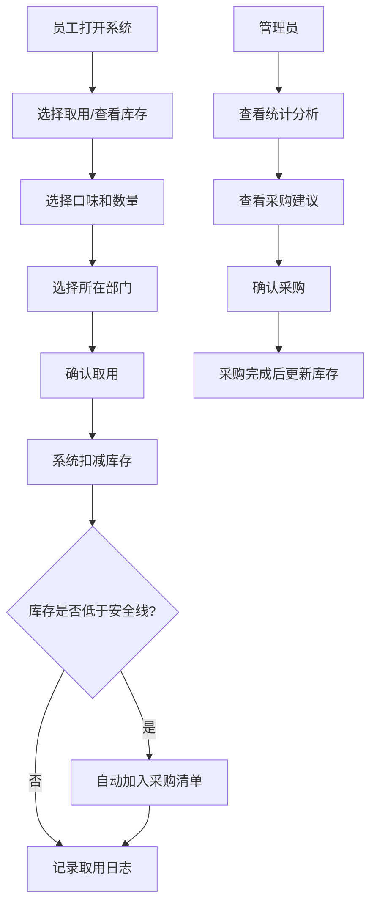

## 1. 产品概述

胶囊咖啡库存管理系统，解决办公室咖啡胶囊消耗无追踪、采购凭感觉的痛点。目标用户为办公室行政/采购人员和全体员工，实现库存透明化、取用记录可追溯、采购决策数据化。

## 2. 核心功能

### 2.1 用户角色
| 角色 | 注册方式 | 核心权限 |
|------|----------|----------|
| 普通员工 | 无需注册，选择部门 | 咖啡胶囊/耗材取用登记 |
| 管理员 | 系统内置 | 口味档案管理、库存调整、查看统计、采购清单管理 |

### 2.2 功能模块
1. **库存总览页**：库存概览卡片、低库存预警、快速取用入口
2. **口味档案页**：胶囊口味 CRUD、品牌/强度/烘焙度/适配机型/单价/照片管理
3. **取用登记页**：口味选择、数量输入、部门选择、库存扣减、记录保存
4. **配套物品页**：清洁片、除垢剂、纸杯等耗材的库存管理
5. **统计分析页**：最受欢迎口味、部门消耗排名、每周成本趋势、即将过期提醒、建议下单数量
6. **采购清单页**：低库存自动加入、手动添加、标记采购完成

### 2.3 页面详情
| 页面名称 | 模块名称 | 功能描述 |
|----------|----------|----------|
| 库存总览 | 库存概览卡片 | 显示各口味当前库存、状态标签（正常/低库存/过期/受潮） |
| 库存总览 | 快速取用面板 | 一键选择热门口味，输入数量和部门快速登记 |
| 库存总览 | 低库存预警区 | 自动列出库存低于安全线的品项，显示建议补货量 |
| 口味档案 | 口味列表 | 卡片式展示，含照片、品牌、强度、烘焙度等信息 |
| 口味档案 | 新增/编辑表单 | 完整的口味信息录入，支持照片上传 |
| 取用登记 | 取用表单 | 口味选择器、数量步进器、部门下拉选择 |
| 取用登记 | 取用历史 | 显示最近取用记录，可按部门/时间筛选 |
| 配套物品 | 耗材列表 | 分类展示清洁片、除垢剂、纸杯等库存 |
| 配套物品 | 耗材登记 | 耗材的领用和补充登记 |
| 统计分析 | 受欢迎度排行 | 柱状图展示各口味消耗数量排名 |
| 统计分析 | 部门消耗 | 饼图展示各部门消耗占比 |
| 统计分析 | 成本趋势 | 折线图展示每周采购/消耗成本 |
| 统计分析 | 保质期预警 | 列表展示即将过期（30天内）的品项 |
| 统计分析 | 采购建议 | 根据消耗速率和安全库存计算建议下单量 |
| 采购清单 | 待采购列表 | 低库存自动加入，可编辑数量、标记采购状态 |

## 3. 核心流程

员工取用流程：选择口味 → 输入数量 → 选择部门 → 确认扣库存 → 低库存自动触发采购提醒。

管理员流程：查看统计报表 → 分析消耗趋势 → 参考采购建议 → 执行采购 → 入库更新库存。

## 4. 用户界面设计

### 4.1 设计风格
- **主色调**：深咖啡色 `#3E2723`，象征咖啡的醇厚
- **辅助色**：暖橙色 `#FF6F00` 用于预警和强调，米白色 `#EFEBE9` 为背景
- **成功色**：森林绿 `#2E7D32`，警告色：深橙红 `#D84315`
- **按钮风格**：圆润边角（8px），微阴影，悬停有轻微上浮效果
- **字体**：标题用 DM Serif Display 衬线字体体现咖啡品质感，正文用 Noto Sans SC 保证中文可读性
- **布局**：顶部导航 + 侧边功能菜单 + 主内容区，卡片式信息展示
- **图标**：使用 lucide-react 图标，统一线宽风格，配合咖啡相关 emoji（☕️ 📦 📊）

### 4.2 页面设计概述
| 页面名称 | 模块名称 | UI 元素 |
|----------|----------|----------|
| 库存总览 | 顶部导航栏 | Logo、页面标题、管理员切换按钮 |
| 库存总览 | 库存卡片网格 | 照片、口味名、剩余数量、状态标签、取用按钮 |
| 库存总览 | 预警横幅 | 橙色背景，显示低库存品项列表 |
| 口味档案 | 卡片列表 | 照片为主，悬浮显示详情，编辑/删除按钮 |
| 口味档案 | 新增表单 | 模态弹窗，分步表单，照片预览 |
| 取用登记 | 口味选择器 | 搜索 + 分类筛选 + 热门推荐 |
| 统计分析 | 图表区域 | 卡片式布局，可切换图表类型，支持数据导出 |
| 采购清单 | 待办列表 | 勾选框、数量编辑、采购状态切换 |

### 4.3 响应式
- 桌面端优先设计（1280px+），三栏布局
- 平板端（768-1279px）：侧边栏折叠为图标，主内容自适应
- 移动端（<768px）：底部 Tab 导航，单列布局，卡片堆叠
- 所有交互元素确保最小触控面积 44x44px

### 4.4 动效设计
- 页面进入：卡片从下往上渐入，错落延迟
- 取用确认：数量变化时数字滚动动画
- 低库存预警：呼吸灯闪烁效果
- 按钮交互：点击时微缩反馈（scale: 0.98）
- 状态标签：过期/受潮标签有轻微摇摆动画提示注意
