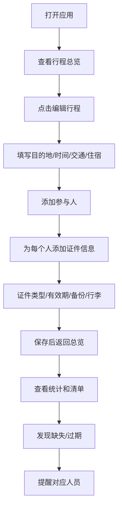

## 1. 产品概述

旅行证件互查小工具，帮助结伴出行的朋友互相检查证件是否齐全有效。解决临到机场才发现身份证没带、港澳通行证过期等问题。

- 核心价值：让所有人都能清楚看到全队证件准备情况，互相提醒，避免因证件问题耽误行程
- 目标用户：结伴旅行的朋友、家人、同事等小团体出行场景

## 2. 核心功能

### 2.1 用户角色
无需注册登录，纯本地工具，单用户管理整个团队的证件信息。

### 2.2 功能模块

1. **行程档案**：管理旅行基本信息，包括目的地、出发时间、交通方式、住宿地址
2. **参与人管理**：添加/编辑参与人员，管理每个人的证件信息
3. **证件管理**：登记证件类型、有效期、拍照备份状态、行李放置状态、紧急联系人、备注
4. **证件清单**：查看全队证件清单，支持隐藏敏感号码，显示确认状态
5. **统计面板**：全队完成率、缺失材料统计、需要提醒的人员
6. **过期提醒**：证件过期或有效期不足标红显示，按剩余天数提醒未确认的人

### 2.3 页面详情
| 页面名称 | 模块名称 | 功能描述 |
|---------|---------|---------|
| 首页/总览 | 行程信息卡片 | 显示目的地、出发倒计时、交通和住宿概览 |
| 首页/总览 | 统计面板 | 完成率圆环图、缺失材料列表、需提醒人员 |
| 首页/总览 | 证件清单 | 按人列出证件状态，过期标红，支持隐藏敏感信息 |
| 行程管理 | 行程表单 | 编辑目的地、出发时间、交通方式、住宿地址、参与人 |
| 人员详情 | 证件列表 | 某人的所有证件详情，可编辑 |
| 人员详情 | 证件表单 | 添加/编辑证件类型、号码、有效期、备份状态、行李状态 |

## 3. 核心流程

## 4. 用户界面设计

### 4.1 设计风格
- **主色调**：旅行主题的深蓝色（#1e3a5f）搭配暖橙色（#f97316）作为提醒强调色
- **辅助色**：成功绿色（#10b981）、警告红色（#ef4444）、中性灰
- **按钮风格**：圆角矩形，hover 时有轻微上浮和阴影变化
- **字体**：中文使用系统无衬线字体，标题加粗，正文清晰易读
- **布局风格**：卡片式布局，模块化分区，信息层次分明
- **图标风格**：线性图标，与旅行主题契合（护照、飞机、日历等）
- **整体氛围**：清爽、专业、安心，给人一种"一切尽在掌握"的感觉

### 4.2 页面设计概述
| 页面名称 | 模块名称 | UI元素 |
|---------|---------|-------|
| 首页总览 | 顶部行程卡片 | 大标题目的地、倒计时数字标签、交通住宿摘要 |
| 首页总览 | 统计三栏 | 完成率圆环 + 数字、缺失材料徽章列表、需提醒人员头像列表 |
| 首页总览 | 证件清单 | 可折叠的人员卡片，内含证件行，状态标签（已确认/待确认/已过期） |
| 行程管理 | 表单区 | 分组字段，左侧标签右侧输入，保存/取消按钮 |
| 证件编辑 | 弹窗/侧滑 | 表单式布局，证件类型下拉、日期选择器、开关组件 |

### 4.3 响应式
- 桌面端优先设计，宽度 1200px 以上最优展示
- 平板端自适应，卡片重新排列
- 移动端单列布局，底部导航切换页面
- 触摸优化，按钮最小 44px 点击区域

### 4.4 动效与交互
- 页面加载时元素淡入 + 轻微上浮
- 状态切换时有颜色过渡动画
- 过期证件有脉冲呼吸效果吸引注意
- 卡片 hover 时有阴影加深和微缩放
- 切换隐藏/显示敏感信息时有平滑过渡
