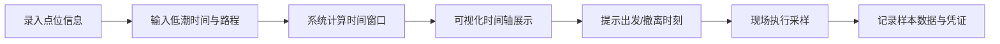

## 1. 产品概述

潮汐采样安排系统是为海洋生物科研团队设计的专业工具，用于规划和记录潮间带贝类采样任务。系统通过可视化潮汐时间轴，帮助队员精准把握低潮窗口，确保采样作业安全高效完成。

- 核心价值：将潮汐时间、路程耗时、采样作业三者精准结合，避免错过采样窗口
- 目标用户：海洋生物研究人员、贝类监测团队、生态调查人员

## 2. 核心功能

### 2.1 功能模块

1. **点位管理**：录入滩涂点位、目标贝种、低潮时间、往返路程、采样许可状态
2. **潮汐时间轴**：可视化展示每个点位潮水退去—回涨的完整时间窗口
3. **智能时刻计算**：自动推算最晚出发时间和必须撤离时间
4. **采样记录**：记录样本编号、盐度、水温、拍照凭证

### 2.3 页面详情

| 页面名称 | 模块名称 | 功能描述 |
|-----------|-------------|---------------------|
| 潮汐采样安排页 | 点位录入表单 | 新增/编辑采样点位信息 |
| 潮汐采样安排页 | 点位列表 | 展示所有采样点位卡片 |
| 潮汐采样安排页 | 潮汐时间轴 | 横向时间轴可视化低潮窗口 |
| 潮汐采样安排页 | 采样记录面板 | 录入和查看样本数据 |
| 潮汐采样安排页 | 状态指示 | 许可状态、时间紧迫度警示 |

## 3. 核心流程

## 4. 用户界面设计

### 4.1 设计风格
- **主色调**：深海蓝 (#0C4A6E) + 潮汐青 (#06B6D4)，体现海洋科学专业感
- **辅助色**：沙滩米 (#FEF3C7)、警示橙 (#F97316)、危险红 (#EF4444)
- **字体**：标题用 Playfair Display（优雅衬线，体现科学严谨），正文用 JetBrains Mono（等宽字体，时间数据更易读）
- **卡片风格**：圆角 12px，柔和阴影，微妙的海浪纹理背景
- **图标风格**：Lucide 线性图标，统一 20px 尺寸

### 4.2 页面设计概述

| 页面名称 | 模块名称 | UI 元素 |
|-----------|-------------|-------------|
| 潮汐采样安排页 | 点位录入表单 | 左侧固定表单，分组标签输入，蓝色提交按钮 |
| 潮汐采样安排页 | 潮汐时间轴 | 中央横向时间轴，渐变色块表示潮汐窗口，关键时间点标记 |
| 潮汐采样安排页 | 采样记录面板 | 右侧可折叠面板，表格形式展示样本记录 |
| 潮汐采样安排页 | 状态徽章 | 许可状态绿/灰/红三色徽章 |

### 4.3 响应式
- 桌面端：三栏布局（表单-时间轴-记录）
- 平板端：两栏布局，记录面板折叠为底部抽屉
- 移动端：单栏垂直布局，时间轴改为纵向

### 4.4 动效设计
- 时间轴渐变色块呼吸动画，表示潮汐流动感
- 新增点位时卡片滑入动画
- 时间紧迫时警示图标脉冲动画
- 表单提交成功的微动效反馈
