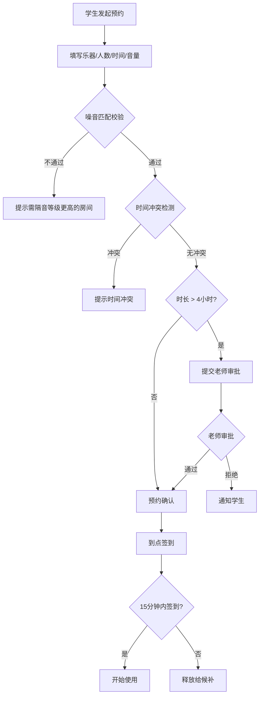
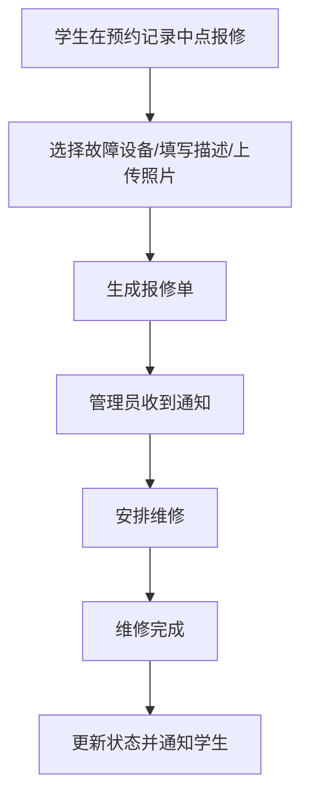

## 1. 产品概述

音乐练习房智能预约管理系统，为音乐学院和音乐培训机构提供练习房预约、噪音管控、审批管理、设备报修和数据分析的一体化解决方案。解决传统预约方式中噪音冲突、时间管理混乱、设备维护难等核心痛点。

## 2. 核心功能

### 2.1 用户角色

| 角色 | 注册方式 | 核心权限 |
|------|----------|----------|
| 学生 | 系统账号 | 浏览房间、发起预约、签到、候补排队、报修设备 |
| 老师 | 系统账号 | 审批长时间预约、查看房间使用情况 |
| 管理员 | 系统账号 | 房间管理、用户管理、查看统计报表、处理报修 |

### 2.2 功能模块

1. **首页仪表板**：统计概览、快速预约入口、待办提醒
2. **房间管理**：房间列表、房间详情、房间资料维护
3. **预约系统**：预约表单、噪音智能匹配、时间校验、审批流程
4. **日历视图**：按房间颜色铺开的时间轴、拖拽预约、冲突检测
5. **签到管理**：二维码签到、超时释放、候补排队
6. **报修系统**：设备报修、报修跟踪、维修记录
7. **统计分析**：利用率统计、爽约分析、热门乐器、审批积压、报修排行

### 2.3 页面详情

| 页面名称 | 模块名称 | 功能描述 |
|----------|----------|----------|
| 首页仪表板 | 统计卡片 | 展示今日预约数、待审批数、待签到数、报修数 |
| 首页仪表板 | 快速预约 | 一键选择乐器和时间，智能推荐房间 |
| 首页仪表板 | 待办列表 | 显示待签到、待审批、待处理报修 |
| 房间列表页 | 房间卡片 | 展示房间照片、位置、隔音等级、容量、当前状态 |
| 房间列表页 | 筛选器 | 按乐器、隔音等级、容量、时间段筛选 |
| 房间详情页 | 房间信息 | 展示房间完整资料、设备照片、开放时段 |
| 房间详情页 | 预约日历 | 展示该房间的预约时间轴 |
| 预约表单页 | 信息填写 | 乐器选择、人数、曲目、谱架需求、预计音量 |
| 预约表单页 | 智能校验 | 噪音匹配校验、时间冲突检测、长时间预约提示 |
| 预约表单页 | 房间推荐 | 基于条件智能推荐可用房间 |
| 日历视图页 | 时间轴 | 多房间并排时间轴，按房间颜色区分 |
| 日历视图页 | 日期导航 | 周/日视图切换、日期跳转 |
| 审批管理页 | 审批列表 | 待审批预约详情、同意/拒绝操作 |
| 签到管理页 | 签到界面 | 展示预约信息、签到按钮、超时倒计时 |
| 报修中心页 | 报修列表 | 报修历史、状态跟踪、新建报修 |
| 统计分析页 | 图表展示 | 利用率趋势、爽约率、热门乐器排行、审批积压、报修排行 |

## 3. 核心流程

### 3.1 预约流程
学生选择乐器和时间，系统根据乐器噪音等级自动匹配符合隔音要求的房间，检测时间冲突；如预约时长超过阈值（如 4 小时），自动提交老师审批，审批通过后预约生效。预约开始前 15 分钟开放签到，预约开始后 15 分钟未签到则自动释放并通知候补充位。

### 3.2 报修流程
学生从预约记录中直接发起报修，填写设备问题描述和照片，管理员收到通知后安排维修，维修完成后更新状态并通知报修人。

## 4. 用户界面设计

### 4.1 设计风格
- **主色调**：深墨蓝 (#1a1f2e) 为主背景，搭配暖铜色 (#c89b3c) 作为强调色，营造专业音乐厅氛围
- **辅助色**：森林绿 (#2d5a3d) 表示可用/正常状态，砖红 (#8b3a3a) 表示占用/警告
- **按钮风格**：圆角矩形，微阴影，悬停时有轻微上浮和发光效果
- **字体**：标题使用 "Noto Serif SC" 衬线体，正文使用 "Noto Sans SC" 无衬线体
- **布局风格**：卡片式布局，左侧导航栏 + 主内容区，层次分明
- **图标风格**：线性图标，粗细一致，配合暖铜色填充
- **质感**：深色背景配合渐变光晕，毛玻璃效果用于弹窗和浮层

### 4.2 页面设计概览

| 页面名称 | 模块名称 | UI 元素 |
|----------|----------|----------|
| 首页仪表板 | 统计卡片 | 渐变背景卡片、数字动画、图标徽章 |
| 房间列表页 | 房间卡片 | 大图封面、状态标签、悬浮查看详情、渐变遮罩 |
| 预约表单页 | 表单 | 分段式表单、进度指示器、实时校验提示 |
| 日历视图页 | 时间轴 | 垂直时间轴、彩色色块、拖拽交互、悬停预览 |
| 统计分析页 | 图表 | 折线图、柱状图、环形图、数据高亮动画 |

### 4.3 响应式
- 桌面端优先设计（1280px+）
- 平板端：侧边栏收起为图标模式
- 移动端：底部 Tab 导航，卡片单列布局，日历视图简化为单日视图

### 4.4 动效设计
- 页面加载：卡片渐入上浮，错峰动画（staggered animation）
- 数据变化：数字滚动动画、图表数据渐进填充
- 交互反馈：按钮按下缩放、卡片悬浮阴影加深、状态切换过渡色
