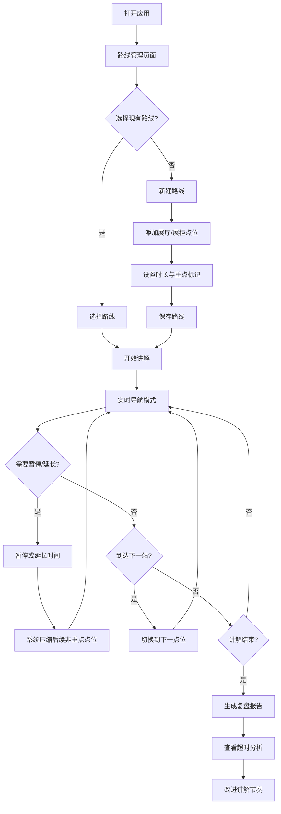

## 1. 产品概述

展馆讲解路线计时器 - 帮助讲解员精准控制讲解节奏，避免前松后紧，确保重点展品有充足时间。通过路线规划、实时导航计时、动态时间调整和数据复盘四大核心功能，让新人快速掌握讲解节奏。

- 目标用户：展馆讲解员、志愿者、博物馆教育工作者
- 核心价值：解决讲解时间分配不均问题，提升讲解质量，加速新人培训

## 2. 核心功能

### 2.1 用户角色

| 角色 | 注册方式 | 核心权限 |
|------|----------|----------|
| 讲解员 | 无需注册，本地使用 | 创建路线、讲解计时、查看报告 |

### 2.2 功能模块

1. **路线管理页面**：展厅列表、展柜配置、停留时长设置、重点标记
2. **实时导航页面**：当前点位显示、倒计时、进度条、暂停/延长控制
3. **复盘报告页面**：实际用时对比、超时分析、节奏评分

### 2.3 页面详情

| 页面名称 | 模块名称 | 功能描述 |
|-----------|-------------|---------------------|
| 路线管理 | 路线列表 | 展示所有已保存的讲解路线，支持新建、编辑、删除、复制 |
| 路线管理 | 路线编辑 | 添加展厅/展柜点位，设置每个点位名称、建议时长、是否重点 |
| 路线管理 | 路线预览 | 显示总时长、重点点位数量、路线顺序 |
| 实时导航 | 状态面板 | 当前点位名称、剩余时间、已用时间、整体进度百分比 |
| 实时导航 | 控制区 | 暂停/继续按钮、延长时间（+30s/+1min/+2min）、跳到下一站 |
| 实时导航 | 路线概览 | 展示完整路线，高亮当前位置，显示各点位时间压缩状态 |
| 实时导航 | 下一站提示 | 预告下一个点位名称和建议时长 |
| 复盘报告 | 时间对比 | 柱状图对比每个点位的计划用时 vs 实际用时 |
| 复盘报告 | 超时分析 | 列出超时最严重的TOP5展品，标注超时原因（手动标注） |
| 复盘报告 | 节奏评分 | 整体时间把控得分、重点点位覆盖率、建议改进方向 |

## 3. 核心流程

讲解员打开应用 → 选择或新建讲解路线 → 开始讲解进入导航模式 → 根据实际情况暂停/延长时间 → 系统自动压缩后续非重点点位时长 → 讲解结束生成复盘报告 → 查看超时分析改进节奏

## 4. 用户界面设计

### 4.1 设计风格
- **主色调**：深青色 #1a3a3a（博物馆专业感）+ 金色 #c9a962（文物质感点缀）
- **辅助色**：翡翠绿 #2d7a4f（正计时/正常）、珊瑚橙 #e07b5f（超时预警）、米白 #f5f0e8（背景）
- **按钮风格**：圆角矩形（8px），轻微阴影，点击有微缩反馈动画
- **字体**：标题使用"Noto Serif SC"（宋体风格，有文化底蕴），正文使用"Noto Sans SC"
- **布局风格**：卡片式布局，柔和阴影，层次分明
- **图标风格**：线性图标，细线条，文化气息

### 4.2 页面设计概述

| 页面名称 | 模块名称 | UI元素 |
|-----------|-------------|-------------|
| 路线管理 | 路线列表 | 卡片网格布局，展示路线名称、总时长、点位数量，hover有浮起效果 |
| 路线管理 | 路线编辑 | 可拖拽排序列表，每个点位可编辑名称、时长、重点星标 |
| 实时导航 | 状态面板 | 大字号倒计时（动态颜色：绿→黄→橙→红），环形进度条 |
| 实时导航 | 控制区 | 大按钮设计，方便操作，延长时间按钮采用快速选择 |
| 实时导航 | 路线概览 | 时间轴样式，当前点位放大高亮，已完成灰显 |
| 复盘报告 | 时间对比 | 横向柱状图，计划与实际并排，超时部分红色高亮 |
| 复盘报告 | 节奏评分 | 仪表盘式评分展示，配文字建议 |

### 4.3 响应式
- 桌面端优先设计，适配讲解台或平板使用场景
- 移动端自适应，支持手机竖屏操作
- 触摸友好，按钮最小尺寸 48x48px
- 关键信息在小屏优先展示

### 4.4 动效设计
- 倒计时接近结束时数字有脉冲动画
- 切换点位时有平滑过渡效果
- 时间压缩时有动态重排动画
- 报告页面图表有渐进加载动画
