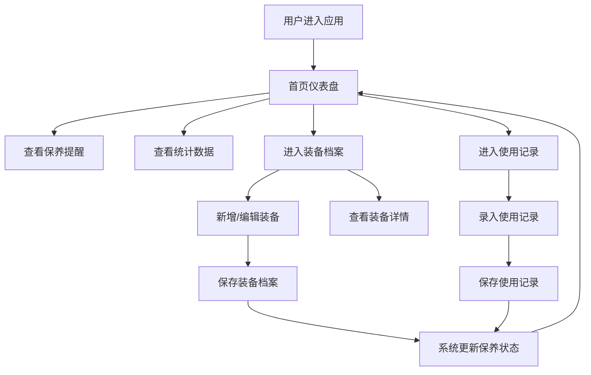

## 1. 产品概述

运动装备保养管理系统，帮助运动爱好者记录装备信息、使用历史，自动提醒保养、更换，统计使用频率与维护成本。解决跑鞋公里数、球拍线寿命、瑜伽垫清洁周期等容易遗忘的问题。

## 2. 核心功能

### 2.1 用户角色

| 角色 | 注册方式 | 核心权限 |
|------|---------|----------|
| 普通用户 | 无需注册（本地存储） | 装备档案管理、使用记录、查看提醒和统计 |

### 2.2 功能模块

1. **首页仪表盘**：保养提醒卡片、超期装备警示、月度统计图表、装备替换建议
2. **装备档案管理**：装备列表、新增/编辑/删除装备、详情查看
3. **使用记录管理**：记录每次使用时长、强度、场地、磨损备注
4. **保养提醒系统**：基于天数/公里数自动计算保养期，区分即将到期和已超期

### 2.3 页面详情

| 页面名称 | 模块名称 | 功能描述 |
|---------|---------|----------|
| 首页仪表盘 | 提醒概览区 | 展示快到保养期（7天内）和已超期的装备卡片列表 |
| 首页仪表盘 | 数据统计区 | 月度使用频率柱状图、维护花费统计、最该替换装备排名 |
| 装备档案页 | 装备列表 | 卡片式展示所有装备，支持按运动类型筛选 |
| 装备档案页 | 新增/编辑表单 | 录入名称、运动类型、购买日期、使用寿命、保养周期、当前状态、照片 |
| 装备档案页 | 装备详情 | 展示装备基本信息、使用记录时间线、保养历史 |
| 使用记录页 | 记录列表 | 按时间倒序展示所有使用记录，支持按装备筛选 |
| 使用记录页 | 新增记录表单 | 选择装备、记录时长/强度/场地/磨损备注 |

## 3. 核心流程

用户进入应用 → 首页查看保养提醒和统计 → 可进入装备管理查看/编辑装备 → 可录入新使用记录 → 系统根据使用数据自动更新保养提醒状态

## 4. 用户界面设计

### 4.1 设计风格

- **主色调**：运动能量色系 - 活力橙 (#FF6B35) 作为主色，搭配深青绿 (#004E64) 作为辅助色
- **中性色**：暖灰色系 (Warm Gray)，背景使用米白 (#FAF9F6)
- **按钮风格**：圆润胶囊型按钮，主要按钮有渐变和微阴影，悬停有上浮动画
- **字体**：标题使用 Space Grotesk（现代几何感），正文使用 Inter
- **布局风格**：卡片式布局，圆角 16px，柔和阴影，适当留白
- **图标风格**：Lucide 图标，统一线条风格

### 4.2 页面设计概览

| 页面名称 | 模块名称 | UI 元素 |
|---------|---------|---------|
| 首页仪表盘 | 提醒概览区 | 双栏卡片网格，即将到期用橙色渐变边框，超期用红色脉冲动画，每张卡片显示装备名、剩余天数/超期天数、建议动作 |
| 首页仪表盘 | 数据统计区 | 顶部 3 个统计数值卡（本月使用次数、本月花费、活跃装备数），下方月度频率柱状图和替换建议列表 |
| 装备档案页 | 装备列表 | 响应式网格，每张装备卡有照片占位、名称标签、状态徽章（良好/需注意/超期）、使用进度条 |
| 装备档案页 | 新增/编辑表单 | 弹窗模态框，分区表单（基本信息、保养参数、照片上传），底部操作按钮 |
| 使用记录页 | 新增记录表单 | 左侧装备选择器，右侧表单字段，时间选择器使用滑块，场地标签选择 |

### 4.3 响应式设计

- 桌面端优先设计，断点 1024px / 768px
- 平板端：网格列数减少，侧边导航变为顶部导航
- 移动端：单列布局，底部 Tab 导航，弹窗改为全屏面板
- 触摸目标最小 44x44px

### 4.4 动效设计

- 页面加载：卡片错落淡入动画 (staggered fade-in)
- 超期装备：边框脉冲呼吸动画
- 悬停交互：卡片轻微上浮 + 阴影加深
- 状态切换：进度条平滑过渡动画
- 表单提交：成功状态弹跳反馈
