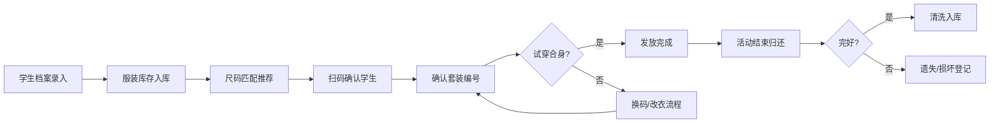

## 1. 产品概述

校园合唱服装尺码管理系统，解决合唱比赛发服装时尺码混乱、领结鞋子错配、排练当天发现不合身等问题。系统面向学校合唱队管理老师和学生管理员，提供学生档案管理、服装库存管理、扫码发放、改衣换码遗失归还记录、以及多维度数据看板功能。

## 2. 核心功能

### 2.1 用户角色
| 角色 | 注册方式 | 核心权限 |
|------|----------|----------|
| 管理员老师 | 系统内置 | 全部功能：学生档案CRUD、库存管理、发放回收、数据看板 |
| 学生助手 | 管理员添加 | 发放扫码、归还登记、查看库存和看板 |

### 2.2 功能模块
1. **仪表板看板**：未领取统计、尺码缺口预警、待改衣列表、未归还提醒、各声部发放进度
2. **学生档案管理**：班级、身高、体重、鞋码、声部、是否改裤长、联系方式
3. **服装库存管理**：上衣/裙裤/鞋/领结/发饰分类，尺码、数量、状态、照片
4. **服装发放中心**：扫码确认学生、套装编号、试穿合身标记
5. **流程记录中心**：改衣记录、换码记录、遗失登记、归还清洗记录

### 2.3 页面详情
| 页面名称 | 模块名称 | 功能描述 |
|----------|----------|----------|
| 仪表板 | 统计卡片 | 展示总人数、已发放、待改衣、未归还等关键指标 |
| 仪表板 | 尺码缺口预警 | 按品类展示库存不足的尺码列表 |
| 仪表板 | 声部进度 | 各声部（女高/女低/男高/男低）发放进度环形图 |
| 仪表板 | 待办事项 | 待改衣、未归还、待领取学生列表 |
| 学生档案 | 学生列表 | 搜索、筛选（班级/声部）、分页展示学生 |
| 学生档案 | 学生表单 | 新增/编辑学生信息（必填校验） |
| 服装库存 | 分类Tab | 上衣/裙裤/鞋/领结/发饰五个分类切换 |
| 服装库存 | 库存卡片 | 展示尺码、数量、状态（完好/待修/遗失）、缩略图 |
| 服装库存 | 出入库表单 | 新增库存、调整数量、上传照片 |
| 发放中心 | 扫码区域 | 模拟扫码输入学生ID或手动搜索选择 |
| 发放中心 | 发放确认 | 展示学生信息、应发套装、合身确认勾选 |
| 发放中心 | 发放历史 | 当日发放记录列表 |
| 流程记录 | 分类Tab | 改衣/换码/遗失/归还清洗四个记录分类 |
| 流程记录 | 记录表单 | 新增流程记录，关联学生和服装物品 |
| 流程记录 | 记录列表 | 按时间倒序展示，支持搜索筛选 |

## 3. 核心流程

学生信息录入 → 服装库存盘点入库 → 发放前根据学生身高体重匹配推荐尺码 → 扫码/搜索学生 → 确认套装编号 → 学生试穿标记是否合身 → 不合身则发起换码或改衣流程 → 使用后归还清洗登记 → 遗失物品登记赔偿

## 4. 用户界面设计

### 4.1 设计风格
- **主色调**：深邃蓝紫色系 (#4F46E5 靛蓝) 搭配金色点缀 (#F59E0B)，体现校园艺术活动的庄重与活力
- **辅助色**：中性灰 (#64748B) 用于文字，浅灰 (#F8FAFC) 背景
- **按钮风格**：圆角12px，渐变填充，悬浮微动效
- **字体**：标题使用 Playfair Display 衬线字体体现文艺气质，正文使用 Noto Sans SC 简体中文
- **布局风格**：卡片式布局 + 左侧导航栏 + 顶部标题栏
- **图标风格**：Lucide 线性图标，统一24px尺寸

### 4.2 页面设计概述
| 页面名称 | 模块名称 | UI元素 |
|----------|----------|--------|
| 仪表板 | 统计卡片 | 大数字+趋势箭头+彩色图标，渐变背景 |
| 仪表板 | 声部进度 | 环形进度图，渐变色填充 |
| 仪表板 | 预警列表 | 红色/黄色警示图标，紧急程度排序 |
| 学生档案 | 列表 | 斑马行、搜索框、筛选下拉、操作按钮组 |
| 学生档案 | 表单 | 分组标签、必填红星、实时校验提示 |
| 服装库存 | 分类Tab | 胶囊形状切换，选中态高亮 |
| 服装库存 | 库存网格 | 响应式卡片网格，悬停阴影放大 |
| 发放中心 | 扫码区 | 大输入框、扫码动画边框、实时搜索建议 |
| 发放中心 | 确认卡 | 学生头像、信息列表、确认步骤条 |
| 流程记录 | 时间线 | 纵向时间线布局，彩色状态标签 |

### 4.3 响应式
- 桌面端优先 (1280px+)：双栏布局，左侧导航240px
- 平板 (768-1279px)：导航折叠为图标栏
- 移动端 (<768px)：底部Tab导航，卡片单列，触摸友好的大按钮

### 4.4 动效设计
- 页面切换：淡入+轻微上移动画 (fade-slide-up)
- 卡片悬浮：阴影加深 + Y轴-2px位移
- 数据加载：骨架屏脉冲动画
- 按钮点击：scale(0.97) 微缩反馈
- 进度变化：数值滚动递增动画
