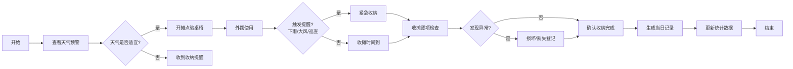

## 1. 产品概述

外摆收纳清单管理系统，帮助小店管理者规范外摆桌椅的日常收纳流程，解决桌椅丢失、损坏、淋雨等问题，提升外摆资产管理效率。

- 主要解决外摆桌椅丢失、损坏无人记录、收摊检查不规范、天气变化来不及收纳等问题
- 目标用户为店铺店长、店员，通过标准化流程降低管理成本，减少资产损失

## 2. 核心功能

### 2.1 用户角色

| 角色 | 登录方式 | 核心权限 |
|------|----------|----------|
| 店长 | 本地登录 | 全部功能：档案管理、开摊收摊、提醒设置、损坏登记、数据统计 |
| 店员 | 本地登录 | 开摊收摊操作、损坏登记、查看提醒 |

### 2.2 功能模块

1. **首页仪表盘**：今日概览、快速操作入口、天气预警、待办提醒
2. **桌椅档案管理**：桌椅信息增删改查、照片上传、状态管理
3. **开摊/收摊流程**：开摊点验、收摊逐项检查、操作记录
4. **智能提醒中心**：天气预警、城管巡查提醒、定时收纳提醒
5. **损坏/丢失登记**：拍照上传、事件记录、维修跟踪
6. **数据统计报表**：使用率统计、常缺件分析、天气影响分析、维修台账

### 2.3 页面详情

| 页面名称 | 模块名称 | 功能描述 |
|----------|----------|----------|
| 首页仪表盘 | 今日概览 | 显示今日外摆数量、天气状态、待办事项 |
| 首页仪表盘 | 快速操作 | 一键开摊、一键收摊、快速登记入口 |
| 首页仪表盘 | 天气预警 | 实时天气、降雨/大风预警、倒计时提醒 |
| 桌椅档案 | 档案列表 | 按编号/区域/状态筛选桌椅列表 |
| 桌椅档案 | 档案详情 | 显示编号、区域、材质、带伞、收纳点、照片、状态历史 |
| 桌椅档案 | 新增/编辑 | 表单录入桌椅信息，支持照片上传 |
| 开摊操作 | 点验流程 | 勾选当日外摆桌椅，记录实际数量 |
| 收摊操作 | 检查清单 | 逐项确认：擦干、折叠、锁链、遮雨布、归位 |
| 收摊操作 | 差异登记 | 发现缺失/损坏时快速跳转登记 |
| 提醒中心 | 提醒列表 | 显示天气、定时、自定义提醒 |
| 提醒中心 | 提醒设置 | 设置预警阈值、巡查时间、定时提醒 |
| 事件登记 | 损坏登记 | 照片上传、损坏描述、责任人员、维修状态 |
| 事件登记 | 丢失登记 | 丢失时间、发现人员、报案状态、处理结果 |
| 统计报表 | 使用率统计 | 每日/每周外摆率、区域使用率对比 |
| 统计报表 | 常缺件分析 | 高频缺失/损坏桌椅编号排名 |
| 统计报表 | 天气影响 | 不同天气下的收纳响应时间、损失统计 |
| 统计报表 | 维修台账 | 待修、维修中、已修桌椅清单及费用 |

## 3. 核心流程

## 4. 用户界面设计

### 4.1 设计风格

- 主色调：深橙色 (#FF6B35) 搭配深青色 (#1B3A4B)，营造专业可靠的店铺管理氛围
- 辅助色：绿色 (#2ECC71) 表示正常，红色 (#E74C3C) 表示警告/异常，黄色 (#F39C12) 表示提醒
- 按钮风格：圆角矩形，主按钮采用渐变橙色，带微妙阴影
- 字体：标题使用 "Noto Sans SC" 粗体，正文使用 "PingFang SC" 常规
- 布局风格：卡片式布局，顶部导航 + 左侧菜单 + 主内容区
- 图标：使用 Font Awesome 线性图标，搭配状态色标

### 4.2 页面设计概述

| 页面名称 | 模块名称 | UI 元素 |
|----------|----------|---------|
| 首页仪表盘 | 今日概览 | 大号数字卡片显示在院桌椅数、完好数、缺失数，渐变背景 |
| 首页仪表盘 | 天气卡片 | 动态天气图标、温度、降雨概率，预警时红色闪烁动画 |
| 首页仪表盘 | 快速操作区 | 大尺寸操作按钮，悬停放大效果，点击波纹动画 |
| 桌椅档案 | 档案列表 | 网格卡片布局，每张卡片显示桌椅缩略图、编号、状态标签 |
| 桌椅档案 | 档案表单 | 分栏表单，照片上传区支持拖拽，实时预览 |
| 收摊操作 | 检查清单 | 复选框列表，带勾选动画，未完成项红色高亮 |
| 统计报表 | 图表区 | ECharts 柱状图/折线图，数据加载动画，交互悬停提示 |
| 事件登记 | 照片上传 | 拍照/上传按钮，图片缩略图网格，支持删除重传 |

### 4.3 响应式设计

- 桌面端（≥1200px）：三栏布局，完整功能展示
- 平板端（768px-1199px）：顶部导航折叠为汉堡菜单，内容区自适应
- 移动端（<768px）：单列布局，底部 Tab 导航，优化触摸区域，按钮最小高度 44px
- 触摸优化：所有可点击元素增加触摸反馈，支持滑动操作列表项

## 5. 非功能性需求

### 5.1 性能要求

- 页面首屏加载时间 ≤ 2s
- 列表查询响应时间 ≤ 500ms
- 照片上传支持压缩，单张图片 ≤ 2MB
- 离线支持：关键数据本地缓存，网络恢复后自动同步

### 5.2 可用性要求

- 操作流程不超过 3 步完成核心任务
- 重要操作提供二次确认
- 支持键盘快捷键操作
- 数据自动保存，防止误操作丢失

### 5.3 数据安全

- 重要数据本地加密存储
- 照片支持水印（时间+地点）
- 操作日志完整记录，不可篡改
- 支持数据导出备份
