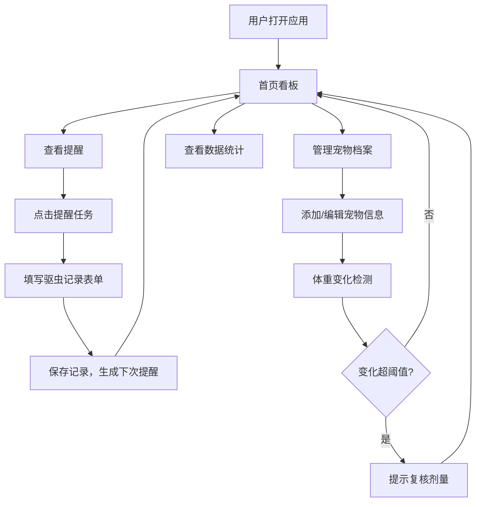

## 1. 产品概述
宠物驱虫管理助手，帮助养宠家庭系统化管理猫狗的体内外驱虫计划，解决用药记混、日期遗忘、剂量不准等问题。
- 目标用户：家中饲养猫/狗的宠物主人，特别是多宠家庭
- 核心价值：清晰记录驱虫历史、智能提醒用药时机、统计用药效果与安全

## 2. 核心功能

### 2.1 用户角色
| 角色 | 注册方式 | 核心权限 |
|------|----------|----------|
| 宠物主人 | 无需注册，本地存储 | 宠物档案管理、驱虫记录、提醒查看、数据统计 |

### 2.2 功能模块
1. **首页看板**：今日/临近/逾期提醒概览、宠物卡片列表、快速添加入口
2. **宠物档案管理**：宠物信息增删改查、照片上传、过敏史记录
3. **驱虫记录管理**：用药记录增删改查、体内/体外分类、剂量记录、操作人
4. **智能提醒系统**：临近日期提醒、逾期提醒、体重变化后剂量复核提示
5. **数据统计**：年度驱虫次数统计、药品过期预警、不良反应记录追踪

### 2.3 页面详情
| 页面名称 | 模块名称 | 功能描述 |
|----------|----------|----------|
| 首页看板 | 提醒概览区 | 卡片式展示逾期、3天内、7天内即将到期的驱虫任务，分类统计数量 |
| 首页看板 | 宠物列表区 | 网格布局展示宠物照片、名字、下次驱虫时间、状态标签 |
| 首页看板 | 快速操作栏 | 快速添加宠物、快速记录驱虫、查看全部提醒 |
| 宠物详情页 | 档案信息区 | 展示宠物照片、名字、品种、体重、年龄、过敏史，支持编辑 |
| 宠物详情页 | 驱虫时间轴 | 按时间倒序展示该宠物所有驱虫记录，含药品、类型、日期、操作人 |
| 宠物详情页 | 体重变化曲线 | 记录体重变化，变化超过阈值时提示复核剂量 |
| 驱虫记录表单 | 药品信息 | 药品名称输入、体内/体外选择、剂量输入（支持按体重自动推荐） |
| 驱虫记录表单 | 日期信息 | 使用日期、下次驱虫日期（可根据周期自动推算）、操作人 |
| 驱虫记录表单 | 不良反应 | 是否有不良反应、备注说明 |
| 统计页面 | 年度驱虫统计 | 按宠物展示今年完成体内/体外驱虫次数 |
| 统计页面 | 药品过期预警 | 展示库存中30天内过期的药品清单 |
| 统计页面 | 不良反应记录 | 汇总所有有不良反应的用药记录，标注药品与宠物 |

## 3. 核心流程

用户打开应用 → 首页看板查看今日提醒 → 点击逾期任务进入驱虫记录表单 → 填写药品、剂量、日期等信息 → 保存后自动生成下次提醒 → 返回首页查看更新后的状态

用户管理宠物 → 首页点击添加宠物 → 上传照片、填写基本信息（名字、品种、体重、年龄、过敏史） → 保存后宠物卡片出现在首页 → 可随时编辑或删除

用户查看统计 → 导航进入统计页 → 按宠物查看年度驱虫次数 → 检查即将过期的药品 → 回顾不良反应历史

## 4. 用户界面设计

### 4.1 设计风格
- **主色调**：暖橙色 `#FF8C42`（活力、温暖）搭配薄荷绿 `#4ECDC4`（清新、健康感）
- **辅助色**：奶白色背景 `#FFFAF3`、深灰文字 `#2D3436`、警示红 `#FF6B6B`
- **按钮风格**：圆角胶囊按钮，主色填充，悬停轻微上浮阴影
- **字体**：标题使用 Lora（衬线优雅），正文使用 Nunito（圆润友好）
- **布局风格**：卡片式布局，柔和圆角（16px），浅色阴影营造层次
- **图标风格**：Lucide 线性图标，搭配手绘风宠物 emoji 🐱🐶

### 4.2 页面设计概览
| 页面名称 | 模块名称 | UI元素 |
|----------|----------|--------|
| 首页看板 | 提醒概览区 | 三色卡片（红=逾期、橙=3天内、绿=7天内），数字+图标，悬停微缩放 |
| 首页看板 | 宠物列表区 | 网格布局，圆角头像卡，下次日期标签，状态徽章 |
| 首页看板 | 快速操作栏 | 底部悬浮操作栏，三个圆形按钮 + 文字 |
| 宠物详情页 | 档案信息区 | 大图头图，信息分组卡片，编辑按钮悬浮于右下角 |
| 宠物详情页 | 驱虫时间轴 | 左侧竖线时间轴，节点用彩色圆点区分体内/体外 |
| 驱虫记录表单 | 药品信息 | 分段控制器切换体内/体外，剂量输入框带体重参考提示 |
| 统计页面 | 年度驱虫统计 | 横向柱状图，不同颜色区分体内/体外，每只宠物一条 |
| 统计页面 | 药品过期预警 | 表格展示，过期前30天标橙，过期后标红 |

### 4.3 响应式
- 桌面端优先，最大宽度 1200px 居中布局
- 平板端（768px）：宠物网格从 3 列变 2 列
- 移动端（< 640px）：宠物网格单列，底部操作栏适配拇指热区
- 所有表单元素支持触摸，最小点击区域 44x44px

### 4.4 动画与交互
- 页面加载时卡片依次淡入上浮（stagger 60ms）
- 提醒卡片悬停轻微上浮（translateY(-2px)）+ 阴影加深
- 表单切换体内/体外时内容区域平滑过渡
- 体重变化提示条从顶部滑入，支持一键收起
