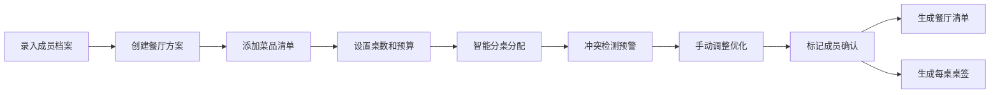

## 1. 产品概述

桌餐忌口确认系统是一款帮助团队组织聚餐活动的管理工具，解决团建订桌时反复询问成员饮食禁忌的痛点。系统通过记录成员档案、规划餐厅方案、智能分桌检测冲突、生成餐厅清单，实现高效的聚餐管理。

- **目标用户**：团队行政、组织者、团建负责人
- **核心价值**：避免饮食意外、减少沟通成本、提升聚餐体验

## 2. 核心功能

### 2.1 用户角色

| 角色 | 注册方式 | 核心权限 |
|------|----------|----------|
| 组织者 | 本地使用 | 全部功能：成员管理、餐厅方案、分桌、看板、导出 |

### 2.2 功能模块

1. **成员档案管理**：成员列表、新增/编辑/删除成员、确认状态标记
2. **餐厅方案管理**：方案列表、菜品管理、桌数配置、预算设置
3. **智能分桌**：自动分配座位、冲突检测预警、手动调整座位
4. **看板总览**：未确认成员、高风险菜品、预算差额、需替换菜品
5. **导出中心**：餐厅忌口清单、每桌桌签打印

### 2.3 页面详情

| 页面名称 | 模块名称 | 功能描述 |
|----------|----------|----------|
| 看板首页 | 统计卡片 | 显示未确认成员数、高风险菜品数、预算差额、需替换菜品数 |
| 看板首页 | 预警列表 | 展示各类风险详情，支持快速跳转处理 |
| 成员管理 | 成员列表 | 表格展示所有成员，支持搜索、筛选、批量操作 |
| 成员管理 | 成员表单 | 录入姓名、联系方式、过敏、宗教忌口、是否喝酒、备注 |
| 餐厅方案 | 方案列表 | 展示所有餐厅方案，支持复制、删除 |
| 餐厅方案 | 菜品管理 | 录入菜品名称、辣度、海鲜、坚果、价格、适用人群 |
| 餐厅方案 | 桌数配置 | 设置总桌数、每桌人数、酒水配置 |
| 智能分桌 | 座位分配 | 可视化桌位布局，拖拽调整座位 |
| 智能分桌 | 冲突提示 | 实时检测过敏冲突、素食不足等问题 |
| 导出中心 | 清单生成 | 生成餐厅忌口清单 PDF/打印版 |
| 导出中心 | 桌签生成 | 生成每桌桌签，包含成员名单和注意事项 |

## 3. 核心流程

**核心流程说明**：
1. 组织者先录入所有参与成员的饮食档案
2. 创建餐厅方案，添加所有菜品并设置参数
3. 系统根据成员数量和桌数配置自动分配座位
4. 实时检测冲突：过敏者与过敏原菜品同桌、素食者座位无素食、宗教冲突等
5. 组织者调整后，标记成员确认状态
6. 最终导出餐厅忌口清单和每桌桌签

## 4. 用户界面设计

### 4.1 设计风格

**设计方向**：精致商务风，强调数据清晰和操作效率

- **主色调**：深青色 `#0F766E`（专业、可靠）
- **辅助色**：琥珀橙 `#F59E0B`（预警、提醒）、珊瑚红 `#EF4444`（高风险）、翡翠绿 `#10B981`（安全、确认）
- **中性色**：石板灰系列（`#0F172A` 到 `#F8FAFC`）
- **字体**：标题使用 `Playfair Display`（精致优雅），正文使用 `Inter`（清晰易读）
- **按钮风格**：圆角 8px，细边框，悬停时轻微上浮和阴影
- **图标风格**：线性图标，统一 20px 尺寸，使用 lucide-react
- **布局风格**：卡片式布局，充足留白，层级分明

### 4.2 页面设计概述

| 页面名称 | 模块名称 | UI 元素 |
|----------|----------|----------|
| 看板首页 | 统计卡片 | 渐变背景卡片，数字大字展示，状态图标 |
| 看板首页 | 预警列表 | 风险等级色标，时间线布局，快速操作按钮 |
| 成员管理 | 成员列表 | 数据表格，状态标签，行内操作 |
| 成员管理 | 成员表单 | 分组表单，过敏标签多选，必填项标记 |
| 餐厅方案 | 菜品管理 | 菜品卡片网格，标签展示辣度/海鲜/坚果等属性 |
| 智能分桌 | 座位分配 | 圆形桌位可视化，头像堆叠显示，拖拽交互 |
| 智能分桌 | 冲突提示 | 右侧抽屉式面板，冲突等级标识，建议解决方案 |

### 4.3 响应式设计

- **桌面优先**：主内容区 1280px 宽度，侧边导航固定
- **平板适配**：≥768px，侧边栏可折叠，表格转为卡片式
- **触控优化**：按钮最小高度 44px，拖拽区域增大，滚动流畅

### 4.4 动画与交互

- 页面加载：卡片渐入 + 轻微位移（staggered 动画）
- 冲突检测：预警项抖动动画，红色脉冲提示
- 拖拽分桌：被拖拽元素半透明，目标区域高亮
- 状态切换：确认标记时的打勾动画，数字变化时的滚动效果
- 悬停效果：卡片轻微上浮，阴影加深，背景色微变
