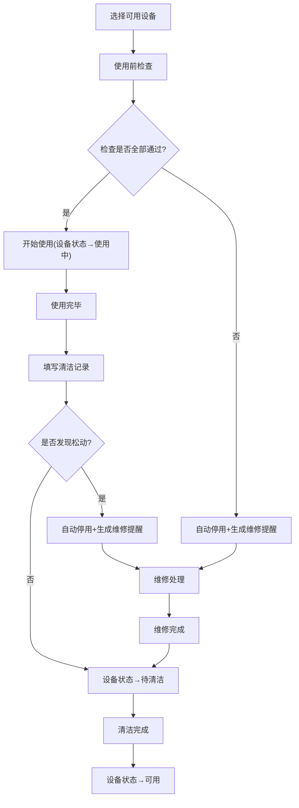

## 1. 产品概述

助浴椅借用与清洁记录系统，用于家庭或机构对老人助浴椅进行全生命周期管理。解决椅子在卫生间、卧室、阳台之间频繁搬移后清洁责任不清、安全检查缺失的问题，确保每次使用前后都有据可查，发现隐患立即停用并触发维修提醒。

- 目标用户：有老人需要助浴椅的家庭护理者、社区养老服务机构
- 核心价值：杜绝"用而不检、清而无记"的安全隐患，保障老人洗浴安全

## 2. 核心功能

### 2.1 功能模块

1. **首页仪表盘**：可用椅子数、待清洁数、待维修数、最近一周使用次数
2. **设备档案页**：管理所有助浴椅的编号、承重、扶手类型、防滑脚垫状态、购入日期和照片
3. **使用前检查页**：使用前逐项勾选座面、靠背、脚垫、螺丝和排水孔
4. **使用后清洁记录页**：记录清洁人、消毒方式、晾干位置、是否发现松动
5. **维修提醒页**：脚垫开裂/靠背晃/螺丝缺失时自动停用设备并生成维修工单

### 2.2 页面详情

| 页面名称 | 模块名称 | 功能描述 |
|---------|---------|---------|
| 首页仪表盘 | 统计卡片 | 显示可用椅子、待清洁、待维修数量及最近一周使用次数 |
| 首页仪表盘 | 设备快览 | 快速查看各椅子当前状态（可用/使用中/待清洁/待维修/已停用） |
| 首页仪表盘 | 最近记录 | 展示最近的借用和清洁记录时间线 |
| 首页仪表盘 | 维修提醒 | 突出显示待维修和已停用的设备提醒 |
| 设备档案 | 设备列表 | 卡片式展示所有助浴椅，按状态筛选 |
| 设备档案 | 设备详情 | 编号、承重(kg)、扶手类型(固定/可拆卸/无)、防滑脚垫状态(完好/磨损/开裂)、购入日期、设备照片 |
| 设备档案 | 新增/编辑设备 | 表单录入或修改设备信息，支持照片上传 |
| 使用前检查 | 选择设备 | 从可用设备列表中选择要使用的椅子 |
| 使用前检查 | 检查清单 | 逐项勾选：座面完好、靠背稳固、脚垫完好、螺丝无缺失、排水孔畅通 |
| 使用前检查 | 异常标记 | 检查不通过项自动标记，触发停用和维修提醒 |
| 使用后记录 | 清洁登记 | 记录清洁人姓名、消毒方式(酒精擦拭/含氯消毒/紫外线/其他)、晾干位置(卫生间/阳台/其他) |
| 使用后记录 | 松动检查 | 是否发现松动(是/否)，如为是则触发停用和维修提醒 |
| 维修提醒 | 提醒列表 | 所有待维修和已停用设备的提醒列表，含触发原因和触发时间 |
| 维修提醒 | 维修完成 | 标记维修完成，恢复设备为可用状态 |

## 3. 核心流程

### 3.1 借用与检查流程

用户选择可用设备 → 逐项完成使用前检查 → 全部通过则开始使用 → 如有不通过项则自动停用设备并生成维修提醒 → 使用完毕 → 记录清洁信息 → 如发现松动则停用并生成维修提醒 → 设备变为待清洁状态 → 清洁完成后设备恢复可用

### 3.2 流程图

## 4. 用户界面设计

### 4.1 设计风格

- **主色调**：温暖安全的蓝绿色系(#0D9488 teal-600)搭配琥珀色(#D97706 amber-600)警示，传达安心与关怀
- **辅助色**：石板灰(zinc)系做中性背景，红色(#DC2626)用于停用/危险状态
- **按钮风格**：圆角(8px)、柔和阴影、hover时微上浮
- **字体**：正文使用 Noto Sans SC，标题使用 ZCOOL XiaoWei 增添人文关怀感
- **布局风格**：卡片式布局，左侧导航栏，顶部面包屑
- **图标风格**：lucide-react 线性图标，简洁清晰

### 4.2 页面设计概览

| 页面名称 | 模块名称 | UI元素 |
|---------|---------|--------|
| 首页仪表盘 | 统计卡片 | 4张圆角卡片，大数字+图标+标签，teal/amber/red/zinc配色 |
| 首页仪表盘 | 设备快览 | 水平滚动卡片组，每张卡显示设备编号+状态徽章 |
| 首页仪表盘 | 最近记录 | 垂直时间线，左侧时间右侧事件描述 |
| 首页仪表盘 | 维修提醒 | 红色边框卡片列表，含警告图标和触发原因 |
| 设备档案 | 设备列表 | 响应式网格卡片，图片+编号+状态+承重 |
| 设备档案 | 设备详情 | 左侧图片区+右侧信息区，状态徽章醒目 |
| 使用前检查 | 检查清单 | 5个勾选项带图标，通过绿色/不通过红色，底部操作按钮 |
| 使用后记录 | 清洁登记 | 表单布局，下拉选择+文本输入，底部确认按钮 |
| 维修提醒 | 提醒列表 | 按时间倒序的警告卡片，含设备编号+原因+操作按钮 |

### 4.3 响应式设计

- 桌面优先设计，最小宽度1024px完整体验
- 平板(768-1024px)：导航折叠为汉堡菜单，卡片2列
- 手机(<768px)：单列布局，底部Tab导航

### 4.4 无障碍设计

- 所有交互元素支持键盘操作
- 状态颜色搭配文字标签，不依赖颜色传达信息
- 表单元素关联label
- 检查清单项支持大点击区域
