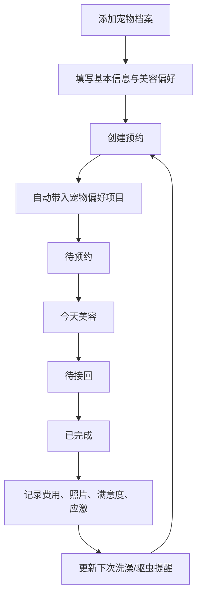

## 1. 产品概述

宠物美容预约档案管理工具，帮助宠物主人系统化管理宠物的美容记录和预约信息，避免每次预约重复交代宠物特征与特别要求，同时提供花费统计与提醒功能。

- 目标用户：有定期美容需求的宠物主人
- 核心价值：一次建档、长期复用；美容全流程跟踪；花费与提醒一目了然

## 2. 核心功能

### 2.1 用户角色

| 角色 | 说明 |
|------|------|
| 宠物主人 | 管理宠物档案、预约、记录、查看统计 |

### 2.2 功能模块

1. **首页**：按状态分组的预约看板、快捷操作入口、到期提醒
2. **宠物档案页**：宠物列表、添加/编辑宠物详细信息
3. **预约管理页**：创建/编辑预约、美容后记录、预约历史
4. **统计页**：年度花费、店铺评分、常做项目分析

### 2.3 页面详情

| 页面名称 | 模块名称 | 功能描述 |
|----------|----------|----------|
| 首页 | 预约看板 | 按待预约、今天美容、待接回、已完成四组展示预约卡片 |
| 首页 | 提醒横幅 | 展示即将到期/已到期的洗澡提醒和驱虫提醒 |
| 首页 | 快捷操作 | 新建预约、添加宠物入口按钮 |
| 宠物档案页 | 宠物列表 | 卡片展示所有宠物，显示头像、名字、品种 |
| 宠物档案页 | 宠物详情 | 编辑品种、体重、毛发长度、脾气、过敏、常去美容店 |
| 宠物档案页 | 美容偏好 | 预设常做项目（洗澡、剪毛、剪指甲、清耳朵），每次预约自动带入 |
| 预约管理页 | 创建预约 | 选择宠物（自动带入偏好项目）、选日期时间、接送方式、预算、特别要求 |
| 预约管理页 | 预约详情 | 查看预约信息，状态流转（待预约→今天美容→待接回→已完成） |
| 预约管理页 | 美容后记录 | 记录实际费用、上传照片、造型满意度评分、是否应激反应 |
| 统计页 | 年度花费 | 按月展示美容花费趋势图、年度总花费 |
| 统计页 | 店铺评分 | 常去美容店的平均满意度评分排名 |
| 统计页 | 项目频率 | 各美容项目完成次数统计 |

## 3. 核心流程

用户添加宠物 → 填写宠物基本信息与美容偏好 → 创建预约（自动带入宠物偏好） → 预约当天标记为"今天美容" → 美容完成后记录实际费用和满意度 → 预约归档为"已完成" → 提醒下次洗澡/驱虫时间

## 4. 用户界面设计

### 4.1 设计风格

- 主色调：暖杏色（#E8A87C）搭配深棕（#3D2B1F），传达温暖宠物关怀感
- 辅助色：奶白（#FFF8F0）、浅灰绿（#A8D5BA）用于状态区分
- 按钮风格：圆角胶囊按钮，柔和阴影
- 字体：标题用 ZCOOL KuaiLe（趣味中文），正文用 Noto Sans SC
- 布局：卡片式布局，顶部导航切换页面
- 图标风格：lucide-react 线性图标

### 4.2 页面设计概述

| 页面名称 | 模块名称 | UI 元素 |
|----------|----------|---------|
| 首页 | 预约看板 | 四列状态栏卡片布局，每张卡片含宠物头像、名字、项目标签、时间；顶部提醒横幅用浅色背景色块区分；底部固定快捷操作按钮 |
| 宠物档案页 | 宠物列表 | 网格卡片布局，每张卡片含宠物照片、名字、品种标签；点击进入详情面板 |
| 宠物档案页 | 宠物详情 | 表单式布局，分组展示（基本信息、美容偏好、过敏注意），底部保存按钮 |
| 预约管理页 | 创建预约 | 步进式表单，第一步选宠物（自动填充），第二步填时间和项目，第三步填接送和特别要求 |
| 预约管理页 | 美容后记录 | 弹窗/侧滑面板，含费用输入、照片上传区、满意度星级、应激开关 |
| 统计页 | 年度花费 | 折线图/柱状图展示月度花费，卡片展示年度总额 |
| 统计页 | 店铺评分 | 横向条形图排名，含平均评分星级 |
| 统计页 | 项目频率 | 环形图展示各项目占比 |

### 4.3 响应式

- 桌面端优先设计，移动端自适应
- 首页看板在窄屏下改为纵向堆叠
- 统计图表在小屏下缩放适配

### 4.4 3D 场景

不适用
