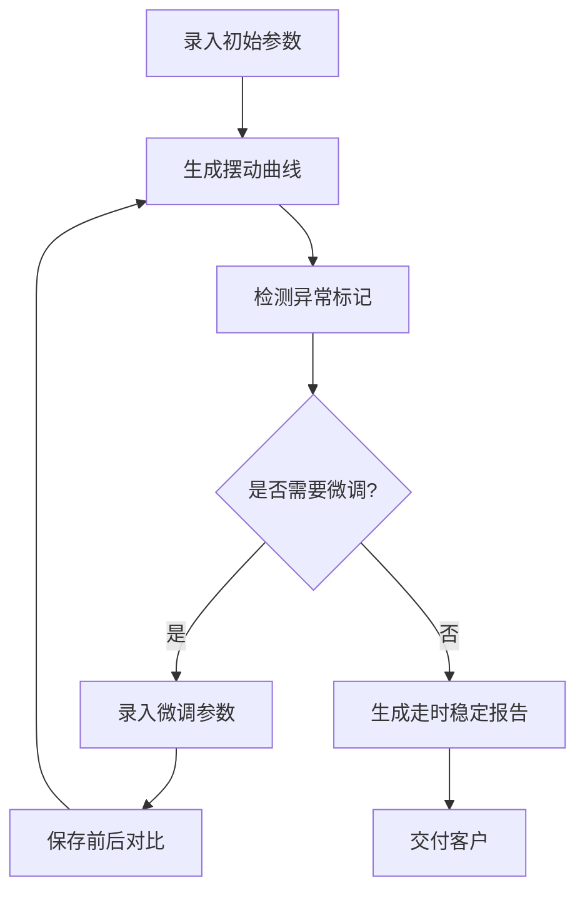

## 1. 产品概述

机械钟擒纵节拍调校记录系统——面向钟表维修师傅的专业工具，用于录入调校参数、可视化滴答间隔摆动曲线、标记异常节拍状态、追踪微调前后误差变化，并最终生成交付客户的走时稳定报告。

- 解决问题：机械钟维修中，擒纵节拍微偏即导致走时忽快忽慢，缺乏系统化的记录与可视化分析手段
- 目标用户：钟表维修师傅、钟表检测站技师
- 核心价值：将经验性的"听音辨位"转化为可量化、可追溯的调校记录，提升维修交付质量

## 2. 核心功能

### 2.1 用户角色

| 角色 | 注册方式 | 核心权限 |
|------|----------|----------|
| 维修师傅 | 直接使用 | 录入参数、查看曲线、保存记录、生成报告 |

### 2.2 功能模块

1. **调校记录页**：参数录入、摆动曲线可视化、异常标记、微调对比、报告生成

### 2.3 页面详情

| 页面名称 | 模块名称 | 功能描述 |
|----------|----------|----------|
| 调校记录页 | 参数录入面板 | 录入摆长(mm)、擒纵叉位置(°)、上弦程度(%)、测试时长(h)、每小时误差(s/h) |
| 调校记录页 | 摆动曲线面板 | 将滴答间隔数据绘制为左右摆动曲线，支持动画展示摆锤运动 |
| 调校记录页 | 异常标记面板 | 自动/手动标记偏摆、停摆、回摆无力、齿轮卡滞四种异常状态 |
| 调校记录页 | 微调对比面板 | 每次微调后保存前后误差对比，以表格和对比图表呈现 |
| 调校记录页 | 走时稳定报告 | 汇总所有调校记录，生成包含稳定性评估、误差趋势、最终结论的交付报告 |

## 3. 核心流程

用户打开页面 → 录入当前钟表参数 → 系统根据参数模拟/绘制摆动曲线 → 自动检测并标记异常 → 师傅进行微调 → 录入微调后参数 → 保存前后对比 → 重复微调至满意 → 生成走时稳定报告交付客户

## 4. 用户界面设计

### 4.1 设计风格

- **主色调**：深棕/古铜色(#8B6914)为基调，暗色背景(#1A1612)模拟工作台环境，琥珀色(#D4A847)作为强调色模拟黄铜质感
- **辅助色**：象牙白(#F5F0E8)用于文字，暗红(#C44536)用于异常告警
- **按钮风格**：圆角带阴影，主操作按钮使用琥珀金色，hover时呈现金属光泽效果
- **字体**：使用 Playfair Display 作为标题字体（衬线体，钟表刻字质感），Noto Sans SC 作为正文字体
- **布局风格**：深色工作台风格，卡片式布局带微妙黄铜边框，左中右三栏式信息密度布局
- **图标风格**：线性图标配合齿轮/钟表元素装饰

### 4.2 页面设计概览

| 页面名称 | 模块名称 | UI元素 |
|----------|----------|--------|
| 调校记录页 | 参数录入面板 | 深色卡片、带黄铜色边框的输入框、琥珀色按钮、参数标签用衬线体 |
| 调校记录页 | 摆动曲线面板 | Canvas绘制的正弦摆动曲线、中心摆锤动画、异常标记用红色闪烁点、坐标轴标注时间(ms)和振幅 |
| 调校记录页 | 异常标记面板 | 四种异常状态用不同色标（偏摆-橙色、停摆-红色、回摆无力-蓝色、齿轮卡滞-紫色）、标记列表带时间戳 |
| 调校记录页 | 微调对比面板 | 对比表格、柱状对比图、绿色改善/红色恶化箭头、微调时间线 |
| 调校记录页 | 走时稳定报告 | 报告预览卡片、误差趋势折线图、稳定性评分环形图、打印/导出按钮 |

### 4.3 响应式

- 桌面优先设计，确保在1920×1080和1440×900分辨率下完整呈现
- 平板端(768px+)将三栏调整为上下布局
- 移动端(<768px)提供简化视图，隐藏次要信息

### 4.4 3D场景指导

不适用
