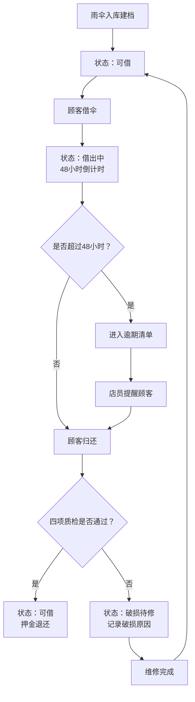

## 1. 产品概述

便利店应急雨伞租借管理系统，解决门店应急雨伞"借多还少"、归还时间不清、破损伞外流等管理难题。面向门店店员和区域管理员，实现雨伞全生命周期管理。

- 核心价值：雨伞借还有据可查，逾期可追踪，破损可拦截，数据可分析
- 目标用户：便利店店员、区域运营管理员

## 2. 核心功能

### 2.1 用户角色

| 角色 | 核心权限 |
|------|----------|
| 门店店员 | 雨伞借出/归还操作、查看本店库存、查看逾期提醒 |
| 区域管理员 | 雨伞档案管理、全部门店数据查看、统计报表、破损伞处理 |

### 2.2 功能模块

1. **仪表盘**：今日借还概览、可借库存、逾期预警、快捷操作入口
2. **雨伞档案**：雨伞列表、新增/编辑档案、详情查看、照片上传、破损标记
3. **借出管理**：选择雨伞、录入顾客信息、押金收取、打印借出小票
4. **归还管理**：扫码/输入编号查找、四项质检（伞骨/伞面/伞套/潮湿）、押金退还
5. **逾期提醒**：逾期清单、逾期天数排序、一键提醒标记、批量导出
6. **统计分析**：各门店可借数量、逾期名单、破损率趋势、雨天借伞峰值

### 2.3 页面详情

| 页面名称 | 模块名称 | 功能描述 |
|----------|----------|----------|
| 仪表盘 | 数据卡片 | 显示可借总数、借出中、已逾期、破损伞四项核心指标 |
| 仪表盘 | 快捷操作 | 四个快捷入口卡片（借出、归还、档案、逾期） |
| 仪表盘 | 最近动态 | 最近10条借还记录时间线 |
| 雨伞档案 | 筛选栏 | 按门店、状态、颜色筛选，关键字搜索编号 |
| 雨伞档案 | 列表卡片 | 网格布局展示雨伞缩略图、编号、状态、门店 |
| 雨伞档案 | 新增/编辑表单 | 编号、颜色、尺寸、押金、门店、破损情况、照片上传 |
| 雨伞档案 | 详情抽屉 | 完整档案信息、借还历史时间线 |
| 借出管理 | 雨伞选择 | 只显示"可借"状态雨伞，支持扫码和编号搜索 |
| 借出管理 | 顾客信息 | 手机号后四位（4位数字校验）、预计归还门店下拉选择 |
| 借出管理 | 押金确认 | 押金金额显示、已收/待收状态切换 |
| 归还管理 | 雨伞查找 | 扫码/输入编号、显示借出时信息 |
| 归还管理 | 四项质检 | 伞骨、伞面、伞套、是否潮湿，每项独立勾选正常/异常 |
| 归还管理 | 异常处理 | 质检异常时标记破损、记录备注 |
| 逾期提醒 | 逾期清单 | 表格展示雨伞编号、借出门店、顾客手机号、借出时间、逾期天数 |
| 逾期提醒 | 批量操作 | 全选、标记已提醒、导出Excel |
| 统计分析 | 门店库存 | 柱状图展示各门店可借/借出/破损数量对比 |
| 统计分析 | 逾期排行 | Top10逾期雨伞列表，含顾客信息 |
| 统计分析 | 破损率 | 折线图展示月度破损率趋势 |
| 统计分析 | 雨天峰值 | 柱状图展示雨天借伞时段分布 |

## 3. 核心流程

### 3.1 雨伞借出流程
店员在借出页面选择可借雨伞 → 录入顾客手机号后四位 → 选择预计归还门店 → 确认押金收取 → 系统生成借出记录，雨伞状态变为"借出中"

### 3.2 雨伞归还流程
店员输入/扫码雨伞编号 → 系统显示借出信息 → 进行四项质检（伞骨/伞面/伞套/潮湿）→ 全部正常则标记"已归还"可再次借出 → 有异常则标记"破损待修"不可再次借出 → 退还押金

### 3.3 逾期处理流程
系统每日自动计算逾期天数（借出超过48小时未归还）→ 逾期清单展示 → 店员标记"已提醒顾客" → 超过7天升级为"严重逾期"

## 4. 用户界面设计

### 4.1 设计风格

- **主色调**：深青色 #0F766E（便利店信任色），辅以暖橙色 #F97316（预警/强调色）
- **中性色**：石板灰系列，背景 #F8FAFC，卡片白色，边框 #E2E8F0
- **按钮样式**：圆角8px，主按钮实心填充，悬停轻微上浮+阴影加深
- **字体**：中文使用 Noto Serif SC 作为标题展示字体，正文使用系统无衬线字体
- **布局风格**：左侧深色导航栏 + 右侧白色内容区，卡片式分组，信息密度适中
- **图标风格**：Lucide 线性图标，统一 20px 尺寸

### 4.2 页面设计概述

| 页面名称 | 模块名称 | UI元素 |
|----------|----------|--------|
| 仪表盘 | 数据卡片 | 4列渐变背景卡片，大号数字+小字标签+趋势箭头 |
| 仪表盘 | 快捷操作 | 2x2 图标卡片网格，hover放大动效 |
| 雨伞档案 | 列表 | 响应式网格，雨伞照片为主视觉，状态标签色彩区分 |
| 借出/归还 | 表单 | 大号输入框，分步指示条，清晰的确认按钮 |
| 归还管理 | 质检区 | 4项卡片式勾选，绿色正常/红色异常 |
| 统计分析 | 图表区 | 卡片包裹，图表标题+筛选下拉 |

### 4.3 响应式

桌面端优先设计（≥1280px），平板端（768-1279px）调整为两列布局，移动端（<768px）顶部导航+单列滚动。

### 4.4 动效与微交互

- 页面切换：淡入 + 轻微向上位移（12px → 0，240ms）
- 卡片 hover：阴影加深 + Y 轴 -2px（160ms 缓动）
- 状态标签颜色过渡：160ms 平滑变色
- 数据数字变化：滚动数字动效
- 表单提交：按钮 loading 旋转 + 成功勾选反馈
