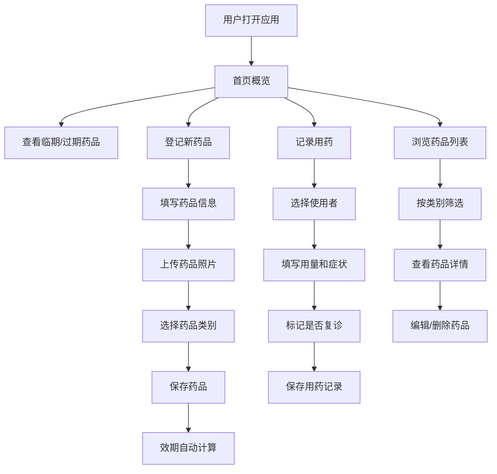

## 1. 产品概述

家庭药箱效期管理系统，解决家庭常备药品过期遗忘、用药记录混乱、应急找药困难等问题。帮助用户管理药品库存、追踪有效期、记录用药历史，确保家庭用药安全。

## 2. 核心功能

### 2.1 用户角色

| 角色 | 注册方式 | 核心权限 |
|------|----------|----------|
| 家庭管理员 | 无需注册，本地使用 | 药品登记、编辑、删除，用药记录管理，查看所有数据 |

### 2.2 功能模块

1. **首页**：临期药品、已过期药品、库存不足药品、家庭成员禁忌药概览
2. **药品登记**：新增/编辑药品信息，支持照片上传
3. **药品列表**：按类别分组展示，类别缺失提示
4. **用药记录**：记录家庭成员用药情况
5. **效期提醒**：临期1个月自动提醒，开封后有效期单独计算

### 2.3 页面详情

| 页面名称 | 模块名称 | 功能描述 |
|-----------|-------------|---------------------|
| 首页 | 概览卡片 | 临期/过期/库存不足/禁忌药四类数据统计卡片 |
| 首页 | 快捷操作 | 快速登记药品、快速记录用药 |
| 药品登记 | 表单模块 | 药品名称、规格、适用症状、购买日期、有效期、开封日期、存放位置、剩余数量、盒子照片、所属类别 |
| 药品列表 | 分组展示 | 按感冒发烧、肠胃、外伤、过敏、慢病备用分组展示 |
| 药品列表 | 类别提示 | 关键类别缺少药品时显示补齐提示 |
| 药品列表 | 状态标签 | 显示临期/过期/开封状态标签 |
| 用药记录 | 记录列表 | 展示历史用药记录，包含使用者、用量、症状、复诊提醒 |
| 用药记录 | 新增记录 | 快速添加用药记录表单 |

## 3. 核心流程

## 4. 用户界面设计

### 4.1 设计风格

- **主色调**：柔和医疗绿 (#10B981)，传递健康、安心的感觉
- **辅助色**：警示橙 (#F59E0B) 用于临期提醒，危险红 (#EF4444) 用于过期提醒
- **中性色**：以白色和浅灰色为背景，内容清晰可读
- **按钮风格**：圆角矩形，悬停时有轻微阴影和颜色变化
- **字体**：使用 Noto Sans SC 中文显示字体，标题加粗，正文易读
- **布局风格**：卡片式布局，顶部导航，左侧快捷菜单
- **图标风格**：使用 lucide-react 线性图标，简洁现代

### 4.2 页面设计概述

| 页面名称 | 模块名称 | UI 元素 |
|-----------|-------------|-------------|
| 首页 | 概览卡片 | 4个统计卡片网格，带图标和数字，不同状态对应不同颜色 |
| 首页 | 快捷操作区 | 两个大按钮：登记药品、记录用药 |
| 药品登记 | 表单 | 分组表单，日期选择器，图片上传预览，类别单选 |
| 药品列表 | 分组标签 | 顶部类别Tab切换，卡片列表展示 |
| 药品列表 | 药品卡片 | 药品照片缩略图，名称规格，效期状态标签，剩余数量 |
| 用药记录 | 时间线 | 按时间倒序展示用药记录，时间线布局 |

### 4.3 响应式

- 桌面端优先设计，采用1200px最大宽度
- 移动端自适应，卡片堆叠展示，底部Tab导航
- 触摸优化：按钮最小高度44px，列表项充足点击区域

### 4.4 交互细节

- 页面加载时卡片渐入动画，依次出现
- 悬停效果：卡片轻微上浮，阴影加深
- 表单验证：实时校验必填项和日期合理性
- 状态标签动画：临期/过期标签有轻微呼吸效果
